# LLM Fundamentals<br />and the Agent Harness

## Lesson 0 — Agentic Engineering Module


<div class="abs-br m-6 flex gap-2">
  <span class="text-sm opacity-50">Agentic Engineering Course</span>
</div>

---
layout: default
---

# Lesson Agenda

<div class="grid grid-cols-2 gap-6 mt-8">

<div>

### Part 1 — LLM Fundamentals

- Tokenization & context windows
- Statistical nature of generated code
- Why software fundamentals still matter

</div>

<div v-click>

### Part 2 — AI Agents

- What is an AI Agent?
- LLM vs Agent, Chatbot vs Agent
- What is a Harness? The Harness Problem

</div>

<div v-click>

### Part 3 — Harness Architecture & Layers

- Execution & Sandboxing
- Tool Interfaces & Protocols
- Context & Working-State Engineering
- Safety, Observability & Governance

</div>

<div v-click>

### Part 4 — Design Patterns & Loops

- Reasoning Loops & OODA
- ReAct, CoT, Plan-and-Solve
- Reflection, Multi-Agent

</div>

</div>

<div class="mt-6 text-sm opacity-50">
  <b>Objective:</b> Understand the underlying architecture and the difference between a simple language model and an autonomous agentic system.
</div>

---
layout: section
---

# Part 1
## LLM Fundamentals

---
layout: default
---

# What Are Large Language Models?

<div class="grid grid-cols-2 gap-8 mt-8">

<div>

### Large-scale neural language models

- Neural networks trained on **billions of parameters**
- Predict the **next token** in a sequence
- Learn patterns, syntax, and knowledge from training data

<div v-click class="mt-6 p-4 bg-blue-500/10 rounded-lg border border-blue-500/30">

**Key fact:** GPT-4 has ~1.7 trillion parameters. An average human reads the equivalent of ~2 billion words in a lifetime.

</div>

</div>

<div v-click>

### The inference pipeline

```
Input → Tokenize → Embed → Transform → Decode → Output
```

<div class="text-xs opacity-50 mt-2">
  Every LLM follows this same fundamental flow
</div>

</div>

</div>

<!--
ML -> class/regr
-->

---
layout: center
class: text-center
---

# Have You Seen *50 First Dates*?

<div class="mt-8">
  
</div>

<div v-click class="mt-6 text-lg opacity-80">
  Lucy (Drew Barrymore) wakes up every morning thinking it's October 13th.<br/>
  <span class="opacity-60">Every day, her memory resets completely — a clean slate.</span>
</div>

<div v-click class="mt-4 text-sm opacity-50">
  Sound familiar? LLMs work exactly the same way.
</div>

---
layout: two-cols
---

# LLMs Are Stateless — Every Call Starts From Zero

### Like *50 First Dates*

<div v-click class="mt-4 text-sm">

Every new conversation, they remember **nothing**:
- Who you are
- What you discussed yesterday
- What decisions you made

</div>

<div v-click class="mt-6 p-3 bg-yellow-500/10 rounded-lg border border-yellow-500/30 text-sm">

**This is exactly how LLMs work.** Every API call is a blank slate — the model only knows what you put in front of it *right now*.

</div>

::right::

### What this means

<div v-click class="mt-4 space-y-3 text-sm">

<div class="p-3 bg-red-500/10 rounded-lg border-l-4 border-red-500">

**Chat apps hide this** — they silently repackage the full history on every message.

</div>

<div class="p-3 bg-red-500/10 rounded-lg border-l-4 border-red-500">

**Agents must manage state** — memory, buffers, context pruning are mandatory.

</div>

<div class="p-3 bg-red-500/10 rounded-lg border-l-4 border-red-500">

**No learning during chat** — the model doesn't "get smarter". Fine-tuning is offline.

</div>

</div>

---
layout: default
---

# Two Kinds of "Memory" — And Why It Matters

<div class="grid grid-cols-2 gap-6 mt-6">

<div>

### 🧠 Weights = Long-term memory

<div class="p-3 bg-gray-500/10 rounded-lg text-sm mt-4">

- **Baked in during training** — frozen afterwards
- Facts, grammar, code patterns, world knowledge
- Cutoff date: knows nothing that happened after
- Cannot learn new facts unless fine-tuned

</div>

<div class="mt-4 p-3 bg-gray-500/10 rounded-lg text-sm">

<b>Analogy:</b> Like a textbook printed in 2024. It can't update itself.

</div>

</div>

<div>

### 📝 Context window = Working memory

<div class="p-3 bg-yellow-500/10 rounded-lg text-sm mt-4">

- **Ephemeral and volatile** — lives only during inference
- System prompt, conversation history, code, tool results
- Scroll off → gone. Forever.
- This is your only channel to "teach" the model in real time

</div>

<div class="mt-4 p-3 bg-yellow-500/10 rounded-lg text-sm">

<b>Analogy:</b> Like a whiteboard erased after each class.

</div>

</div>

</div>

<div v-click class="mt-6 p-3 bg-blue-500/10 rounded-lg border border-blue-500/30 text-center text-sm">

<b>Key insight:</b> Anything not in the weights <b>and</b> not in the current context window <b>does not exist</b> for the model. No hidden memory. No subconscious. No "I think we talked about this before."

</div>

---
layout: default
---

# Context Windows

<div class="grid grid-cols-2 gap-8 mt-8">

<div>

### What is a context window?

The maximum number of tokens the model can "see" at once during inference.

<div v-click class="mt-4">

### Evolution

| Model | Context Window |
|---------|---------------|
| GPT-4o | 128K tokens |
| Claude Haiku 4.5 | 200K tokens |
| Claude Opus 4.5 | 1M tokens |
| DeepSeek-V4-Pro | 1M tokens |

</div>

</div>

<div v-click>

### Practical implications

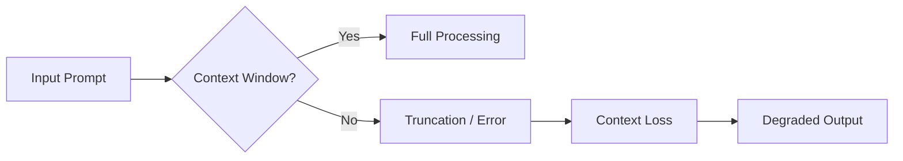

<div class="mt-6 p-4 bg-red-500/10 rounded-lg border border-red-500/30 text-sm">

**Real-world problem:** A 50K-line codebase is approx 100K+ tokens. Exceeds the context window of most models.

</div>

<div v-click class="mt-4 p-3 bg-green-500/10 rounded border border-green-500/30 text-sm">

**Solution:** Context pruning, RAG, strategic chunking — Module 3 topic

</div>

</div>

</div>

---
layout: default
---

# Context Rot — The Silent Degradation

<div class="grid grid-cols-2 gap-6 mt-4">

<div>

### The "lost in the middle" problem

<div class="text-sm mt-4">

Even **before** the context window overflows, model quality degrades. Research shows LLMs pay **disproportionate attention** to:

</div>

<div v-click class="mt-3 text-sm space-y-2">

<div class="p-2 bg-green-500/10 rounded border border-green-500/30">

<b>📍 Beginning of context</b> — system prompts, early instructions are well-attended

</div>

<div class="p-2 bg-red-500/10 rounded border border-red-500/30">

<b>📍 End of context</b> — the most recent messages also get strong attention

</div>

<div class="p-2 bg-yellow-500/10 rounded border border-yellow-500/30">

<b>📍 Middle of context → 💀</b> — instructions, facts, and tool definitions placed here are often <b>ignored</b>

</div>

</div>

</div>

<div>

### Why it matters in practice

<div v-click class="text-sm mt-4 space-y-3">

<div class="p-2 bg-red-500/10 rounded border border-red-500/30">

<b>Instructions buried in history vanish</b> — safety rules, coding standards, constraints given 20 messages ago? The model may have already "forgotten" them.

</div>

<div class="p-2 bg-red-500/10 rounded border border-red-500/30">

<b>Tools stop working</b> — function definitions placed mid-context become invisible. The model stops calling them, or calls them wrong.

</div>

<div class="p-2 bg-red-500/10 rounded border border-red-500/30">

<b>Silent failure, no warning</b> — the model doesn't say "I forgot". It confidently continues with degraded reasoning. <b>You</b> must detect it.

</div>

</div>


</div>

</div>

---
layout: default
---

# Every Token Is a Dice Roll 🎲

<div class="grid grid-cols-2 gap-6 mt-4">

<div>

### How an LLM generates output

<div class="text-sm mt-4 space-y-3">

<div v-click>

1. The model is given a prompt: `function sort`

</div>

<div v-click>

2. For the next position, it scores **every token in its vocabulary** (~100K+) with a probability

</div>

<div v-click>

3. It **does not pick** "the right answer" — it **samples** from that distribution, like rolling weighted dice

</div>

<div v-click>

4. The sampled token is added to the output… then repeat from step 1

</div>

</div>

<div v-click class="mt-4 p-3 bg-yellow-500/10 rounded-lg border border-yellow-500/30 text-sm">

<b>Key difference from traditional software:</b> the model never executes, compiles, or verifies. It just predicts the most statistically likely sequence.

</div>

</div>

<div class="flex items-center justify-center">

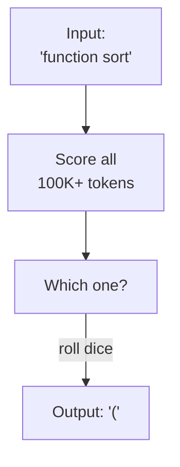

</div>

</div>

---
layout: two-cols
---

# Temperature: The Creativity Knob

### How it works

<div class="text-sm mt-4">

| 🎚️ Temp | Behavior | Use case |
|----------|----------|----------|
| **0.0** | Always picks most probable token | Code, math |
| **0.3–0.7** | Slight randomness | General tasks |
| **0.8–1.2** | Explores less likely paths | Brainstorming |
| **>1.5** | Near-random output | Just for fun |

<div class="mt-6">

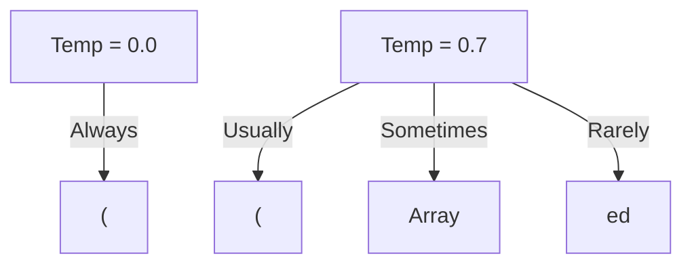

</div>

</div>

::right::

<div class="ml-6">

### Why it matters

<div v-click class="text-sm mt-4 space-y-4">

<div class="p-2 bg-red-500/10 rounded border border-red-500/30">

<b>Same prompt ≠ same output</b><br/><code class="text-xs">function sort(arr)</code> → 3 different results across runs

</div>

<div class="p-2 bg-red-500/10 rounded border border-red-500/30">

<b>Hallucinations are not a bug</b><br/>They're a byproduct of probabilistic sampling. The model always produces <em>something</em>.

</div>

<div class="p-2 bg-green-500/10 rounded border border-green-500/30">

<b>Verify everything</b><br/>Test, compile, lint, review. The model suggests — <b>you</b> decide.

</div>

</div>

</div>

---
layout: two-cols
---

# Tokenization

The process of breaking text into processable units.

<div class="mt-4">

### Types of tokenization

- **BPE** (Byte Pair Encoding) — GPT series
- **WordPiece** — BERT
- **SentencePiece** — LLaMA, Mistral
- **Unigram** — T5

</div>

<div v-click class="mt-4">

### Practical example

```
Text: "Hello world!"
Tokens: ["Hello", " world", "!"]

Text: "Tokenization"
Tokens: ["Token", "ization"]
```

</div>

::right::

<div class="ml-4 mt-4">

### Why does it matter?

<div v-click>

1. **Cost** — every token has a price in API calls
2. **Limits** — every model has a context window
3. **Quality** — suboptimal tokenization = poor output

</div>

<div v-click class="mt-6">

```ts
// Example: counting tokens with tiktoken
import { encoding_for_model } from 'tiktoken'

const enc = encoding_for_model('gpt-4')
const tokens = enc.encode('Hello world!')

console.log(`Original text: "Hello world!"`)
console.log(`Token count: ${tokens.length}`)
console.log(`Token IDs: [${tokens}]`)
```

</div>

<div v-click class="mt-4 p-3 bg-yellow-500/10 rounded border border-yellow-500/30 text-sm">

A typical non-English word consumes **2-3x more tokens** than English. Language choice impacts cost.

</div>

</div>

---
layout: default
---

# Autoregressive — One Token at a Time

<div class="grid grid-cols-2 gap-6 mt-4">

<div>

### Each token builds on the last

<div class="text-sm mt-4">

LLMs are **autoregressive**: every token is generated based on **all previous tokens** — including the ones the model just produced itself.

<div v-click class="mt-3">

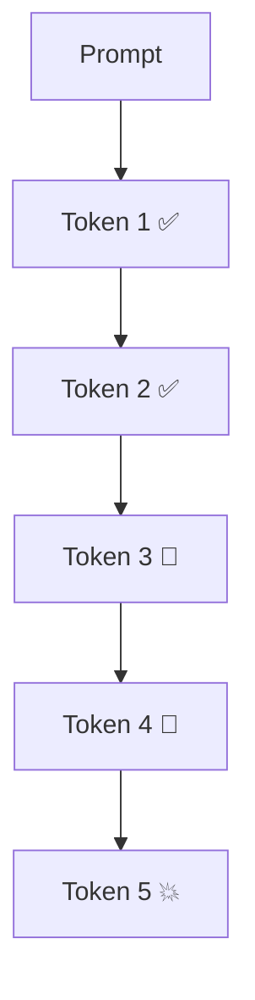

</div>

<div v-click class="mt-2 p-2 bg-yellow-500/10 rounded-lg border border-yellow-500/30 text-xs">

<b>The problem:</b> if token 3 is slightly "off", the model conditions on that wrong token to generate token 4. The error **compounds**, not corrects.

</div>

</div>

</div>

<div>

### The model never goes back

<div v-click class="text-sm mt-4 space-y-3">

<div class="p-2 bg-red-500/10 rounded border border-red-500/30">

Unlike a human who re-reads and edits, the LLM commits to every token as it's produced. Once token 42 is written, it becomes **indisputable ground truth** for token 43.

</div>

<div class="p-2 bg-red-500/10 rounded border border-red-500/30">

There is no backward pass, no revision loop, no "wait, let me fix that earlier part". The avalanche only flows **forward**.

</div>

</div>

</div>

</div>

---
layout: default
---

# The Snowball Effect 🏔️ — Why It Matters

<div class="grid grid-cols-2 gap-6 mt-4">

<div>

### The metaphor

<div class="text-sm mt-4">

<div class="p-4 bg-blue-500/10 rounded-lg border border-blue-500/30">

<b>Imagine:</b> A tiny snowball rolls down a mountain. Each rotation picks up more snow. By the bottom, it's an avalanche.

<br/><br/>

A small token drift at position 50 becomes a catastrophic hallucination by position 500.

</div>

</div>

</div>

<div>

### In practice

<div v-click class="text-sm mt-4 space-y-3">

<div class="p-3 bg-red-500/10 rounded border border-red-500/30">

<b>Code generation:</b> slightly wrong variable name → wrong logic → broken function → cascading bugs across the codebase

</div>

<div class="p-3 bg-red-500/10 rounded border border-red-500/30">

<b>Hallucinated facts:</b> a minor inaccuracy in paragraph 1 becomes the foundation for paragraph 2 → the entire response is fabricated

</div>

<div class="p-3 bg-green-500/10 rounded border border-green-500/30">

<b>Why Chain-of-Thought works:</b> writing reasoning <em>before</em> the answer anchors early tokens to correct intermediate steps, preventing drift

</div>

</div>

</div>

</div>

---
layout: statement
---

# LLMs don't "think" (Maybe)

## They predict the statistically<br />most probable token sequence

<div class="mt-8 text-lg opacity-70">
  <em>"It's just math. Really good math, but still math."</em>
</div>

---
layout: default
---

# Why Software Fundamentals Matter More Than Ever

<div class="grid grid-cols-2 gap-8 mt-8">

<div>

### The AI coding paradox

<div v-click class="mt-4">

AI writes code faster than any human, but:

- It doesn't understand the domain
- It doesn't know architectural constraints
- It can't test in a real environment
- It hallucinates with confidence

</div>

<div v-click class="mt-6">

### You need an engineer to:

- Validate semantics and correctness
- Apply SOLID principles
- Verify security and performance
- Guide the overall architecture

</div>

</div>

<div v-click class="mt-8">

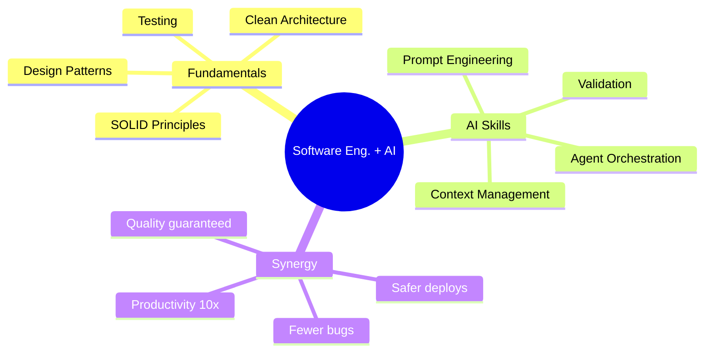

</div>

</div>

---
layout: center
class: text-center
---

# AI is an amplifier

<div class="mt-4 text-xl">

If you're a great engineer, AI makes you **extraordinary**<br />
If you're a bad engineer, AI makes you **dangerous**

</div>

<div v-click class="mt-12 text-lg opacity-70">
  <em>"AI won't replace developers.<br />Developers who use AI will replace developers who don't."</em>
</div>

---
layout: section
---

# Part 2
## AI Agents

---
layout: default
---

# What is an AI Agent?

<div class="grid grid-cols-2 gap-8 mt-6">

<div>

### Definition

<div class="text-sm mt-4">

An AI agent is an **LLM-powered system** that can:

<div v-click class="mt-3 space-y-2">

- **Perceive** its environment (files, APIs, user input)
- **Reason** about goals and plan actions
- **Act** through tools (shell, code, network)
- **Iterate** — observe results, correct, retry

</div>

<div v-click class="mt-4 p-3 bg-blue-500/10 rounded-lg border border-blue-500/30 text-sm">

<b>LLM + Tools + Autonomy = Agent</b>

</div>

</div>

</div>

<div v-click>

### The agentic loop

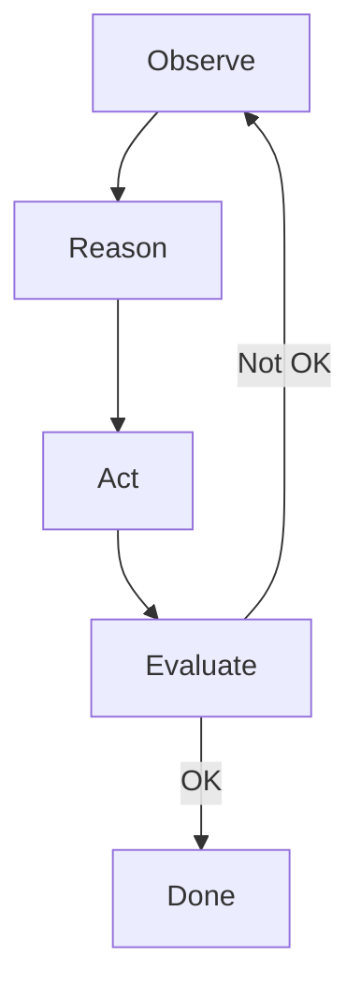

<div class="mt-2 p-1 bg-purple-500/10 rounded border border-purple-500/30 text-xs text-center">

Like a senior developer who writes code, runs tests, finds bugs, fixes them — in a loop

</div>

</div>

</div>

---
layout: default
---

# LLM vs Agent: The Fundamental Difference

<div class="grid grid-cols-2 gap-8 mt-6 items-start">

<div>

### Traditional LLM

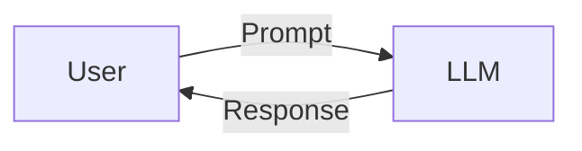

<div class="mt-4 p-4 bg-gray-500/10 rounded-lg text-sm">

- Input → Direct output
- No persistent memory
- No action capability
- Reacts, doesn't act

</div>

</div>

<div v-click>

### AI Agent

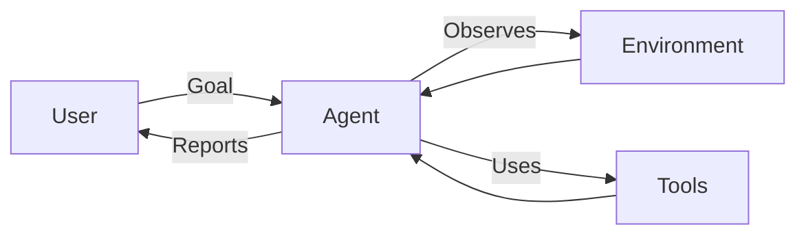

<div class="mt-4 p-4 bg-blue-500/10 rounded-lg text-sm">

- Perceives the environment
- Plans autonomously
- Acts through tools
- Iterates until goal is met

</div>

</div>

</div>

---
layout: default
---

# Chatbot vs Agent

<div class="grid grid-cols-2 gap-8 mt-4 items-start">

<div>

### Chatbot (ChatGPT, Claude)

- One-shot conversation
- No autonomous initiative
- No external tool access
- Context limited to chat

<div v-click class="mt-4">

```ts
const response = await llm.chat(
  "Write a sorting function"
)
// User must copy, paste, test...
```

</div>

</div>

<div>

### Agent (Coding Agent)

- Autonomous and proactive
- Reads/writes filesystem
- Runs commands, tests, builds
- Iterates until correct

<div v-click class="mt-4">

```ts
await agent.run(
  "Implement optimized sorting"
)
// reads → writes → tests → fixes → commits
```

</div>

</div>

</div>

---
layout: statement
---

# An LLM is a brain.<br />An agent is a brain<br />with hands.

<div class="mt-8 text-lg opacity-70">
  <em>The harness is what gives it hands</em>
</div>

---
layout: default
---

# What is a Harness?

<div class="grid grid-cols-2 gap-8 mt-6">

<div>

### The missing infrastructure

<div class="text-sm mt-4">

An LLM is just a text predictor. The **harness** is the engineering infrastructure that surrounds the model — all the code that:

<div v-click class="mt-3 space-y-2">

- Manages execution environments and sandboxing
- Provides tools and enforces safety
- Handles context, memory, and working state
- Orchestrates the agent lifecycle
- Instruments observability and governance

</div>

</div>

</div>

<div v-click>

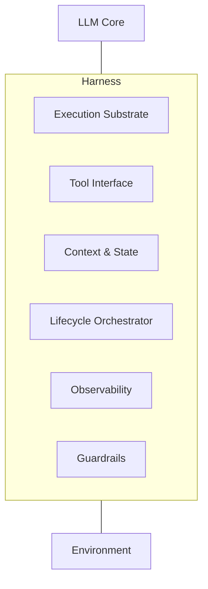

</div>

</div>

---
layout: default
---

# The Harness Problem

<div class="grid grid-cols-2 gap-6 mt-6">

<div>

### The model isn't everything

<div class="p-4 bg-blue-500/10 rounded-lg border border-blue-500/30 mt-4">

<b>"I improved 15 LLMs at coding in one afternoon. Only the harness changed."</b>
<br/>
<span class="text-sm opacity-70">— Can Bölük, 2026</span>

</div>

<div v-click class="mt-4 text-sm space-y-2">

The harness determines:

- <b>Efficacy</b>: how well tools integrate and context is managed
- <b>Reliability</b>: recovery from failures, state durability
- <b>Safety</b>: execution boundaries, permission models
- <b>Observability</b>: traceability of agent decisions

</div>

</div>

<div v-click>

### The survey landscape

<div class="text-sm mt-4 space-y-3">

<div class="p-3 bg-gray-500/10 rounded-lg">

<b>171 public artifacts</b> catalogued across 6 architectural layers

</div>

<div class="p-3 bg-gray-500/10 rounded-lg">

<b>Key finding:</b> Most projects focus on lifecycle orchestration (47 entries), while context engineering (9) and governance (14) remain underserved

</div>

<div class="p-3 bg-gray-500/10 rounded-lg">

<b>Production references:</b> Claude Code, Codex CLI, OpenHands, OpenCode

</div>

</div>

</div>

</div>

---
layout: default
---

# Harness vs Generic Frameworks

<div class="grid grid-cols-2 gap-8 mt-6">

<div>

### Generic AI Frameworks

<div class="p-4 bg-red-500/10 rounded-lg mt-4">

- LangChain, CrewAI, AutoGPT...
- **Opinionated**: impose abstractions
- **Complex**: lots of boilerplate
- **Rigid**: hard to customize
- **Heavy**: dependency overhead

</div>

<div v-click class="mt-4">

```ts
// LangChain - typical example
import { ChatOpenAI } from 'langchain/chat_models/openai'
import { AgentExecutor } from 'langchain/agents'
import { Calculator } from 'langchain/tools/calculator'
// ... 30+ lines of configuration
```

</div>

</div>

<div v-click>

### The Harness Philosophy

<div class="p-4 bg-green-500/10 rounded-lg mt-4">

- The LLM is a component, not the product
- **Minimal**: only what's needed
- **Transparent**: understand every part
- **Flexible**: adapt to your use case
- **Layered**: separate concerns cleanly

</div>

<div v-click class="mt-4">

```ts
// Minimal Harness - concept
const agent = createAgent({
  model: 'gpt-4',
  tools: [readFile, writeFile, execShell],
  safety: { sandbox: true },
})

const result = await agent.run(
  "Refactor the auth module into TypeScript"
)
```

</div>

</div>

</div>

---
layout: statement
---

# The harness is<br />what makes an LLM<br />an agent

<div class="mt-8 text-lg opacity-70">
  <em>Improve the harness, not just the model</em>
</div>

---
layout: section
---

# Part 3
## Harness Architecture & Layers

---
layout: default
---

# The Six Layers of a Harness

<div class="mt-4">

### Every production agent system needs these layers

<div class="grid grid-cols-3 gap-3 mt-6">

<div v-click class="p-3 bg-blue-500/10 rounded-lg border border-blue-500/30">

### E — Execution

Sandboxing, containers, micro-VMs, filesystem isolation

</div>

<div v-click class="p-3 bg-green-500/10 rounded-lg border border-green-500/30">

### T — Tool Interface

Protocols (MCP, A2A), function calling, API contracts

</div>

<div v-click class="p-3 bg-purple-500/10 rounded-lg border border-purple-500/30">

### C — Context & State

Memory, session persistence, working files, context pruning

</div>

<div v-click class="p-3 bg-yellow-500/10 rounded-lg border border-yellow-500/30">

### L — Lifecycle

Planning, orchestration, task decomposition, sub-agents

</div>

<div v-click class="p-3 bg-pink-500/10 rounded-lg border border-pink-500/30">

### O — Observability

Tracing, logging, metrics, evaluation, cost tracking

</div>

<div v-click class="p-3 bg-red-500/10 rounded-lg border border-red-500/30">

### G — Guardrails

Permission control, rate limiting, security policies, governance

</div>

</div>

</div>

---
layout: default
---

# Layer 1: Execution & Sandboxing

<div class="grid grid-cols-2 gap-6 mt-6">

<div>

### Why execution isolation matters

<div class="text-sm mt-4 space-y-2">

<div class="p-3 bg-red-500/10 rounded-lg border border-red-500/30">

Agents execute **untrusted code**. Without sandboxing, every `rm -rf` or `DROP TABLE` is real.

</div>

<div v-click class="p-3 bg-gray-500/10 rounded-lg">

### Isolation spectrum

**Containers** — Docker, gVisor · **Micro-VMs** — Firecracker · **WASM** — Pyodide, Capsule · **Cloud** — E2B, Daytona

</div>

</div>

</div>

<div v-click>

### Production examples

<div class="text-sm mt-4 space-y-2">

<div class="p-3 bg-green-500/10 rounded-lg border border-green-500/30">

<b>Codex CLI:</b> local execution with sandbox confinement

</div>

<div class="p-3 bg-green-500/10 rounded-lg border border-green-500/30">

<b>OpenHands:</b> sandboxed execution + shell/browser in one system

</div>

<div class="p-3 bg-green-500/10 rounded-lg border border-green-500/30">

<b>SWE-agent:</b> Agent-Computer Interface with remote backends

</div>

<div class="p-3 bg-yellow-500/10 rounded-lg border border-yellow-500/30 text-xs">

<b>Key principle:</b> The execution boundary is a harness responsibility, not an afterthought

</div>

</div>

</div>

</div>

---
layout: default
---

# Layer 2: Tool Interfaces & Protocols

<div class="grid grid-cols-2 gap-6 mt-4">

<div>

### Model Context Protocol (MCP)

<div class="text-sm mt-4">

Standard for LLM ↔ tool communication. Servers expose tools, clients discover and invoke. **85K+ stars** on GitHub.

</div>

<div v-click class="mt-3">

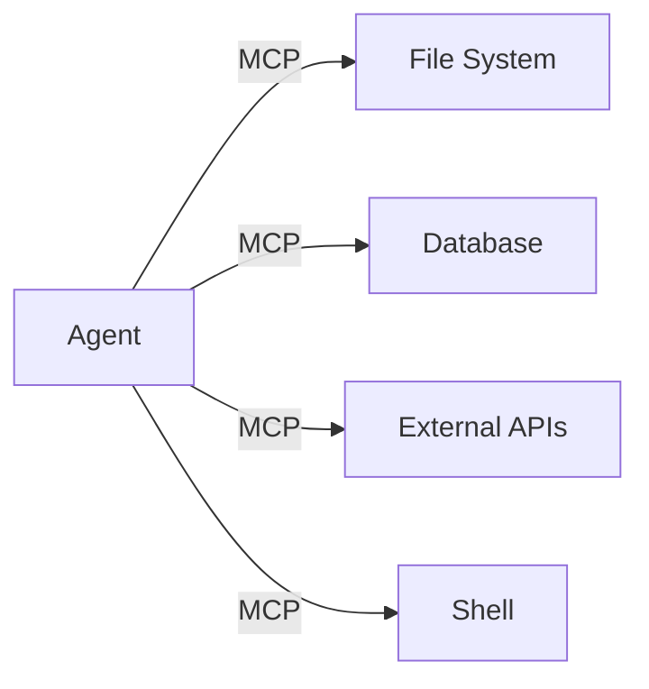

</div>

</div>

<div v-click>

### Beyond MCP

<div class="text-sm mt-4 space-y-2">

<div class="p-2 bg-gray-500/10 rounded-lg">

<b>A2A:</b> Google's protocol for inter-agent communication

</div>

<div class="p-2 bg-gray-500/10 rounded-lg">

<b>OpenAPI / Function Calling:</b> Structured tool definitions with typed params

</div>

<div class="p-2 bg-gray-500/10 rounded-lg">

<b>AGENTS.md (20K+ stars):</b> Repo-level agent instructions

</div>

<div class="p-2 bg-green-500/10 rounded-lg text-xs">

<b>Best practice:</b> Precise tool descriptions with explicit error handling. The model chooses tools based on descriptions.

</div>

</div>

</div>

</div>

---
layout: default
---

# Layer 3: Context & Working-State Engineering

<div class="grid grid-cols-2 gap-6 mt-4">

<div>

### Beyond the context window

<div class="text-sm mt-4 space-y-3">

<div class="p-3 bg-yellow-500/10 rounded-lg border border-yellow-500/30">

<b>The problem:</b> Context windows are finite. Long-running agents must manage what stays and what goes.

</div>

<div v-click class="space-y-2">

### Key techniques

- **Context pruning** — remove irrelevant history
- **Compaction** — summarize old interactions
- **File-based memory** — persist state to disk (planning-with-files)
- **Structured skills** — inject modular capability descriptions

</div>

</div>

</div>

<div v-click>

### Working state patterns

<div class="text-sm mt-4 space-y-3">

<div class="p-3 bg-gray-500/10 rounded-lg">

<b>claude-mem (72K stars):</b> Plugin-style memory layer for coding agents — session persistence across restarts

</div>

<div class="p-3 bg-gray-500/10 rounded-lg">

<b>planning-with-files (20K stars):</b> Persistent file-based task planning — agent writes its plan to disk, reads it on resume

</div>

<div class="p-3 bg-green-500/10 rounded-lg">

<b>Golden rule:</b> The harness must make context management explicit. The LLM cannot self-manage its own memory — it has amnesia by design.

</div>

</div>

</div>

</div>

---
layout: default
---

# Layer 4: Lifecycle & Orchestration

<div class="grid grid-cols-2 gap-6 mt-4">

<div>

### The orchestration layer

<div class="text-sm mt-4">

The lifecycle orchestrator handles:

<div v-click class="mt-2 space-y-1">

- **Task decomposition** — breaking goals into sub-tasks
- **Sub-agent delegation** — spawn specialized agents
- **Checkpoint/restore** — durable progress across failures
- **Git workflows** — branch, commit, PR automation

</div>

</div>

</div>

<div v-click>

### Production patterns

<div class="text-sm mt-4 space-y-2">

<div class="p-2 bg-gray-500/10 rounded-lg">

<b>Single-agent loop:</b> Claude Code, Codex CLI — observe → plan → act → evaluate

</div>

<div class="p-2 bg-gray-500/10 rounded-lg">

<b>Role separation:</b> OpenCode — plan/build roles + LSP + sub-agents

</div>

<div class="p-2 bg-gray-500/10 rounded-lg">

<b>Durable orchestration:</b> Symphony (OpenAI) — issue tracker as control plane

</div>

<div class="p-2 bg-yellow-500/10 rounded-lg text-xs">

<b>Caution:</b> Start with a single agent. Add multi-agent only when necessary.

</div>

</div>

</div>

</div>

---
layout: default
---

# Layers 5 & 6: Observability, Safety & Governance

<div class="grid grid-cols-2 gap-6">

<div>

### Observability

<div class="text-sm space-y-1">

<div class="p-2 bg-gray-500/10 rounded-lg">

<b>Langfuse (26K★), OpenLLMetry (7K★):</b> Tracing, metrics, cost monitoring

</div>

<div class="p-2 bg-gray-500/10 rounded-lg">

<b>AgentOps, Arize Phoenix:</b> Agent-specific observability platforms

</div>

<div class="p-2 bg-blue-500/10 rounded-lg text-xs">

<b>Must-have:</b> Trace every tool call, every LLM interaction, every state change

</div>

</div>

</div>

<div v-click>

### Guardrails & Security

<div class="text-sm space-y-1">

<div class="p-2 bg-red-500/10 rounded-lg">

<b>LiteLLM (45K★), IronClaw (12K★):</b> Gateway proxy, WASM security routines

</div>

<div class="p-2 bg-red-500/10 rounded-lg">

<b>Prompt injection defense:</b> Instruction hierarchy, privilege separation

</div>

<div class="p-2 bg-blue-500/10 rounded-lg text-xs">

<b>Must-have:</b> Sandbox execution, human-in-the-loop, full audit trail

</div>

</div>

</div>

</div>

---
layout: section
---

# Part 4
## Design Patterns & Reasoning Loops

---
layout: default
---

# What Are Reasoning Loops?

<div class="mt-6">

### The core of agentic intelligence

<div class="grid grid-cols-2 gap-8 mt-6">

<div>

The reasoning loop is the cycle that allows the agent to:

1. **Observe** the current state
2. **Reason** about the next step
3. **Act** by executing an operation
4. **Evaluate** the result
5. **Iterate** until completion

<div v-click class="mt-4 p-4 bg-blue-500/10 rounded-lg">

**Metaphor:** Like a senior developer who writes code, runs tests, finds bugs, fixes them, retests — in a continuous loop.

</div>

</div>

<div v-click>


<div class="mt-2 p-1 bg-purple-500/10 rounded border border-purple-500/30 text-xs">

OODA: Observe → Orient → Decide → Act → Assess

</div>

</div>

</div>

</div>

---
layout: default
---

# Pattern 1: ReAct (Reasoning + Acting)

<div class="mt-6">

### The most widespread LLM agent pattern

<div class="grid grid-cols-2 gap-6 mt-4">

<div>

```
Thought: I need to calculate the user's age.
          I have the birth date in the DB.
Action: query_database("SELECT birth_date FROM users WHERE id=42")
Observation: 1990-03-15
Thought: Now I calculate the age.
Action: calculate("2024 - 1990")
Observation: 34
Thought: The user is 34. I'll respond.
Answer: The user is 34 years old.
```

</div>

<div v-click>

### ReAct pattern phases

1. **Thought** — The agent reasons about what to do
2. **Action** — Selects and uses a tool
3. **Observation** — Receives feedback
4. **Repeat** — Continues until answer is reached

<div class="mt-6 p-4 bg-green-500/10 rounded-lg">

Benefits:
- Explicit, traceable reasoning
- Self-correction when observation is unexpected
- Combines internal knowledge + external tools

</div>

</div>

</div>

</div>

---
layout: default
---

# Pattern 2: Chain-of-Thought (CoT)

<div class="mt-6">

### Explicit step-by-step reasoning

<div class="grid grid-cols-2 gap-6 mt-4">

<div>

### Without CoT

```
Q: If a train departs at 9:00 at 80 km/h
   and another at 9:30 at 120 km/h,
   when do they meet?
A: At 10:30
```

<div v-click class="mt-4">

Problem: You can't tell if the reasoning is correct. The LLM may have guessed.

</div>

</div>

<div v-click>

### With Chain-of-Thought

```
Q: If a train departs at 9:00 at 80 km/h
   and another at 9:30 at 120 km/h,
   when do they meet?

Reasoning:
- At 9:30, train A has covered 40 km
- The trains approach at 80+120=200 km/h
- Time to close 40 km = 40/200 = 0.2h = 12 min
- They meet at 9:42
```

<div class="mt-4">

Benefit: The reasoning is verifiable. We can validate each step.

</div>

</div>

</div>

</div>

---
layout: default
---

# Pattern 3: Plan-and-Solve

<div class="mt-4">

### For complex tasks requiring decomposition

<div class="mt-4">

```
TASK: "Migrate PostgreSQL to MongoDB maintaining all relationships"

PLAN:
1. Analyze existing schema
2. Identify relationships & constraints
3. Design document model
4. Write migration script
5. Run on test, validate, fix
6. Deploy with rollback plan
```

</div>

<div v-click class="mt-4 grid grid-cols-2 gap-4">

<div class="p-3 bg-blue-500/10 rounded-lg">

### Benefits
- Plan visibility
- Each step is validatable
- Pause/resume possible
- Parallelism where applicable

</div>

<div class="p-3 bg-yellow-500/10 rounded-lg">

### Watch out
- Agent may over-engineer
- Human validation on plan needed
- Plans can become outdated

</div>

</div>

</div>

---
layout: default
---

# Pattern 4: Reflection & Self-Correction

<div class="mt-6">

### The agent critically evaluates its own output

<div class="grid grid-cols-2 gap-6 mt-4">

<div>

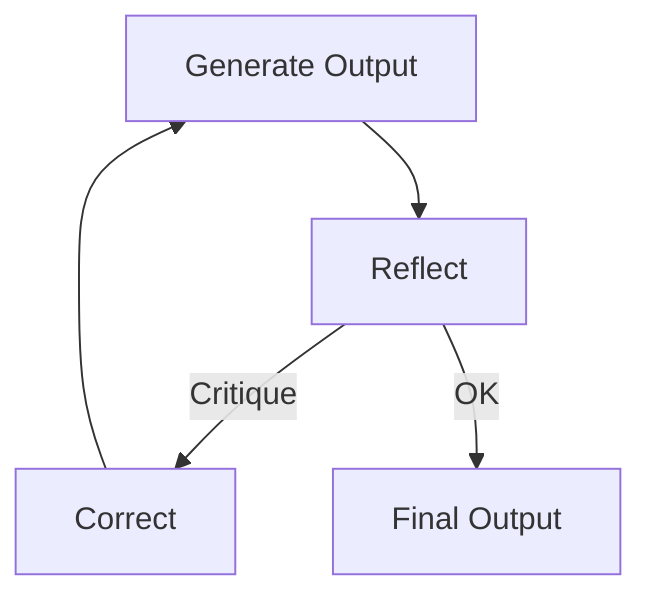

<div class="mt-2">

### How it works:

<div class="text-sm">

1. The agent generates a solution
2. The agent itself (or a second agent) evaluates it
3. Identifies issues and corrects them
4. Repeats until quality is sufficient

</div>

</div>

</div>

<div v-click class="flex items-center justify-center">

<div class="p-4 bg-blue-500/10 rounded-lg border border-blue-500/30 text-center">

### Self-critique loop

**Generate → Reflect → Correct → Repeat**

The agent acts as its own reviewer,<br/>catching mistakes before the human sees them.

</div>

</div>

</div>

</div>

---
layout: default
---

# Pattern 4: Reflection & Self-Correction (example)

<div class="mt-6">

### Self-reflection in practice

<div class="grid grid-cols-2 gap-6">

<div>

```
Generate: I wrote this sorting function.
          function sort(arr) { return arr.sort() }
```

</div>

<div v-click>

```
Reflect:  Critique -
          1. Missing type annotation
          2. Default sort is lexicographic,
             not numeric!
          3. Missing empty array handling
          4. Not pure (mutates input)
```

</div>

</div>

<div v-click class="mt-6">

```
Correct:  function sortNumbers(arr) {
           if (!arr.length) return []
           return [...arr].sort((a, b) => a - b)
         }
```

<div class="mt-4 p-3 bg-green-500/10 rounded-lg border border-green-500/30 text-center">

The reflection loop caught 4 issues the human might have missed

</div>

</div>

</div>

---
layout: two-cols
---

# Pattern 5: Multi-Agent Delegation

<div class="mt-4">

### An architect agent + specialized agents

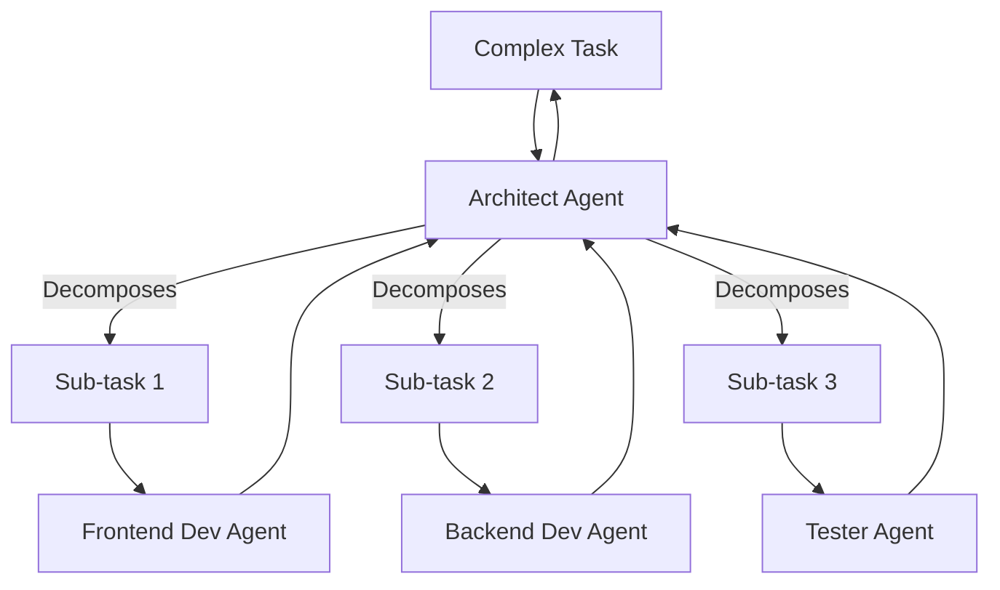

</div>

::right::

<div class="ml-4 mt-4">

<div v-click>

### Pros

- Each agent has a narrow context
- Role specialization
- Parallel execution possible
- Better domain quality

</div>

<div v-click class="mt-4">

### Cons

- Coordination overhead
- Complex inter-agent communication
- Multiplied costs
- Harder debugging

</div>

<div v-click class="mt-6 p-3 bg-yellow-500/10 rounded-lg text-sm">

**Golden rule:** Always start with a single agent. Add multi-agent complexity only when necessary.

</div>

</div>

---
layout: default
---

# Design Pattern Comparison

<div class="mt-4">

<div class="text-sm">

| Pattern | Strength | When to use | Complexity |
|---------|----------|-------------|------------|
| **ReAct** | Reasoning + action | External tools needed | Medium |
| **Chain-of-Thought** | Transparent reasoning | Logic & debugging | Low |
| **Plan-and-Solve** | Decomposition | Complex multi-step | High |
| **Reflection** | Self-improvement | Quality-critical output | Medium |
| **Multi-Agent** | Specialization | Large-scale systems | Very High |

</div>

<div v-click class="mt-4 p-3 bg-blue-500/10 rounded-lg border border-blue-500/30">

**Start here:** **ReAct + Reflection** — the winning pair for agentic coding.

</div>

</div>

---
layout: default
---

# The Reasoning Loop in Agentic Coding

<div class="mt-4">

### How it applies to coding assistance:

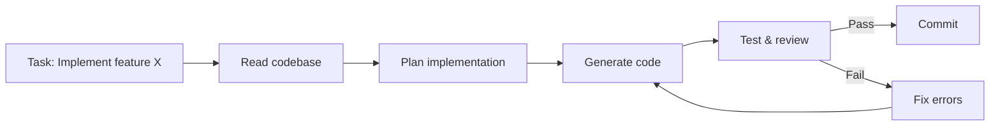

<div v-click class="mt-4 grid grid-cols-3 gap-4 text-center">

<div class="p-3 bg-gray-500/10 rounded-lg">

### Observe
Read files, run tests, analyze errors

</div>

<div class="p-3 bg-gray-500/10 rounded-lg">

### Reason
Plan, decompose, decide approach

</div>

<div class="p-3 bg-gray-500/10 rounded-lg">

### Act
Write code, run commands, commit

</div>

</div>

</div>

---
layout: statement
class: text-center
---

# Lesson Summary

<div class="grid grid-cols-2 gap-4 text-left text-sm">

<div class="p-3 bg-blue-500/10 rounded-lg">

### LLM Fundamentals
- Tokenization and context windows
- Statistical nature of generated code
- Software fundamentals matter more than ever

</div>

<div class="p-3 bg-blue-500/10 rounded-lg">

### What is a Harness
- The infrastructure surrounding the model
- The Harness Problem: improving the harness > improving the model
- Minimal, transparent, layered philosophy

</div>

<div class="p-3 bg-blue-500/10 rounded-lg">

### Harness Architecture
- Six layers: Execution, Tools, Context, Lifecycle, Observability, Guardrails
- Production refs: Claude Code, Codex CLI, OpenHands
- Context engineering and working-state management

</div>

<div class="p-3 bg-blue-500/10 rounded-lg">

### Design Patterns
- ReAct, CoT, Plan-and-Solve
- Reflection and Self-Correction
- Multi-Agent Delegation

</div>

</div>

---
layout: center
class: text-center
---

# Next Lesson

## Lesson 1: The Agentic Engineering Mindset

<div class="mt-8">

Environment setup<br />
Execution permission configuration<br />
"Active Delegation" exercise<br />

</div>

<div class="mt-12 text-lg opacity-50">
  <em>"Stop using AI as a chatbot<br />and start treating it as an operating engineer."</em>
</div>

---
layout: center
class: text-center
---

<div class="mb-8">
  <div class="text-7xl font-bold bg-gradient-to-r from-blue-400 via-purple-400 to-pink-400 bg-clip-text text-transparent">
    Questions?
  </div>
</div>

<div class="flex justify-center items-stretch gap-6 mt-12">

  <!-- Repo Card -->
  <a href="https://github.com/salvatorebottiglieri/coding_with_ai" target="_blank"
     class="w-64 p-6 rounded-xl border border-gray-700 bg-gray-800/60 hover:bg-gray-700/60 hover:border-blue-500/50 transition-all duration-300 no-underline flex flex-col items-center justify-center">
    <div class="text-3xl mb-3">
      <carbon-logo-github />
    </div>
    <div class="text-sm font-semibold text-gray-300 mb-1">Course Repository</div>
    <div class="text-xs text-blue-400 break-all text-center">
      salvatorebottiglieri/<br/>coding_with_ai
    </div>
  </a>

  <!-- References Card -->
  <div class="w-96 p-6 rounded-xl border border-gray-700 bg-gray-800/60 text-left flex flex-col">
    <div class="text-sm font-semibold text-gray-400 mb-4 uppercase tracking-wider">📚 References</div>
    <div class="space-y-3 text-sm">
      <a href="https://youtu.be/BEKc4P87XKo" target="_blank"
         class="block px-3 py-2 rounded-lg hover:bg-gray-700/50 transition-colors no-underline border-l-2 border-transparent hover:border-blue-400">
        <div class="text-gray-200 font-medium">Agentic Engineering</div>
        <div class="text-xs text-gray-500">Brendan O'Leary</div>
      </a>
      <a href="https://eugeneyan.com/" target="_blank"
         class="block px-3 py-2 rounded-lg hover:bg-gray-700/50 transition-colors no-underline border-l-2 border-transparent hover:border-purple-400">
        <div class="text-gray-200 font-medium">Human-AI Collaboration</div>
        <div class="text-xs text-gray-500">Eugene Yan</div>
      </a>
      <a href="https://www.amazon.it/Agentic-Design-Patterns-Hands-Intelligent/dp/3032014018" target="_blank"
         class="block px-3 py-2 rounded-lg hover:bg-gray-700/50 transition-colors no-underline border-l-2 border-transparent hover:border-pink-400">
        <div class="text-gray-200 font-medium">Agentic Design Patterns</div>
        <div class="text-xs text-gray-500">Handbook</div>
      </a>
      <a href="https://picrew.github.io/LLM-Harness" target="_blank"
         class="block px-3 py-2 rounded-lg hover:bg-gray-700/50 transition-colors no-underline border-l-2 border-transparent hover:border-yellow-400">
        <div class="text-gray-200 font-medium">Agent Harness Engineering</div>
        <div class="text-xs text-gray-500">Survey Paper (2026)</div>
      </a>
    </div>
  </div>

</div>

<div class="mt-10 text-sm text-gray-500">
  Lesson 0 — Agentic Engineering Module
</div>
