# LLM Fundamentals<br />and Agent Anatomy

## Lesson 0 — Agentic Engineering Module

<div class="pt-12">
  <span class="text-xl opacity-75">Duration: 2 hours</span>
</div>

<div class="abs-br m-6 flex gap-2">
  <span class="text-sm opacity-50">Agentic Engineering Course</span>
</div>

---
layout: default
---

# Lesson Agenda

<div class="grid grid-cols-2 gap-6 mt-8">

<div>

### Part 1 — LLM Fundamentals
30 min

- Tokenization & context windows
- Statistical nature of generated code
- Why software fundamentals still matter

</div>

<div v-click>

### Part 2 — What is an AI Agent?
30 min

- LLM vs Agent
- Chatbot vs Agent
- Agentic Engineering principles

</div>

<div v-click>

### Part 3 — The Agent Harness
30 min

- Anatomy of an agentic system
- Memory, Planner, Tools, Safety
- Harness vs Generic Frameworks

</div>

<div v-click>

### Part 4 — Design Patterns & Loops
30 min

- Reasoning Loops & OODA
- ReAct, CoT, Plan-and-Solve
- Reflection, Tool Use, Multi-Agent

</div>

</div>

<div class="mt-6 text-sm opacity-50">
  <b>Objective:</b> Understand the underlying architecture and the difference between a simple language model and an autonomous agentic system.
</div>

---
layout: section
---

# Part 1
## LLM Fundamentals
### 30 minutes

---
layout: default
---

# What Are Large Language Models?

<div class="grid grid-cols-2 gap-8 mt-8">

<div>

### Large-scale neural language models

- Neural networks trained on **billions of parameters**
- Predict the **next token** in a sequence
- Learn patterns, syntax, and knowledge from training data

<div v-click class="mt-6 p-4 bg-blue-500/10 rounded-lg border border-blue-500/30">

**Key fact:** GPT-4 has ~1.7 trillion parameters. An average human reads the equivalent of ~2 billion words in a lifetime.

</div>

</div>

<div v-click>

### The inference pipeline

```
Input → Tokenize → Embed → Transform → Decode → Output
```

<div class="text-xs opacity-50 mt-2">
  Every LLM follows this same fundamental flow
</div>

</div>

</div>

---
layout: two-cols
---

# Tokenization

The process of breaking text into processable units.

<div class="mt-4">

### Types of tokenization

- **BPE** (Byte Pair Encoding) — GPT series
- **WordPiece** — BERT
- **SentencePiece** — LLaMA, Mistral
- **Unigram** — T5

</div>

<div v-click class="mt-4">

### Practical example

```
Text: "Hello world!"
Tokens: ["Hello", " world", "!"]

Text: "Tokenization"
Tokens: ["Token", "ization"]
```

</div>

::right::

<div class="ml-4 mt-4">

### Why does it matter?

<div v-click>

1. **Cost** — every token has a price in API calls
2. **Limits** — every model has a context window
3. **Quality** — suboptimal tokenization = poor output

</div>

<div v-click class="mt-6">

```ts
// Example: counting tokens with tiktoken
import { encoding_for_model } from 'tiktoken'

const enc = encoding_for_model('gpt-4')
const tokens = enc.encode('Hello world!')

console.log(`Original text: "Hello world!"`)
console.log(`Token count: ${tokens.length}`)
console.log(`Token IDs: [${tokens}]`)
```

</div>

<div v-click class="mt-4 p-3 bg-yellow-500/10 rounded border border-yellow-500/30 text-sm">

A typical non-English word consumes **2-3x more tokens** than English. Language choice impacts cost.

</div>

</div>

---
layout: default
---

# Context Windows

<div class="grid grid-cols-2 gap-8 mt-8">

<div>

### What is a context window?

The maximum number of tokens the model can "see" at once during inference.

<div v-click class="mt-4">

### Evolution

| Model | Context Window |
|---------|---------------|
| GPT-4o | 128K tokens |
| GPT-4.1 | 1M tokens |
| Claude 4 Sonnet | 200K tokens |
| Claude Opus 4.5 | 1M tokens |
| Gemini 2.5 Pro | 1M+ tokens |
| DeepSeek V3 | 128K tokens |
| Llama 4 Maverick | 128K tokens |

</div>

</div>

<div v-click>

### Practical implications

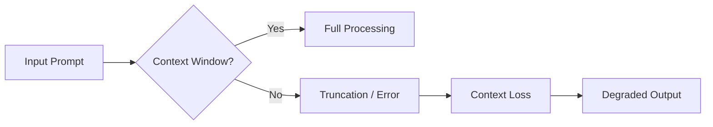

<div class="mt-6 p-4 bg-red-500/10 rounded-lg border border-red-500/30 text-sm">

**Real-world problem:** A 50K-line codebase is approx 100K+ tokens. Exceeds the context window of most models.

</div>

<div v-click class="mt-4 p-3 bg-green-500/10 rounded border border-green-500/30 text-sm">

**Solution:** Context pruning, RAG, strategic chunking — Module 3 topic

</div>

</div>

</div>

---
layout: default
---

# The Statistical Nature of Generated Code

<div class="mt-6">

### The LLM is a "probabilistic completer"

<div class="grid grid-cols-2 gap-8 mt-6">

<div>

```ts
// Input prompt
function sortArray(arr: number[]): number[] {
```

<div v-click>

```ts
// Generated output (most probable sequence)
function sortArray(arr: number[]): number[] {
  return arr.sort((a, b) => a - b)
}
```

</div>

</div>

<div v-click>

### What actually happens:

1. The model computes P(token | context) for every possible token
2. Selects or samples the most probable token
3. Repeats for each subsequent position
4. **It does not execute, compile, or verify**

</div>

</div>

<div v-click class="mt-8">

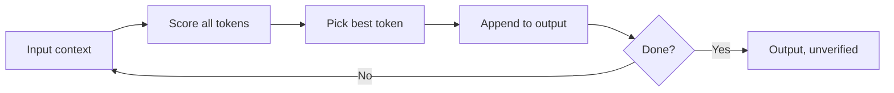

</div>

</div>

---
layout: statement
---

# LLMs don't "think"

## They predict the statistically<br />most probable token sequence

<div class="mt-8 text-lg opacity-70">
  <em>"It's just math. Really good math, but still math."</em>
</div>

---
layout: default
---

# Why Software Fundamentals Matter More Than Ever

<div class="grid grid-cols-2 gap-8 mt-8">

<div>

### The AI coding paradox

<div v-click class="mt-4">

AI writes code faster than any human, but:

- It doesn't understand the domain
- It doesn't know architectural constraints
- It can't test in a real environment
- It hallucinates with confidence

</div>

<div v-click class="mt-6">

### You need an engineer to:

- Validate semantics and correctness
- Apply SOLID principles
- Verify security and performance
- Guide the overall architecture

</div>

</div>

<div v-click class="mt-8">

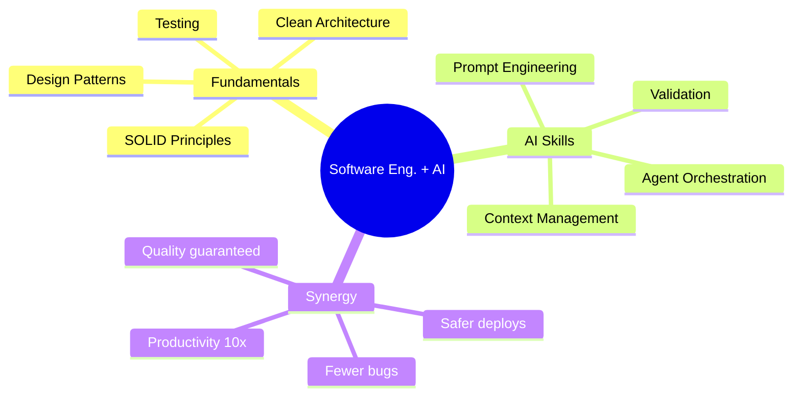

</div>

</div>

---
layout: center
class: text-center
---

# AI is an amplifier

<div class="mt-4 text-xl">

If you're a great engineer, AI makes you **extraordinary**<br />
If you're a bad engineer, AI makes you **dangerous**

</div>

<div v-click class="mt-12 text-lg opacity-70">
  <em>"AI won't replace developers.<br />Developers who use AI will replace developers who don't."</em>
</div>

---
layout: section
---

# Part 2
## What is an AI Agent?
### 30 minutes

---
layout: default
---

# LLM vs Agent: The Fundamental Difference

<div class="grid grid-cols-2 gap-8 mt-8 items-start">

<div>

### Traditional LLM

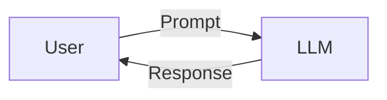

<div class="h-4"></div>

<div class="mt-4 p-4 bg-gray-500/10 rounded-lg">

- Input to Direct output
- No persistent memory
- No action capability
- Reacts, doesn't act

</div>

</div>

<div v-click>

### AI Agent

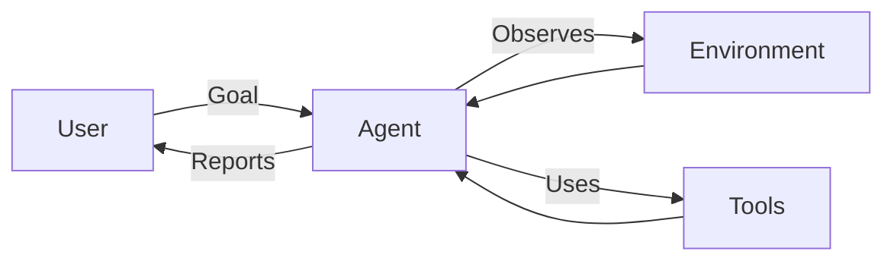

<div class="mt-4 p-4 bg-blue-500/10 rounded-lg">

- Perceives the environment
- Plans autonomously
- Acts through tools
- Iterates until goal is met

</div>

</div>

</div>

---
layout: default
---

# Chatbot vs Agent: A Comparison

<div class="grid grid-cols-2 gap-8 mt-6 items-start">

<div>

### Chatbot (ChatGPT, Claude chat)

- One-shot conversation
- No autonomous initiative
- No external tool access
- Context limited to chat
- Fast, immediate responses

<div v-click class="mt-6">

```ts
// Chatbot pattern
const response = await llm.chat(
  "Write a sorting function"
)
// User must copy, paste, test...
```

</div>

</div>

<div>

### Agent (Coding Agent)

- Autonomous and proactive
- Reads/writes filesystem
- Runs commands, tests, builds
- Iterates until correct
- Session memory

<div v-click class="mt-6">

```ts
// Agent pattern
await agent.run(
  "Implement optimized sorting"
)
// Agent: reads → writes → tests
// → fixes → commits (autonomously)
```

</div>

</div>

</div>

---
layout: default
---

# Agentic Engineering: Working WITH AI

<div class="mt-4">

### Not "using" AI, but "collaborating" with AI

<div class="grid grid-cols-2 gap-6 mt-4">

<div class="p-4 bg-gray-500/10 rounded-lg border border-gray-500/30">

### Traditional Paradigm

**User → Prompt → AI → Output**

- AI is a passive tool
- Developer does all the work
- AI completes atomic tasks

</div>

<div v-click class="p-4 bg-blue-500/10 rounded-lg border border-blue-500/30">

### Agentic Engineering

**User → Agent → Environment + Tools**

- AI is an active collaborator
- Delegate entire workflows
- Continuous feedback loop

</div>

</div>

<div v-click class="grid grid-cols-4 gap-3 mt-4">

<div class="p-3 bg-green-500/10 rounded-lg border border-green-500/30 text-sm">
  <b>Active delegation</b><br/>Ask "solve Y", not "write X"
</div>

<div class="p-3 bg-green-500/10 rounded-lg border border-green-500/30 text-sm">
  <b>Rich context</b><br/>Constraints, not just requests
</div>

<div class="p-3 bg-green-500/10 rounded-lg border border-green-500/30 text-sm">
  <b>Continuous validation</b><br/>Verify every step
</div>

<div class="p-3 bg-green-500/10 rounded-lg border border-green-500/30 text-sm">
  <b>Iteration</b><br/>Agent learns and self-corrects
</div>

</div>

</div>

---
layout: default
---

# Eugene Yan: Human-AI Collaboration Principles

<div class="mt-4">

### The mental framework for Agentic Engineering

<div class="grid grid-cols-2 gap-6 mt-4">

<div>

<div class="grid grid-cols-2 gap-3">

<div v-click class="p-3 bg-purple-500/10 rounded-lg border-l-4 border-purple-500">

**1. Define the Goal**<br/>Ask *what*, not *how*

</div>

<div v-click class="p-3 bg-purple-500/10 rounded-lg border-l-4 border-purple-500">

**2. Set Guardrails**<br/>Constraints over instructions

</div>

<div v-click class="p-3 bg-purple-500/10 rounded-lg border-l-4 border-purple-500">

**3. Trust but Verify**<br/>Validate continuously

</div>

<div v-click class="p-3 bg-purple-500/10 rounded-lg border-l-4 border-purple-500">

**4. Iterate to Quality**<br/>First output ≠ final output

</div>

</div>

</div>

<div v-click class="flex items-center justify-center">

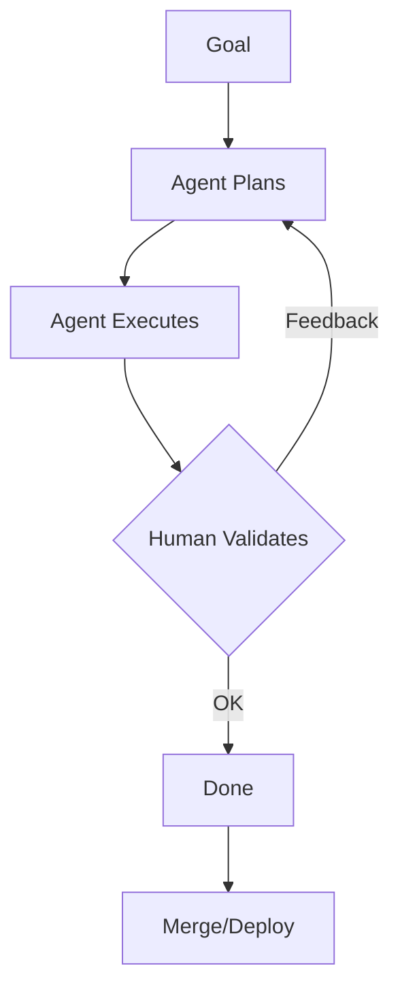

</div>

</div>

</div>

---
layout: statement
---

# From "AI as responder"<br />to "AI as operating engineer"

<div class="mt-8 text-lg opacity-70">
  <em>The fundamental mindset shift of this course</em>
</div>

---
layout: section
---

# Part 3
## The Agent Harness
### 30 minutes

---
layout: default
---

# Anatomy of an Agentic System

<div class="mt-4">

### The "shell" that turns an LLM into an agent

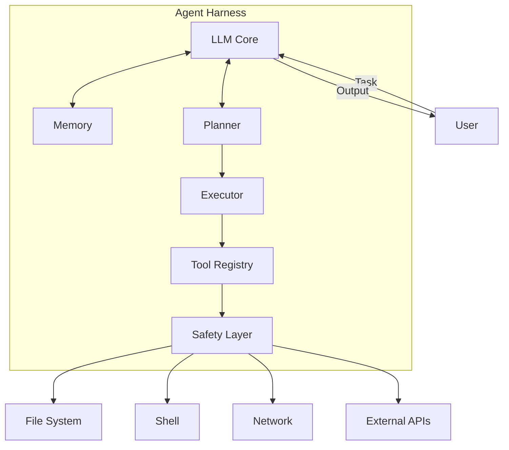

</div>

---
layout: two-cols
---

# Harness Components

<div class="mt-4">

### 1. LLM Core

- The "brain" of the agent
- Can be swapped (GPT, Claude, local model)
- Handles reasoning and generation

<div v-click class="mt-4">

### 2. Memory System

- Short-term memory (current conversation)
- Long-term memory (previous sessions)
- Context management (what to remember / discard)

</div>

</div>

::right::

<div class="ml-4 mt-4">

<div v-click>

### 3. Planner

- Breaks down complex tasks into sub-tasks
- Decides execution order
- Manages dependencies and priorities

</div>

<div v-click class="mt-4">

### 4. Tool Registry

- Catalog of available tools
- File system read/write
- Shell command execution
- API calls, web search, etc.

</div>

<div v-click class="mt-4">

### 5. Safety Layer

- Operation sandboxing
- Pre/post execution validation
- Rate limiting and permission control

</div>

</div>

---
layout: default
---

# Harness vs Generic Frameworks

<div class="grid grid-cols-2 gap-8 mt-6">

<div>

### Generic AI Frameworks

<div class="p-4 bg-red-500/10 rounded-lg mt-4">

- LangChain, CrewAI, AutoGPT...
- **Opinionated**: impose abstractions
- **Complex**: lots of boilerplate
- **Rigid**: hard to customize
- **Heavy**: dependency overhead

</div>

<div v-click class="mt-4">

```ts
// LangChain - typical example
import { ChatOpenAI } from 'langchain/chat_models/openai'
import { AgentExecutor } from 'langchain/agents'
import { Calculator } from 'langchain/tools/calculator'
// ... 30+ lines of configuration
```

</div>

</div>

<div v-click>

### Minimal Agent Harness

<div class="p-4 bg-green-500/10 rounded-lg mt-4">

- Mario Zechner's approach
- **Minimal**: only what's needed
- **Transparent**: understand every part
- **Flexible**: adapt to your use case
- **Lightweight**: zero unnecessary deps

</div>

<div v-click class="mt-4">

```ts
// Minimal Harness - concept
const agent = createAgent({
  model: 'gpt-4',
  tools: [readFile, writeFile, execShell],
  safety: { sandbox: true },
})

const result = await agent.run(
  "Refactor the auth module into TypeScript"
)
```

</div>

</div>

</div>

---
layout: default
---

# Lifecycle of an Agent Task

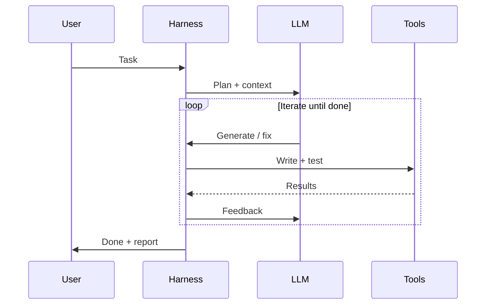

---
layout: default
---

# Safety Layer: Why It's Critical

<div class="grid grid-cols-2 gap-6 mt-6">

<div>

### Risks of an uncontrolled agent

<div v-click class="mt-4">

- Accidental deletion of files
- Destructive commands (`rm -rf`, `DROP TABLE`)
- Credentials leaked in logs
- Uncontrolled API calls
- Infinite loops of self-correction

</div>

<div v-click class="mt-6 p-4 bg-yellow-500/10 rounded border border-yellow-500/30">

**Real example:** An agent in a loop made 10,000 API calls in 5 minutes — $500 in costs!

</div>

</div>

<div v-click>

### Protection strategies

<div class="text-sm space-y-2">

**1. Sandboxing** — Docker container, virtual FS

**2. Command validation** — Allowlist + regex patterns

**3. Rate Limiting** — Max ops/min, circuit breaker

**4. Human-in-the-loop** — Confirm critical ops, manual override

**5. Logging & audit** — Full traceability, auto rollback

</div>

</div>

</div>

---
layout: section
---

# Part 4
## Design Patterns & Reasoning Loops
### 30 minutes

---
layout: default
---

# What Are Reasoning Loops?

<div class="mt-6">

### The core of agentic intelligence

<div class="grid grid-cols-2 gap-8 mt-6">

<div>

The reasoning loop is the cycle that allows the agent to:

1. **Observe** the current state
2. **Reason** about the next step
3. **Act** by executing an operation
4. **Evaluate** the result
5. **Iterate** until completion

<div v-click class="mt-4 p-4 bg-blue-500/10 rounded-lg">

**Metaphor:** Like a senior developer who writes code, runs tests, finds bugs, fixes them, retests — in a continuous loop.

</div>

</div>

<div v-click>

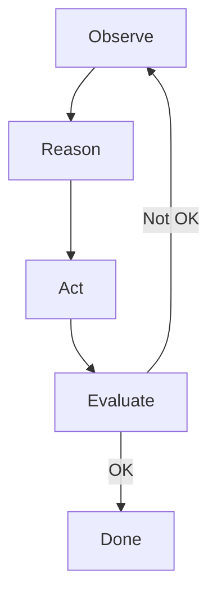

<div class="mt-2 p-1 bg-purple-500/10 rounded border border-purple-500/30 text-xs">

OODA: Observe → Orient → Decide → Act → Assess

</div>

</div>

</div>

</div>

---
layout: default
---

# Pattern 1: ReAct (Reasoning + Acting)

<div class="mt-6">

### The most widespread LLM agent pattern

<div class="grid grid-cols-2 gap-6 mt-4">

<div>

```
Thought: I need to calculate the user's age.
          I have the birth date in the DB.
Action: query_database("SELECT birth_date FROM users WHERE id=42")
Observation: 1990-03-15
Thought: Now I calculate the age.
Action: calculate("2024 - 1990")
Observation: 34
Thought: The user is 34. I'll respond.
Answer: The user is 34 years old.
```

</div>

<div v-click>

### ReAct pattern phases

1. **Thought** — The agent reasons about what to do
2. **Action** — Selects and uses a tool
3. **Observation** — Receives feedback
4. **Repeat** — Continues until answer is reached

<div class="mt-6 p-4 bg-green-500/10 rounded-lg">

Benefits:
- Explicit, traceable reasoning
- Self-correction when observation is unexpected
- Combines internal knowledge + external tools

</div>

</div>

</div>

</div>

---
layout: default
---

# Pattern 2: Chain-of-Thought (CoT)

<div class="mt-6">

### Explicit step-by-step reasoning

<div class="grid grid-cols-2 gap-6 mt-4">

<div>

### Without CoT

```
Q: If a train departs at 9:00 at 80 km/h
   and another at 9:30 at 120 km/h,
   when do they meet?
A: At 10:30
```

<div v-click class="mt-4">

Problem: You can't tell if the reasoning is correct. The LLM may have guessed.

</div>

</div>

<div v-click>

### With Chain-of-Thought

```
Q: If a train departs at 9:00 at 80 km/h
   and another at 9:30 at 120 km/h,
   when do they meet?

Reasoning:
- At 9:30, train A has covered 40 km
- The trains approach at 80+120=200 km/h
- Time to close 40 km = 40/200 = 0.2h = 12 min
- They meet at 9:42
```

<div class="mt-4">

Benefit: The reasoning is verifiable. We can validate each step.

</div>

</div>

</div>

</div>

---
layout: default
---

# Pattern 3: Plan-and-Solve

<div class="mt-4">

### For complex tasks requiring decomposition

<div class="mt-4">

```
TASK: "Migrate PostgreSQL to MongoDB maintaining all relationships"

PLAN:
1. Analyze existing schema
2. Identify relationships & constraints
3. Design document model
4. Write migration script
5. Run on test, validate, fix
6. Deploy with rollback plan
```

</div>

<div v-click class="mt-4 grid grid-cols-2 gap-4">

<div class="p-3 bg-blue-500/10 rounded-lg">

### Benefits
- Plan visibility
- Each step is validatable
- Pause/resume possible
- Parallelism where applicable

</div>

<div class="p-3 bg-yellow-500/10 rounded-lg">

### Watch out
- Agent may over-engineer
- Human validation on plan needed
- Plans can become outdated

</div>

</div>

</div>

---
layout: default
---

# Pattern 4: Reflection & Self-Correction

<div class="mt-6">

### The agent critically evaluates its own output

<div class="grid grid-cols-2 gap-6 mt-4">

<div>

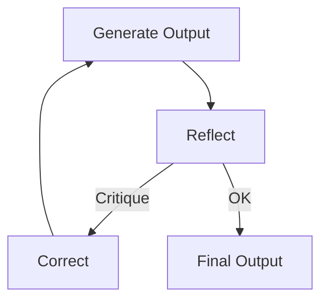

<div class="mt-2">

### How it works:

<div class="text-sm">

1. The agent generates a solution
2. The agent itself (or a second agent) evaluates it
3. Identifies issues and corrects them
4. Repeats until quality is sufficient

</div>

</div>

</div>

<div v-click class="flex items-center justify-center">

<div class="p-4 bg-blue-500/10 rounded-lg border border-blue-500/30 text-center">

### Self-critique loop

**Generate → Reflect → Correct → Repeat**

The agent acts as its own reviewer,<br/>catching mistakes before the human sees them.

</div>

</div>

</div>

</div>

---
layout: default
---

# Pattern 4: Reflection & Self-Correction (example)

<div class="mt-6">

### Self-reflection in practice

<div class="grid grid-cols-2 gap-6">

<div>

```
Generate: I wrote this sorting function.
          function sort(arr) { return arr.sort() }
```

</div>

<div v-click>

```
Reflect:  Critique -
          1. Missing type annotation
          2. Default sort is lexicographic,
             not numeric!
          3. Missing empty array handling
          4. Not pure (mutates input)
```

</div>

</div>

<div v-click class="mt-6">

```
Correct:  function sortNumbers(arr) {
           if (!arr.length) return []
           return [...arr].sort((a, b) => a - b)
         }
```

<div class="mt-4 p-3 bg-green-500/10 rounded-lg border border-green-500/30 text-center">

The reflection loop caught 4 issues the human might have missed

</div>

</div>

</div>

---
layout: default
---

# Pattern 5: Tool Use and Function Calling

<div class="mt-6">

### Giving the agent the ability to interact with the world

<div class="grid grid-cols-2 gap-6 mt-6">

<div>

### Tool Definition

```ts
const tools = [
  {
    name: "read_file",
    description: "Reads a file from the filesystem",
    parameters: {
      path: "string (file path)",
    }
  },
  {
    name: "write_file",
    description: "Writes content to a file",
    parameters: {
      path: "string",
      content: "string",
    }
  },
  {
    name: "execute_command",
    description: "Runs a shell command",
    parameters: {
      command: "string",
      timeout: "number?",
    }
  },
  {
    name: "search_codebase",
    description: "Searches the codebase",
    parameters: {
      query: "string",
      fileTypes: "string[]?",
    }
  }
]
```

</div>

<div v-click>

### Best Practices for Tools

<div class="mt-4 space-y-3">

<div class="p-3 bg-green-500/10 rounded-lg">

**1. Precise descriptions**
The model chooses which tool to use based on the description. Be exhaustive.

</div>

<div class="p-3 bg-green-500/10 rounded-lg">

**2. Typed parameters**
Use precise types (string, number, boolean, enum). Avoid "any".

</div>

<div class="p-3 bg-green-500/10 rounded-lg">

**3. Explicit error handling**
Every tool must return clear, actionable errors.

</div>

<div class="p-3 bg-green-500/10 rounded-lg">

**4. Idempotency**
Tools should be safe to call multiple times.

</div>

</div>

</div>

</div>

</div>

---
layout: two-cols
---

# Pattern 6: Multi-Agent Delegation

<div class="mt-4">

### An architect agent + specialized agents

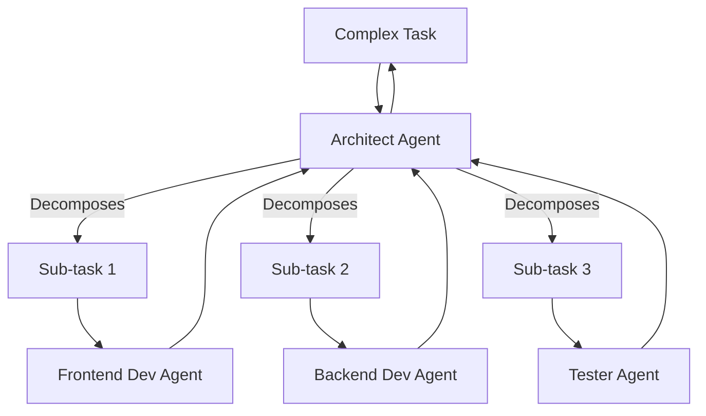

</div>

::right::

<div class="ml-4 mt-4">

<div v-click>

### Pros

- Each agent has a narrow context
- Role specialization
- Parallel execution possible
- Better domain quality

</div>

<div v-click class="mt-4">

### Cons

- Coordination overhead
- Complex inter-agent communication
- Multiplied costs
- Harder debugging

</div>

<div v-click class="mt-6 p-3 bg-yellow-500/10 rounded-lg text-sm">

**Golden rule:** Always start with a single agent. Add multi-agent complexity only when necessary.

</div>

</div>

---
layout: default
---

# Design Pattern Comparison

<div class="mt-4">

<div class="text-sm">

| Pattern | Strength | When to use | Complexity |
|---------|----------|-------------|------------|
| **ReAct** | Reasoning + action | External tools needed | Medium |
| **Chain-of-Thought** | Transparent reasoning | Logic & debugging | Low |
| **Plan-and-Solve** | Decomposition | Complex multi-step | High |
| **Reflection** | Self-improvement | Quality-critical output | Medium |
| **Tool Use** | World interaction | Any production task | Medium |
| **Multi-Agent** | Specialization | Large-scale systems | Very High |

</div>

<div v-click class="mt-4 p-3 bg-blue-500/10 rounded-lg border border-blue-500/30">

**Start here:** **ReAct + Tool Use + Reflection** — the winning triplet for agentic coding.

</div>

</div>

---
layout: default
---

# The Reasoning Loop in Agentic Coding

<div class="mt-4">

### How it applies to coding assistance:

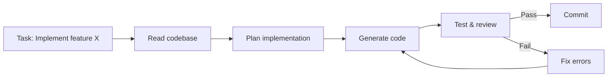

<div v-click class="mt-4 grid grid-cols-3 gap-4 text-center">

<div class="p-3 bg-gray-500/10 rounded-lg">

### Observe
Read files, run tests, analyze errors

</div>

<div class="p-3 bg-gray-500/10 rounded-lg">

### Reason
Plan, decompose, decide approach

</div>

<div class="p-3 bg-gray-500/10 rounded-lg">

### Act
Write code, run commands, commit

</div>

</div>

</div>

---
layout: statement
class: text-center
---

# Lesson Summary

<div class="mt-8 grid grid-cols-2 gap-6 text-left">

<div class="p-4 bg-blue-500/10 rounded-lg">

### LLM Fundamentals
- Tokenization and context windows
- Statistical nature of generated code
- Software fundamentals matter more than ever

</div>

<div class="p-4 bg-blue-500/10 rounded-lg">

### What is an Agent
- Difference between LLM and Agent
- Chatbot vs AI Agent
- Agentic Engineering as collaboration

</div>

<div class="p-4 bg-blue-500/10 rounded-lg">

### Agent Harness
- Anatomy of the agentic system
- Memory, Planner, Tools, Safety
- Minimalism vs heavy frameworks

</div>

<div class="p-4 bg-blue-500/10 rounded-lg">

### Design Patterns
- ReAct, CoT, Plan-and-Solve
- Reflection and Self-Correction
- Tool Use and Multi-Agent Delegation

</div>

</div>

---
layout: center
class: text-center
---

# Next Lesson

## Lesson 1: The Agentic Engineering Mindset

<div class="mt-8">

Environment setup<br />
Execution permission configuration<br />
"Active Delegation" exercise<br />

</div>

<div class="mt-12 text-lg opacity-50">
  <em>"Stop using AI as a chatbot<br />and start treating it as an operating engineer."</em>
</div>

---
layout: end
---

# Questions?

<div class="mt-12 text-center opacity-50">

### References

- Brendan O'Leary — Agentic Engineering
- Eugene Yan — Human-AI Collaboration Patterns
- Agentic Design Patterns (Handbook)
- Agent Harness vs Everything

</div>
