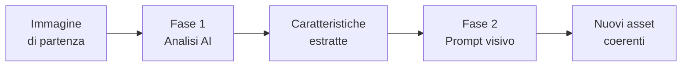

# AI per UI/UX

## Sessione 1 — Reiterazione dello Stile Visivo

  Percorso in 3 sessioni — UI/UX Department

---
layout: default
---

# Perché l'AI nel Design?

### <twemoji-snail /> Senza AI

- Analizzi ogni immagine a occhio
- Estrai palette colore a mano
- Cerchi reference una per una
- Scrivi prompt solo dopo tentativi
- Ogni nuovo asset richiede ricominciare

### <twemoji-high-voltage /> Con l'AI

**Analisi istantanea** — carichi un'immagine e l'AI estrae stile, colori, proporzioni

**Prompt automatico** — dall'analisi l'AI genera il prompt per nuovi asset coerenti

**Variazioni infinite** — stesso stile, temi diversi, in pochi secondi

  Oggi partiamo dal workflow <b>più semplice</b> e <b>più immediato</b> da integrare.

---
layout: section
---

# Il Percorso in 3 Sessioni

### <twemoji-green-circle /> Oggi — Sessione 1

**Reiterazione dello Stile**

Il più semplice: analizza → prompt → genera

<twemoji-stopwatch /> 30-40 minuti

### <twemoji-yellow-circle /> Sessione 2

**Brand Identity**

Dall'ascolto del cliente alla brand guide

<twemoji-stopwatch /> 60 minuti

### <twemoji-blue-circle /> Sessione 3

**UI/UX Prototype**

Dalla discovery al prototipo animato su Figma

<twemoji-stopwatch /> 90 minuti

  Ogni sessione aggiunge complessità. Si parte da ciò che l'AI fa meglio.

---
layout: default
---

# Il Workflow: 2 Fasi

### <twemoji-magnifying-glass-tilted-left /> Fase 1 — Analisi

L'AI estrae oggettivamente:
- Tipo di segno (linea / forma piena)
- Spessore del tratto
- Palette colori (HEX)
- Dettagli: angoli, curve, proporzioni
- Per foto: inquadratura, composizione, tono

### <twemoji-writing-hand /> Fase 2 — Prompt

L'analisi diventa automaticamente un prompt:
- Descrizione sintetica dello stile
- Ottimizzato per Midjourney / DALL·E
- Riferimento all'immagine originale
- Pronto per generare variazioni

---
layout: default
---

# Fase 1 — Analisi dell'Immagine

### <twemoji-magnifying-glass-tilted-left /> Icone e Illustrazioni

<b>Prompt da usare:</b>

*"Analizza lo stile di questa icona/illustrazione: tipo di segno (linea o forma piena), spessore del tratto, colori utilizzati (HEX), proporzioni, livello di dettaglio, angoli e curve. Elenca le caratteristiche oggettive in una lista."*

<b>Cosa ottieni:</b>
- <twemoji-check-mark-button /> Linea / forma piena
- <twemoji-check-mark-button /> Spessore tratto (px)
- <twemoji-check-mark-button /> Palette esatta (HEX)
- <twemoji-check-mark-button /> Raggio angoli, tipo curve
- <twemoji-check-mark-button /> Livello di dettaglio

### <twemoji-camera-with-flash /> Immagini Fotografiche

<b>Prompt da usare:</b>

*"Analizza questa immagine: tipo di inquadratura, composizione, palette cromatica dominante (HEX), tono e atmosfera generale, coerenza tra soggetti."*

<b>Cosa ottieni:</b>
- <twemoji-check-mark-button /> Distanza / angolo
- <twemoji-check-mark-button /> Regola compositiva
- <twemoji-check-mark-button /> Palette dominante
- <twemoji-check-mark-button /> Mood / atmosfera
- <twemoji-check-mark-button /> Stile fotografico

---
layout: default
---

# Fase 2 — Dal Prompt alla Generazione

### <twemoji-writing-hand /> Step 1: Converti l'analisi in prompt

Prendi l'output della Fase 1 e chiedi all'AI:

*"Converti questa analisi stilistica in un prompt ottimizzato per Midjourney, per generare nuove [icone / illustrazioni / immagini] coerenti con lo stesso stile."*

### <twemoji-artist-palette /> Step 2: Genera nuovi asset

Usa il prompt generato in Midjourney, DALL·E o Adobe Firefly:

*"Set of 6 [tema] icons in [stile], [spessore tratto], [palette], consistent stroke, SVG style, white background, grid layout"*

### <twemoji-counterclockwise-arrows-button /> Step 3: Itera e rifinisci

- Seleziona i risultati migliori
- Aggiusta manualmente su Figma se necessario
- Salva il prompt come template per progetti futuri

---
layout: default
---

# Tre Casi d'Uso

### <twemoji-large-blue-diamond /> Icone

**Analisi:**
- Linea vs forma piena
- Spessore tratto
- Palette

**Prompt:**
*"12 outline icons, 2px stroke, #2E74B5, rounded corners 4px, minimal, for [theme]"*

Esempio: espandere un set di icone da 4 a 20

### <twemoji-large-blue-diamond /> Illustrazioni

**Analisi:**
- Tratto / forma piena
- Palette colori
- Livello dettaglio

**Prompt:**
*"Illustration in flat style, [palette], [livello dettaglio], [tema], corporate but friendly, 4:3"*

Esempio: nuova sezione hero coerente con le illustrazioni esistenti

### <twemoji-large-blue-diamond /> Immagini

**Analisi:**
- Inquadratura
- Composizione
- Mood

**Prompt:**
*"Professional photo, [inquadratura], [composizione], [mood], [soggetto], natural light, 16:9"*

Esempio: nuovi hero shot coerenti con lo stile fotografico del brand

---
layout: default
---

# Toolbox — Sessione 1

### <twemoji-speech-balloon /> Per l'analisi

**ChatGPT (GPT-4o)**
Vision integrata — carichi l'immagine e analizza in un passaggio

**Claude**
Analisi testuale dettagliata, output strutturato

### <twemoji-artist-palette /> Per la generazione

**Midjourney**
Il migliore per coerenza stilistica, reference image

**Adobe Firefly**
Integrato con Creative Cloud, perfetto per ritocchi

**DALL·E 3**
Ottimo per iterazioni rapide, integrato in ChatGPT

---
layout: default
---

# Proviamolo — Esercizio Guidato

### <twemoji-bullseye /> Obiettivo

Hai un set di 4 icone outline. Devi produrne altre 6 nello stesso stile.

<b>1. Carica l'icona in ChatGPT</b>
Usa il prompt di analisi:
*"Analizza lo stile di questa icona: tipo di segno, spessore tratto, colori, proporzioni, dettagli."*

<b>2. Chiedi di convertire in prompt Midjourney</b>
*"Converti questa analisi in un prompt Midjourney per generare 6 nuove icone per i temi: impostazioni, utente, notifica, download, upload, calendario."*

<b>3. Genera in Midjourney / DALL·E</b>
Prendi il prompt e genera. Seleziona i risultati migliori.

<b>4. Aggiusta su Figma</b>
Importa le icone, verifica coerenza, aggiusta dettagli se necessario.

<b><twemoji-stopwatch /> Tempo stimato:</b> 15 minuti (contro 1-2 ore ridisegnando a mano)

---
layout: default
---

# Riepilogo — Sessione 1

### <twemoji-check-mark-button /> Cosa hai imparato

- Caricare un'immagine e far analizzare lo stile all'AI
- Convertire l'analisi in un prompt generativo
- Generare nuovi asset visivi coerenti
- Iterare per affinare il risultato

### <twemoji-key /> Key takeaway

- **L'analisi è il superpotere** — un buon prompt nasce da una buona analisi
- **Non serve reinventare** — l'AI replica stili esistenti in modo sorprendente
- **Tu decidi cosa tenere** — l'AI propone, il designer seleziona e rifinisce

  Da oggi: ogni volta che devi produrre asset coerenti con uno stile esistente, 
  <b>prima analizza con AI, poi genera.</b>

---
layout: center
class: text-center
---

# Prossima Sessione

## Brand Identity — Con l'AI

  Dall'ascolto del cliente alla brand guide. 
  Benchmark automatizzati, concept generativi, 
  documentazione accelerata.

  <twemoji-yellow-circle /> Sessione 2 di 3 — complessità intermedia

