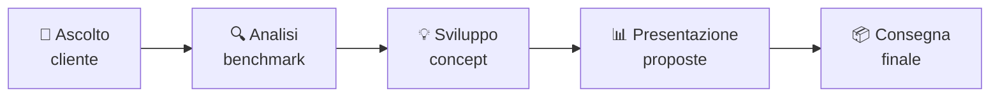

# AI per UI/UX

## Sessione 2 — Brand Identity

  Percorso in 3 sessioni — UI/UX Department

---
layout: default
---

# Recap — Sessione 1

### ✅ Abbiamo visto

- Analisi automatica dello stile visivo con AI
- Conversione analisi → prompt generativo
- Generazione di nuovi asset coerenti (icone, illustrazioni, foto)

### 🎯 Oggi andiamo oltre

- Dalla singola immagine all'**intero sistema di brand**
- Dalla generazione di asset alla **strategia visiva**
- Dall'analisi dell'esistente alla **creazione da zero**

---
layout: section
---

# Brand Identity con l'AI

## Il workflow completo

  5 fasi — per ciascuna vedremo <b>dove</b> e <b>come</b> l'AI ti accelera

---
layout: default
---

# 1. Ascolto e Intervista — Preparati con l'AI

### 🎯 Prima del meeting

<b>Genera domande mirate</b>

*"Devo intervistare il fondatore di [azienda, settore] per definire la brand identity. Genera 15 domande organizzate per: missione/valori, target, competitor, personalità, preferenze visive."*

<b>Ricerca pre-meeting</b>

*"Fammi una sintesi del settore [X]: trend attuali, competitor principali, pubblico target tipico, tono di voce dominante."*

<b>Definisci il tono di voce</b>

*"Suggerisci 3 opzioni di tono di voce per un brand che vuole essere percepito come [aggettivi]. Per ciascuna: headline, CTA, messaggio social."*

  ⏱️ Risparmio: 30-45 min di preparazione → 5 min di revisione

### 📝 Dopo il meeting

<b>Trascrizione → Brief strutturato</b>

Carica la trascrizione e chiedi:
*"Estrai: missione, valori, target, vincoli visivi, preferenze esplicite. Struttura come brief creativo in sezioni."*

<b>Estrai keyword visive</b>

*"Da questa intervista, estrai 10 parole chiave visive che guidino la direzione creativa."*

<b>Primi spunti creativi</b>

*"Basandoti su questo brief, suggerisci 3 direzioni creative possibili con una frase per ciascuna."*

---
layout: default
---

# 2. Analisi Benchmark — Automatizzata

### 🔍 Mappa competitiva in minuti

L'AI analizza decine di competitor in pochi secondi.

<b>Analisi strutturata</b>
*"Analizza i brand [A, B, C, D]. Per ciascuno: stile logo, palette, tipografia, tono visivo, punti di forza e debolezze. Formato tabella confrontabile."*

<b>Identifica pattern e gap</b>
*"Da questa analisi comparativa, quali pattern dominano nel settore? Dove c'è spazio per differenziarsi? Cosa evitare perché inflazionato?"*

<b>Moodboard comparativa</b>
Midjourney / DALL·E:
*"Visual moodboard of [industry] brand identities, grid of 6 examples per category: logos, colors, typography, business cards, social media"*

  ⏱️ Risparmio: 3-4 ore di ricerca manuale → 30 minuti

### 🛠️ Strumenti

**ChatGPT / Claude** — Analisi testuale e comparativa
Carica screenshot dei competitor, chiedi analisi visiva.

**Midjourney** — Moodboard generation
*"Brand identity moodboard, [industry], [keywords], professional, grid layout, clean"*

**Are.na + AI** — Raccogli reference, poi chiedi all'AI di descrivere i pattern visivi comuni.

---
layout: default
---

# 3. Sviluppo Concept — Con l'AI Generativa

### 💡 Esplora senza disegnare

Prima di aprire Illustrator, usa l'AI per esplorare direzioni.

<b>Genera concept da keyword</b>
*"Sviluppa 2 direzioni creative distinte per un brand [settore] con valori [X, Y, Z]. Per ciascuna: nome del concept, logica visiva, palette suggerita, riferimento culturale."*

<b>Esplora simboli e metafore</b>
*"Quali simboli visivi rappresentano il concetto di [valore]? Suggerisci 10 idee, dalle più letterali alle più astratte. Per ciascuna spiega la connessione."*

### 🎨 Generazione asset

<b>Logo exploration</b>
*"Minimalist logo for [brand], [industry], [keywords], vector, flat, white background, 1:1 --ar 1:1"*

<b>Icon set coerente</b>
*"Set of 12 outline icons for [theme], 2px stroke, [palette], minimal, SVG style, grid layout"*

<b>Template presentazione</b>
*"Presentation template, [brand colors], modern clean, title + section + content + closing, 16:9, mockup"*

<b>Biglietto da visita / Stationery</b>
*"Business card mockup, [brand], [colors], minimal, on desk, photorealistic, 3:2"*

---

# 3. Sviluppo Concept — Con l'AI Generativa (continua)

### ⚠️ Attenzione

- L'AI esplora possibilità, <b>non</b> produce il logo finale
- Usa l'output come <b>ispirazione</b>, non come consegna
- Il logo definitivo richiede vettorializzazione e rifinitura
- Verifica sempre l'originalità rispetto ai competitor

### ✅ Best practice

- Genera <b>tante varianti</b> (20+) e seleziona le migliori
- Usa le reference image in Midjourney per guidare lo stile
- Combina output AI come <b>base</b> + ritocco manuale in Illustrator
- Salva i prompt che funzionano come template riutilizzabili

---
layout: default
---

# 4. Presentazione Proposte — Potenziata

### 📄 Documentazione automatica

<b>Razionale creativo</b>
*"Scrivi un razionale creativo per un brand identity concept basato su [keyword e simboli]. Includi: ispirazione, scelte visive, connessione coi valori del brand. Tono professionale ma accessibile."*

<b>Descrizione delle proposte</b>
*"Ho 2 proposte di logo: [concept A] + [concept B]. Scrivi una descrizione comparativa per il cliente che spieghi i punti di forza di ciascuna."*

<b>Mockup e applicazioni</b>
Genera con Midjourney:
*"Brand identity presentation on iPad, [logo] on screen, clean desk, photorealistic, 16:9"*

### 🎯 Perché funziona

- Il cliente capisce meglio il concept se lo vede applicato
- Il razionale scritto bene vende la tua idea
- Dedichi tempo al design, non alla scrittura

<b>⏱️ Risparmio:</b> 1-2 ore di scrittura e impaginazione → 20 minuti di revisione AI

---
layout: default
---

# 5. Consegna Finale — Brand Guide Accelerata

### 📘 Struttura della brand guide

L'AI ti genera la struttura e i contenuti testuali.

<b>Genera la struttura</b>
*"Struttura una brand guide completa con queste sezioni: logo (versioni, proporzioni, spazi di rispetto, usi non consentiti), palette colori (HEX, RGB, CMYK, Pantone), tipografia (famiglie, scale, pesi, usi), tono visivo (stile fotografico, illustrativo, iconografico), esempi di applicazione."*

<b>Regole di utilizzo</b>
*"Scrivi le regole di utilizzo del logo per: spazi di rispetto, dimensioni minime, versioni consentite, usi non consentiti. Stile chiaro, adatto a una brand guide."*

### 🚀 Checklist e template

<b>Checklist di consegna</b>
*"Cosa non deve mancare in una brand guide completa da consegnare al cliente? Fammi una checklist."*

<b>Template PPT</b>
Usa Gamma.app o chiedi all'AI:
*"Crea la struttura di un template PowerPoint per [brand]. Slide: copertina, indice, sezione, contenuto, chiusura. Layout pulito, [colori], [tipografia]."*

  ⏱️ Risparmio: 2-3 ore di documentazione → 30 minuti

---
layout: default
---

# Riepilogo — Sessione 2

### ✅ Cosa hai imparato

- Preparare l'intervista cliente con domande generate dall'AI
- Automatizzare l'analisi benchmark dei competitor
- Esplorare concept creativi con AI generativa
- Generare razionali creativi e documentazione
- Accelerare la consegna della brand guide

### 🔑 Key takeaway

- **L'AI non crea il logo finale** — esplora, ispira, accelera
- **Il testo è metà del lavoro** — l'AI scrive razionali, regole, descrizioni
- **L'analisi benchmark è il risparmio più grande** — da ore a minuti
- **Tu resti il direttore creativo** — l'AI è il tuo assistente

  Dalla prossima brand identity, integra l'AI in <b>ogni fase</b> del processo. 
  Non per sostituirti, ma per <b>restituirti tempo creativo</b>.

---
layout: center
class: text-center
---

# Prossima Sessione

## UI/UX Prototype — Con l'AI

  Dalla discovery al prototipo animato su Figma. 
  Wireframe, visual design, animazioni, 
  tutto accelerato dall'AI.

  🔵 Sessione 3 di 3 — la più complessa e completa

