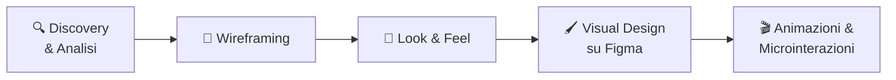

# AI per UI/UX

## Sessione 3 — UI/UX Prototype

  Percorso in 3 sessioni — UI/UX Department

---
layout: default
---

# Il Percorso Completo

### ✅ Sessione 1

**Reiterazione Stile**

Analisi → prompt → generazione

### ✅ Sessione 2

**Brand Identity**

Ascolto → benchmark → concept → consegna

### 🔵 Oggi — Sessione 3

**UI/UX Prototype**

Discovery → wireframe → visual → animazione

  Il workflow più complesso. Mettiamo insieme tutto.

  Oggi applichiamo l'AI al flusso completo di progettazione di un'interfaccia.

---
layout: section
---

# UI/UX Prototype con l'AI

## 5 Fasi

---
layout: default
---

# 1. Discovery e Analisi — Con l'AI

### 📋 Da caos a struttura

Note sparse, call, email → mappa navigazione e feature list.

<b>Competitor analysis istantanea</b>
*"Analizza le app [X, Y, Z]. Crea una tabella comparativa di: navigazione, pattern UX, onboarding, gestione errori, punti di forza e debolezze UI."*

<b>Genera domande per interviste utente</b>
*"Genera 10 domande per un'intervista utente sul tema [X]. Target: [Y]. Obiettivo: capire bisogni e pain point attuali."*

<b>Sintesi automatica da note grezze</b>
Dai in pasto trascrizioni di call, email, brief → AI produce:
- Mappa della navigazione
- Lista feature prioritizzate (must-have vs nice-to-have)
- Vincoli tecnici e di design

  ⏱️ Risparmio: 2-3 ore di sintesi → 15 minuti di revisione

### 🗺️ Output strutturato

<b>Prompt per la mappa:</b>
*"Per un'app di [tipo] con queste feature [elenco], quali sono le schermate principali e come si collegano? Qual è il flusso utente principale?"*

<b>Prompt per le priorità:</b>
*"Classifica queste feature [elenco] in must-have e nice-to-have per un MVP. Spiega perché per ciascuna."*

<b>Prompt per i vincoli:</b>
*"Basandoti sul framework [nome], quali vincoli di design devo considerare? Cosa posso e non posso fare?"*

---
layout: default
---

# 2. Wireframing — Con l'AI

### 📐 Da funzionalità a struttura

<b>Architettura delle schermate</b>
*"Per un'app di [tipo] con queste feature [elenco], quali schermate servono? Per ciascuna: azione principale, cosa vede l'utente per primo, cosa è secondario."*

<b>Suggerisci componenti per schermata</b>
*"Per la schermata [nome], che deve fare [azione], quali componenti UI sono più adatti? Considera che usiamo [framework]. Suggerisci layout e gerarchia."*

<b>Genera copy e microtesti</b>
*"Scrivi 5 varianti per il titolo e la CTA di una pagina che fa [X]. Tono: [brand voice]. Target: [utente]."*

### 🤖 Tool specializzati

<b>Uizard</b> — Sketch / screenshot → wireframe
Carica uno schizzo o screenshot, genera wireframe interattivo editabile.

<b>Galileo AI</b> — Testo → UI design
Descrivi la schermata in linguaggio naturale, genera il design completo.

<b>Figma AI</b> — Plugin nativo
Genera layout, auto-layout, dummy content, varianti di componente.

  <b>💡 Pro tip:</b> Usa l'AI per il <b>pensiero strutturale</b> (cosa va dove) e i tool per la <b>traduzione visiva</b> (come appare).

---
layout: default
---

# 3. Look & Feel — Con l'AI

### 🎨 Sistema visivo prima del design

<b>Generazione palette</b>
*"Genera una palette colori per un'app [settore] con tono [emozione]. Fornisci: primary, secondary, accent, success, warning, error, neutral scale (50-900). HEX per ciascuno."*

<b>Pairing tipografici</b>
*"Suggerisci 3 pairing tipografici per un'interfaccia [tipo]. Deve funzionare su [framework]. Includi: heading font, body font, scale (px), pesi."*

<b>Tono visivo</b>
*"Descrivi un mood visivo per [prodotto] che comunichi [valori]. Stile: [riferimenti]. Includi: trattamento immagini, iconografia, uso dello spazio."*

### 🛠️ Strumenti dedicati

<b>Khroma</b> — AI color palette
Si allena sui colori che preferisci, genera combinazioni infinite con anteprima su UI.

<b>Fontjoy</b> — AI font pairing
Deep learning per abbinamenti tipografici armonici con preview live.

<b>Midjourney / DALL·E</b> — Moodboard
*"UI moodboard for [tipo] app, [stile], [colori], clean interfaces, 16:9, grid of 6"*

  <b>💡 Pro tip:</b> Chiedi all'AI di adattare palette e tipografia al framework (Material, PrimeNG) per garantire implementabilità.

---
layout: default
---

# 4. Visual Design su Figma — Con l'AI

### 🖌️ Componenti e varianti

<b>Genera varianti di un componente</b>
*"Ho un pulsante primario con stile [colore, border-radius, padding]. Generami le specifiche per gli stati: default, hover, active, disabled, loading, error. Tema: [brand]."*

<b>Design system in miniatura</b>
*"Definisci un mini design system con token per: spacing (scale 4-32), border-radius (3 scale), shadow (3 livelli), font-scale (6 taglie). Adatto a [framework]. Output: tabella."*

<b>Dati realistici per mockup</b>
*"Genera 20 righe di dati fittizi in italiano per una tabella di [tipo]. Formato JSON. Includi: [campi]."*

### 🔌 Plugin Figma + AI

<b>Figma AI</b>
- Auto-layout intelligente
- Riempimento automatico con dati
- Suggerimenti in linea col design system

<b>Magician</b>
- Testo → icone SVG direttamente in Figma
- Riscrittura copy nei frame
- Generazione immagini da prompt

<b>Similayer</b>
- Seleziona elementi simili in un click
- Rinomina e organizza layer automaticamente

  ⚠️ L'AI accelera la costruzione. La coerenza visiva e l'usabilità restano tue.

---
layout: default
---

# 5. Animazioni e Microinterazioni — Con l'AI

### 🎬 Specifiche di animazione

L'animazione serve a rendere esplicito il cambio di stato.

<b>Genera specifiche</b>
*"Per un dropdown che si apre, suggerisci durata, easing curve e comportamento dell'animazione. Output: durata, CSS easing, descrizione del comportamento."*

<b>Microinterazioni complete</b>
*"Quali microinterazioni servono in una tabella che supporta: filtro, ordinamento, espansione riga, selezione multipla? Per ciascuna: trigger, animazione, feedback visivo."*

<b>Genera codice CSS / Lottie</b>
*"Scrivi il CSS per un'animazione di skeleton loading. 3 varianti: card (370x200), riga tabella (full width x 48), avatar (40x40 circle)."*

### 🛠️ Strumenti

<b>Jitter</b> — Animazioni UI senza codice
Importa da Figma, anima con timeline visuale. Export video/GIF/Lottie.

<b>Rive</b> — Animazioni interattive
State machine visuali per microinterazioni complesse. Export per web e mobile.

<b>LottieFiles</b> — Player + editor
Libreria di animazioni pronte + AI per generare nuove. Integrazione con Figma.

---
layout: default
---

# Riepilogo Finale — Dove l'AI ti Accelera

### ⚡ L'AI è già forte in

- ✅ **Analisi competitor e benchmark** — da ore a minuti
- ✅ **Generazione testi**: copy, CTA, microcopy, razionali, documentazione
- ✅ **Generazione asset**: moodboard, icone, illustrazioni, varianti
- ✅ **Esplorazione palette e tipografia** — combinazioni illimitate
- ✅ **Specifiche tecniche**: CSS, easing, token, scale
- ✅ **Sintesi**: da note sparse a documenti strutturati
- ✅ **Reiterazione stile**: da 1 immagine a N asset coerenti

### 🧠 Serve il tuo giudizio per

- 🧠 **Scelte strategiche** — l'AI non conosce il cliente
- 🧠 **Coerenza complessiva** — gusto e occhio restano tuoi
- 🧠 **Fattibilità tecnica** — l'AI ignora i vincoli reali del framework
- 🧠 **Relazione col cliente** — empatia, ascolto, fiducia
- 🧠 **Approvazione finale** — l'AI propone, tu decidi

La regola d'oro

  L'AI ti fa risparmiare il <b>60-70% del tempo operativo</b> 
  (ricerca, bozze, varianti, documentazione). 
  Tu investi il tempo guadagnato nella <b>qualità strategica e creativa</b>.

---
layout: default
---

# Piano di Adozione — Da Dove Iniziare

### 🟢 Subito — Questa settimana

- **ChatGPT/Claude** per analisi competitor e benchmark
- Prompt per generare domande intervista
- Sintesi automatica note meeting → brief
- Analisi stile da immagine (Sessione 1)

  ⏱️ Impatto immediato, curva di apprendimento minima

### 🟡 Prossimo mese

- **Midjourney/DALL·E** per moodboard e asset exploration
- **Figma AI** e **Magician** nel workflow quotidiano
- **Khroma / Fontjoy** per palette e tipografia
- Brand identity assistita (Sessione 2)

  Richiede un po' di pratica con i prompt generativi

### 🔵 Entro 2-3 mesi

- **Uizard / Galileo AI** per wireframe rapidi
- **Jitter / Rive** per animazioni e prototipi
- **Reiterazione stile** sistematica nell'asset pipeline
- UI/UX prototype end-to-end (Sessione 3)

  Workflow completamente integrato

  <b>Non serve rivoluzionare tutto subito.</b> Un tool alla volta, un workflow alla volta.

---
layout: default
---

# Toolbox Completo

### 💬 Chat / Analisi

- **ChatGPT (GPT-4o)** — vision, analisi, testo
- **Claude** — analisi documenti, sintesi
- **Perplexity** — ricerca con fonti

### 🎨 Generazione Immagini

- **Midjourney** — coerenza stilistica
- **DALL·E 3** — iterazioni rapide
- **Adobe Firefly** — integrato CC

### 🖌️ Design & UI

- **Figma AI** — plugin nativi
- **Magician** — icone, copy, immagini
- **Uizard** — sketch → wireframe
- **Galileo AI** — testo → UI

### 🎬 Animazione

- **Jitter** — animazioni no-code
- **Rive** — state machine
- **LottieFiles** — libreria + AI

### 🌈 Colori & Font

- **Khroma** — palette AI
- **Fontjoy** — font pairing
- **Coolors** — palette generation

### 📄 Documentazione

- **ChatGPT / Claude** — testi
- **Gamma** — presentazioni AI
- **Notion AI** — documentazione

---
layout: center
class: text-center
---

# Fine del Percorso 🎉

  Hai gli strumenti per integrare l'AI 
  in ogni fase del tuo workflow creativo.

  <b>Sessione 1</b> 
  Reiterazione stile

  <b>Sessione 2</b> 
  Brand Identity

  <b>Sessione 3</b> 
  UI/UX Prototype

  <em>"L'AI non ti sostituisce. Ti restituisce il tempo per fare la differenza."</em>

---
layout: center
class: text-center
---

  

    Domande?
  

  Feedback, dubbi, casi d'uso specifici?

  Francesca — UI/UX Department

