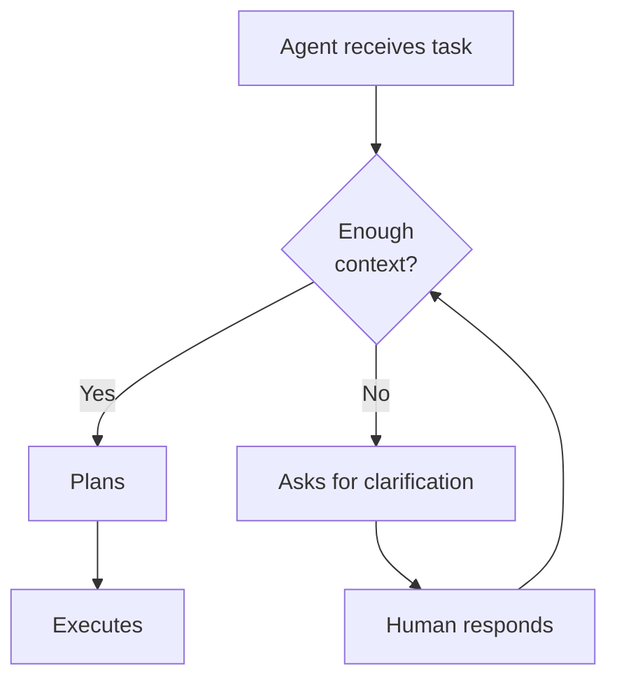
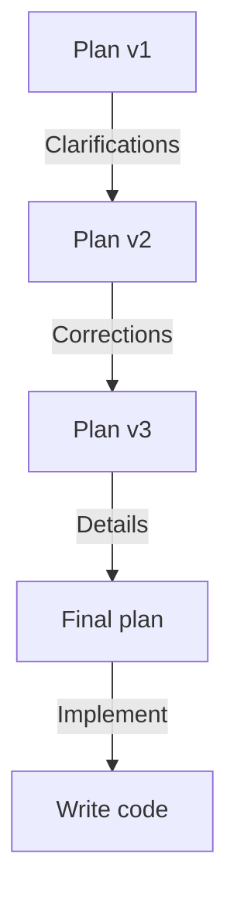
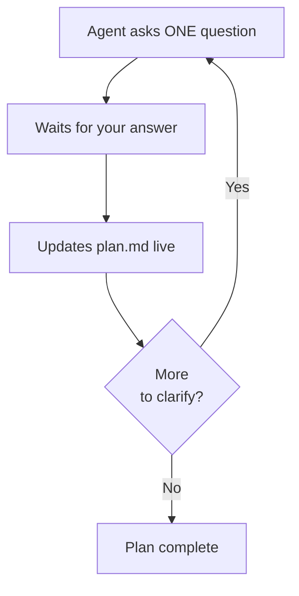

# The Agentic<br />Engineering Mindset

## Lesson 1 — Agentic Engineering Module

<div class="abs-br m-6 flex gap-2">
  <span class="text-sm opacity-50">Agentic Engineering Course</span>
</div>

---
layout: default
---

# Lesson Agenda — 120 minutes

<div class="grid grid-cols-3 gap-4 mt-8">

<div class="p-4 bg-blue-500/10 rounded-lg border border-blue-500/30">

### 🧠 Theory — 20 min

The **Delegation Workflow**:
6 principles for working *with* AI, not just *using* it

<div class="mt-3 text-xs opacity-70">
  Sources: Brendan O'Leary, Eugene Yan
</div>

</div>

<div v-click class="p-4 bg-green-500/10 rounded-lg border border-green-500/30">

### ⚙️ Setup — 30 min

- VS Code + GitHub Copilot
- Custom instructions
- Loading the `co-decompose` skill

</div>

<div v-click class="p-4 bg-purple-500/10 rounded-lg border border-purple-500/30">

### 🏗️ Active Delegation — 70 min

- Co-decomposition exercise
- Pair planning with the agent
- Output: live PRD in 6 sections
- **Final debrief (last 10 min)**

</div>

</div>

<div class="mt-8 text-center text-sm opacity-50">
  <b>Objective:</b> Stop using AI like a chatbot and start treating it as an operating engineer.
</div>

---
layout: section
---

# Part 1 — Theory
## The Delegation Workflow (20 min)

---
layout: default
---

# From "Using" to "Working With" AI

<div class="grid grid-cols-2 gap-8 mt-8">

<div>

### Using AI (passive)

<div class="p-4 bg-red-500/10 rounded-lg mt-4 space-y-2 text-sm">

- "Write this function"
- "Build this component"
- Single, isolated prompts
- You verify afterwards
- AI is a **tool**, not a **colleague**

</div>

<div v-click class="mt-4 text-xs opacity-70">
  This is what you've done so far.
</div>

</div>

<div v-click>

### Working With AI (agentic)

<div class="p-4 bg-green-500/10 rounded-lg mt-4 space-y-2 text-sm">

- "Help me plan this feature"
- "What am I missing in my reasoning?"
- Iterative, ongoing conversation
- The agent **asks**, **proposes**, **explores**
- AI is an **engineering collaborator**

</div>

<div v-click class="mt-4 text-xs opacity-70">
  This is what we'll do from today onward.
</div>

</div>

</div>

<!--
The fundamental shift: you're no longer giving orders — you're guiding a conversation.
-->

---
layout: statement
---

# The Delegation Workflow

<div class="mt-8 text-lg opacity-70">
  6 principles for delegating to an AI agent<br/>without losing control or quality
</div>

<div v-click class="mt-12 text-sm opacity-50">
  Brendan O'Leary — "Agentic Engineering: Working With AI, Not Just Using It"
</div>

---
layout: default
---

# Principle 1: Context Is Your Only Lever

<div class="grid grid-cols-2 gap-8 mt-6">

<div>

### The only lever you have

<div class="text-sm mt-4 space-y-3">

The agent has no **implicit memory**, no **subconscious**, doesn't know who you are.

<div v-click class="p-3 bg-blue-500/10 rounded-lg border border-blue-500/30">

Everything the agent knows depends on **what you put in the context window**: instructions, files, history, constraints, examples.

</div>

<div v-click class="p-3 bg-yellow-500/10 rounded-lg border border-yellow-500/30">

**There is no hidden intelligence.** If you didn't write it in the context, the agent doesn't know it. Period.

</div>

</div>

</div>

<div v-click>

### Practical consequence

<div class="text-sm mt-4 space-y-3">

<div class="p-3 bg-red-500/10 rounded-lg border border-red-500/30">

<b>Poor quality context → poor quality output</b>

Vague prompts, missing instructions, half-imported files: everything translates to mediocre results.

</div>

<div class="p-3 bg-green-500/10 rounded-lg border border-green-500/30">

<b>Context quality is your only superpower.</b>

Write precise prompts, include constraints, bring examples, provide documentation. Invest in context.

</div>

</div>

<div v-click class="mt-4 p-2 bg-blue-500/10 rounded text-xs text-center">
<b>💡 Today's exercise:</b> The co-decomposition skill uses exactly this principle — it writes the plan <b>live</b> in the shared context.

</div>

</div>

</div>

---
layout: default
---

# Principle 2: The Human Defines the Why

<div class="grid grid-cols-2 gap-6 mt-6">

<div>

### You own:

<div class="text-sm mt-4 space-y-2">

<div v-click class="p-2 bg-blue-500/10 rounded-lg">

<b>Goal</b> — what we're building and why it matters

</div>

<div v-click class="p-2 bg-blue-500/10 rounded-lg">

<b>Scope</b> — what's in and what's out

</div>

<div v-click class="p-2 bg-blue-500/10 rounded-lg">

<b>Constraints</b> — technical, business, and time limits

</div>

<div v-click class="p-2 bg-blue-500/10 rounded-lg">

<b>Acceptance Criteria</b> — how we decide it's done

</div>

</div>

</div>

<div v-click>

### The agent explores the how

<div class="text-sm mt-4 space-y-3">

The agent doesn't decide **whether** to do something — you do.

<div class="p-3 bg-green-500/10 rounded-lg border border-green-500/30">

The agent explores **how** to implement:
- Proposes alternative architectures
- Suggests patterns and technologies
- Identifies trade-offs
- Asks for clarification when context is missing

</div>

<div class="p-3 bg-yellow-500/10 rounded-lg border border-yellow-500/30 text-xs">

<b>Golden rule:</b> The human owns the direction, the agent owns the exploration.

</div>

</div>

</div>

</div>

<!--
This principle connects directly to the exercise: the 6 sections of the PRD you'll fill in today.
-->

---
layout: default
---

# Principle 3: The Agent Surfaces Unknowns

<div class="mt-6">

### A good agent doesn't guess — it asks

<div class="grid grid-cols-2 gap-6 mt-6">

<div class="text-sm space-y-3">

<div class="p-3 bg-red-500/10 rounded-lg border border-red-500/30">

<b>Passive agent (chatbot):</b> when context is missing, it **hallucinates**. It invents constraints, assumes requirements, produces code nobody asked for.

</div>

<div v-click class="p-3 bg-green-500/10 rounded-lg border border-green-500/30">

<b>Active agent (engineer):</b> when context is missing, it **asks**.

- "Which database are we using?"
- "Is auth JWT or session-based?"
- "Does it need to work offline?"

</div>

<div v-click class="p-3 bg-blue-500/10 rounded-lg border border-blue-500/30 text-xs">
<b>The difference:</b> an agent that asks is **reliable**. An agent that doesn't is **dangerous**.

</div>

</div>

<div v-click class="flex items-center justify-center">



<div class="text-xs opacity-50 text-center mt-2">
  The virtuous loop: ask → clarify → plan
</div>

</div>

</div>

</div>

---
layout: default
---

# Principle 4: Plan Then Act, Never Act Then Plan

<div class="mt-4">

<div class="grid grid-cols-2 gap-6">

<div>

### ⚠️ The anti-pattern

<div class="p-4 bg-red-500/10 rounded-lg mt-4 text-sm">

Agent: *"Sure! Here's the code:"*

```python
def create_calendar_event():
    # 200 lines of code
    # nobody validated
    # with implicit decisions everywhere
```

<div class="mt-3 text-xs">

Result: unwanted code, fragile architecture, wasted time.

</div>

</div>

</div>

<div v-click>

### ✅ The correct pattern

<div class="p-4 bg-green-500/10 rounded-lg mt-4 text-sm">

Agent: *"Before writing code, let's plan."*

```
1. What's the exact goal?
2. What are the constraints?
3. What are the user stories?
4. How do we validate the result?

Only then: we write code.
```

<div class="mt-3 text-xs">

Result: code that actually delivers value, solid architecture, time well spent.

</div>

</div>

</div>

</div>

<div v-click class="mt-6 p-3 bg-yellow-500/10 rounded-lg border border-yellow-500/30 text-center text-sm">

<b>⚓ This is the anchor principle of the lesson.</b> Today's exercise is entirely built on "plan then act".

</div>

</div>

---
layout: center
class: text-center
---

# Plan Then Act

<div class="mt-8 text-xl opacity-80">
  The plan is cheap.<br/>
  Wrong code is expensive.
</div>

<div v-click class="mt-12 text-lg">
  🏗️ Today's exercise:<br/>
  <span class="opacity-70">you'll plan with the agent before writing a single line.</span>
</div>

---
layout: default
---

# Principle 5: Iteration Beats Perfection

<div class="grid grid-cols-2 gap-6 mt-6">

<div>

### The first plan is always wrong

<div class="text-sm mt-4 space-y-3">

<div class="p-3 bg-blue-500/10 rounded-lg border border-blue-500/30">

Don't aim for the perfect plan on the first try. **It doesn't exist.**

</div>

<div v-click class="p-3 bg-yellow-500/10 rounded-lg border border-yellow-500/30">

The value isn't in the initial plan — it's in the **refinement conversation** that follows.

</div>

<div v-click class="p-3 bg-green-500/10 rounded-lg border border-green-500/30">

Each iteration clarifies, corrects, improves. After 3-4 rounds, the plan is **dramatically** better.

</div>

</div>

</div>

<div v-click>

### The refinement process



<div class="mt-4 text-sm px-3">

</div>

</div>

</div>

---
layout: default
---

# Principle 6: Trust Is a Gradient

<div class="mt-4">

### Don't trust blindly — build trust gradually

<div class="grid grid-cols-3 gap-4 mt-6">

<div class="p-4 bg-red-500/10 rounded-lg border border-red-500/30">

### 🟢 Low Trust

- Small, isolated tasks
- Immediate verification
- No side effects

<div class="mt-4 text-xs opacity-60">

Examples: formatting code, writing unit tests, generating boilerplate

</div>

</div>

<div v-click class="p-4 bg-yellow-500/10 rounded-lg border border-yellow-500/30">

### 🟡 Medium Trust

- Moderate tasks
- Review before merge
- Limited scope

<div class="mt-4 text-xs opacity-60">

Examples: refactoring a module, implementing a simple feature
</div>

</div>

<div v-click class="p-4 bg-green-500/10 rounded-lg border border-green-500/30">

### 🔴 High Trust

- Complex tasks
- Operational autonomy
- Only after proven track record

<div class="mt-4 text-xs opacity-60">

Examples: end-to-end architecture, autonomous deployment

</div>

</div>

</div>

<div v-click class="mt-6 p-3 bg-blue-500/10 rounded-lg border border-blue-500/30 text-center text-sm">

<b>Today we start at the 🟢 level:</b> co-planning validated together. Code will come later, not now.

</div>

</div>

---
layout: section
---

# Part 2 — Setup
## Environment Setup (30 min)

---
layout: default
---

# 1. VS Code + GitHub Copilot

<div class="grid grid-cols-2 gap-6 mt-8">

<div>

### Installation

<div class="text-sm mt-4 space-y-4">

<div class="p-3 bg-gray-500/10 rounded-lg">

**1. VS Code** — https://code.visualstudio.com/
Download and install the latest stable version

</div>

<div v-click class="p-3 bg-gray-500/10 rounded-lg">

**2. GitHub Copilot extension**
Open VS Code → Extensions (Ctrl+Shift+X) → search "GitHub Copilot" → Install

</div>

<div v-click class="p-3 bg-gray-500/10 rounded-lg">

**3. Authentication**
Click the Copilot icon in the bottom right → Sign in with GitHub

</div>

</div>

</div>

<div v-click>

### Verification

<div class="text-sm mt-4 space-y-3">

<div class="p-3 bg-yellow-500/10 rounded-lg border border-yellow-500/30">

Open the Chat panel (Ctrl+Shift+I) and type:

```
Hello, who are you and what can you do?
```

</div>

<div class="p-3 bg-green-500/10 rounded-lg border border-green-500/30">

If Copilot responds, installation is complete. ✅

</div>

<div class="p-3 bg-red-500/10 rounded-lg border border-red-500/30 text-xs">

If it doesn't respond: verify GitHub authentication and internet connection.

</div>

</div>

</div>

</div>

---
layout: default
---

# 2. Custom Instructions

<div class="grid grid-cols-2 gap-6 mt-6">

<div>

### What they are

<div class="text-sm mt-4">

**Custom instructions** are the personal system prompt Copilot will use in every conversation. They define:

<div v-click class="mt-3 space-y-2">

- Your role and context
- The tech stack you use
- Code conventions and style
- Expected agent behavior

</div>

</div>

<div v-click class="mt-4">

### Where to configure them

<div class="text-sm mt-2 space-y-2">

<div class="p-2 bg-gray-500/10 rounded-lg">

**VS Code:** Settings → Copilot → Custom Instructions

</div>

<div class="p-2 bg-gray-500/10 rounded-lg">

**GitHub:** Settings → Copilot → Custom instructions

</div>

</div>

</div>

</div>

<div v-click>

### Recommended template

<div class="text-sm mt-4 p-3 bg-gray-500/10 rounded-lg">

```
I am a software engineer working on [project].
My tech stack includes [technologies].

When helping me:
- Ask one question at a time when you need clarification
- Never assume missing context — ask instead
- Propose a plan before writing code
- Write clean, tested, maintainable code
- Use [conventions] for naming and structure
- Write all output in English
```

</div>

<div class="mt-3 p-2 bg-blue-500/10 rounded text-xs text-center">

<b>Tip:</b> Start with this base template. You'll refine it in future lessons.

</div>

</div>

</div>

---
layout: default
---

# 3. Loading the `co-decompose` Skill

<div class="mt-6 grid grid-cols-2 gap-4 text-sm">

<div>

### What is a skill

<div class="mt-3 p-3 bg-blue-500/10 rounded-lg border border-blue-500/30">

A specialized instruction module the agent loads when it detects a certain task. Extends capabilities without rewriting everything.

</div>

</div>

<div v-click>

### Load the skill

<div class="mt-3 space-y-2">

<div class="p-2 bg-gray-500/10 rounded">

**1.** Download `co-decompose.zip` from the course repo

</div>

<div class="p-2 bg-gray-500/10 rounded">

**2.** Extract to `.github/copilot/skills/co-decompose/`

</div>

<div class="p-2 bg-gray-500/10 rounded">

**3.** Ask Copilot: *"Do you see the co-decompose skill?"*

</div>

</div>

</div>

</div>

<div v-click class="mt-4 p-2 bg-green-500/10 rounded-lg border border-green-500/30 text-xs text-center">

<b>✨ Copilot loads the skill automatically</b> when you start a planning conversation.

</div>

---
layout: section
---

# Part 3 — Active Delegation
## Co-Decomposition Exercise (70 min)

---
layout: default
---

# Co-Decomposition: What It Is

<div class="grid grid-cols-2 gap-6 mt-6">

<div>

### Definition

<div class="text-sm mt-4">

**Co-decomposition** is a collaboration pattern where:

<div v-click class="mt-3 space-y-3">

<div class="p-3 bg-blue-500/10 rounded-lg border border-blue-500/30">

**Human and agent negotiate the plan together**, in real time, before writing code.

</div>

<div class="p-3 bg-green-500/10 rounded-lg border border-green-500/30">

The agent **asks** one question at a time, the human **answers**, the plan **grows** incrementally.

</div>

<div class="p-3 bg-yellow-500/10 rounded-lg border border-yellow-500/30">

It's not "ask and receive." It's a **structured conversation** with a concrete output.

</div>

</div>

</div>

</div>

<div v-click>

### The real-world parallel

<div class="text-sm mt-4">

Like a tech lead planning with a senior engineer:

<div class="mt-3 space-y-1">

<div class="p-2 bg-gray-500/10 rounded-lg">

<b>You:</b> "We need a notification system"

</div>

<div class="p-2 bg-gray-500/10 rounded-lg">

<b>Engineer:</b> "Email, push, or both?"

</div>

<div class="p-2 bg-gray-500/10 rounded-lg">

<b>You:</b> "Email for now, push later"

</div>

</div>

<div class="mt-2 text-xs opacity-60">
The agent will do exactly this with you — one question at a time.
</div>

</div>

</div>

</div>

---
layout: default
---

# The Exercise — Overview

<div class="grid grid-cols-2 gap-6 mt-6">

<div>

### The task

<div class="mt-4 p-4 bg-blue-500/10 rounded-lg border border-blue-500/30">

**"I need to build an app that creates calendar events after consensus among participants. Help me plan it."**

</div>

<div v-click class="mt-4 text-sm space-y-2">

- Paste this exact prompt into Copilot Chat
- The agent will load the `co-decompose` skill
- It will start asking you questions, **one at a time**

</div>

<div v-click class="mt-4 p-2 bg-yellow-500/10 rounded-lg border border-yellow-500/30 text-xs">

<b>⚠️ Fundamental rule:</b> Don't write code. Don't ask for code. Today is planning only.

</div>

</div>

<div v-click>

### The expected output

<div class="text-sm mt-4">

A `plan.md` file with **6 sections** filled in live during the session:

<div class="mt-3 space-y-1">

<div class="p-2 bg-gray-500/10 rounded">**1. Goal** — what we're building and why</div>
<div class="p-2 bg-gray-500/10 rounded">**2. Scope** — what's in and what's out</div>
<div class="p-2 bg-gray-500/10 rounded">**3. Constraints** — technical/business limits</div>
<div class="p-2 bg-gray-500/10 rounded">**4. User Stories** — who does what</div>
<div class="p-2 bg-gray-500/10 rounded">**5. Acceptance Criteria** — how we validate</div>
<div class="p-2 bg-gray-500/10 rounded">**6. Risks** — what could go wrong</div>

</div>

</div>

</div>

</div>

---
layout: default
---

# Timer Checkpoints — 70 minutes

<div class="mt-4 grid grid-cols-2 gap-3 text-sm">

<div class="p-2 bg-blue-500/10 rounded border border-blue-500/30">

### ⏱️ 0–5 min

Kickoff — paste the prompt, agent responds with first question.

</div>

<div v-click class="p-2 bg-green-500/10 rounded border border-green-500/30">

### ⏱️ 5–25 min

Goal + Scope + Constraints — define the what, the boundary, the limits.

</div>

<div v-click class="p-2 bg-purple-500/10 rounded border border-purple-500/30">

### ⏱️ 25–45 min

User Stories + Acceptance Criteria — who uses it and how to verify.

</div>

<div v-click class="p-2 bg-yellow-500/10 rounded border border-yellow-500/30">

### ⏱️ 45–60 min

Risks + Final Review — identify risks, review the complete plan.

</div>

<div v-click class="p-2 bg-red-500/10 rounded border border-red-500/30">

### ⏱️ 60–70 min

DEBRIEF — everyone presents their plan in 2 minutes.

</div>

</div>

---
layout: default
---

# How the `co-decompose` Skill Works

<div class="grid grid-cols-2 gap-6 mt-6">

<div>

### The interview loop



<div class="text-xs opacity-50 text-center mt-2">
  One question at a time. Always.
</div>

</div>

<div v-click>

### What to expect

<div class="text-sm mt-2 space-y-3">

<div class="p-2 bg-blue-500/10 rounded-lg">

The agent will ask questions like:

- *"Who are the users of this app?"*
- *"Is consensus unanimous or majority?"*
- *"Do we integrate Google Calendar from the start or later?"*
- *"What happens if a participant doesn't respond?"*
- *"Do we need authentication? If so, which provider?"*

</div>

<div class="p-2 bg-yellow-500/10 rounded-lg border border-yellow-500/30 text-xs">

<b>💡 Tip:</b> If the agent asks something you hadn't thought about, that's normal. Take your time to reason. Don't rush.

</div>

</div>

</div>

</div>

---
layout: default
---

# The Task in Detail — Calendar Consensus App

<div class="grid grid-cols-2 gap-6 mt-6">

<div>

### The course project

<div class="text-sm mt-4 p-3 bg-blue-500/10 rounded-lg">

An application that **automates calendar event creation** only when **full consensus** is reached among participants. Google Calendar integration to create the final event.

</div>

<div v-click class="mt-4 space-y-2 text-sm">

<div class="p-2 bg-gray-500/10 rounded-lg">

<b>Areas to explore with the agent:</b>
- Consensus mechanism (unanimous? majority?)
- Handling missing responses
- Google Calendar API integration
- Notifications and reminders

</div>

</div>

</div>

<div v-click>

### Be creative, not passive

<div class="text-sm mt-4 space-y-3">

The agent will guide you, but **you own the decisions**:

<div class="p-2 bg-green-500/10 rounded-lg">

If the agent proposes a solution you don't like, **say so**. Propose alternatives.

</div>

<div class="p-2 bg-green-500/10 rounded-lg">

If the agent forgets an aspect that matters to you, **raise it**.

</div>

<div class="p-2 bg-green-500/10 rounded-lg">

If you can't answer a question, **take note**. It's an area to explore.

</div>

<div class="p-2 bg-yellow-500/10 rounded-lg border border-yellow-500/30 text-xs">

<b>Goal:</b> Not the perfect plan, but the quality conversation.

</div>

</div>

</div>

</div>

---
layout: default
---

# Anti-Patterns to Avoid

<div class="mt-6 max-w-3xl mx-auto text-sm space-y-4">

<div class="p-4 bg-red-500/10 rounded-lg border border-red-500/30">

**❌ Answer "yes/no" in monosyllables**

The agent asks a complex question and you answer "ok". You're delegating the decision.

</div>

<div v-click class="p-4 bg-red-500/10 rounded-lg border border-red-500/30">

**❌ Ask for code prematurely**

"Wait, show me how you'd write function X." You're skipping the planning.

</div>

<div v-click class="p-4 bg-red-500/10 rounded-lg border border-red-500/30">

**❌ Ignore the agent's questions**

The agent asks "Which auth protocol?" and you change the subject. The agent can't proceed without that answer.

</div>

</div>

---
layout: default
---

# Best Practices

<div class="mt-6 max-w-3xl mx-auto text-sm space-y-4">

<div class="p-4 bg-green-500/10 rounded-lg border border-green-500/30">

**✅ Answer in an articulated way**

"For auth I'd use JWT with refresh tokens, because the app will be a React SPA."

</div>

<div v-click class="p-4 bg-green-500/10 rounded-lg border border-green-500/30">

**✅ Ask the agent to go deeper**

"Explain the trade-offs between unanimous and majority consensus in this context."

</div>

<div v-click class="p-4 bg-green-500/10 rounded-lg border border-green-500/30">

**✅ Take notes on gray areas**

"I don't know which email provider to use yet. Let's put it in risks and decide later."

</div>

</div>

---
layout: default
---

# Before You Start — Checklist

<div class="mt-6">

<div class="max-w-2xl mx-auto space-y-3 text-sm">

<div class="p-3 bg-gray-500/10 rounded-lg flex items-start gap-3">
  <span class="text-lg">✅</span>
  <div><b>VS Code + Copilot</b> installed and authenticated</div>
</div>

<div v-click class="p-3 bg-gray-500/10 rounded-lg flex items-start gap-3">
  <span class="text-lg">✅</span>
  <div><b>Custom instructions</b> configured (at least the base template)</div>
</div>

<div v-click class="p-3 bg-gray-500/10 rounded-lg flex items-start gap-3">
  <span class="text-lg">✅</span>
  <div><b>co-decompose skill</b> downloaded and loaded in your workspace</div>
</div>

<div v-click class="p-3 bg-gray-500/10 rounded-lg flex items-start gap-3">
  <span class="text-lg">✅</span>
  <div><b>Starting prompt</b> ready to paste:</div>
</div>

<div v-click class="ml-8 p-3 bg-blue-500/10 rounded-lg border border-blue-500/30 font-mono text-xs">
  I need to build an app that creates calendar events after consensus among participants. Help me plan it.
</div>

<div v-click class="mt-6 p-3 bg-green-500/10 rounded-lg border border-green-500/30 text-center">

<b>🚀 When you're ready, paste the prompt and start the conversation.</b>

</div>

</div>

</div>

---
layout: section
---

# Go!<br />⏱️ Start Planning

<div class="mt-8 text-lg opacity-70">
  60 minutes of co-decomposition<br/>
  Then group debrief
</div>

---
layout: section
---

# Debrief
## Sharing and Discussion (10 min)

---
layout: default
---

# Debrief — 10 minutes

<div class="grid grid-cols-2 gap-6 mt-6">

<div>

### Each person (2 min):

<div class="text-sm mt-4 space-y-3">

<div class="p-3 bg-blue-500/10 rounded-lg">

**1.** Show your generated `plan.md`

</div>

<div v-click class="p-3 bg-blue-500/10 rounded-lg">

**2.** Share the **most surprising** decision that emerged during the conversation with the agent

</div>

<div v-click class="p-3 bg-blue-500/10 rounded-lg">

**3.** One thing the agent asked that you **hadn't thought about**

</div>

</div>

</div>

<div v-click>

### Group discussion:

<div class="text-sm mt-4 space-y-3">

<div class="p-3 bg-purple-500/10 rounded-lg border border-purple-500/30">

**How has your perception** of the agent changed after this experience?

</div>

<div v-click class="p-3 bg-purple-500/10 rounded-lg border border-purple-500/30">

**Which Delegation Workflow principle** did you see in action most clearly?

</div>

<div v-click class="p-3 bg-purple-500/10 rounded-lg border border-purple-500/30">

**What would you do differently** if you had to redo the exercise?

</div>

</div>

</div>

</div>

---
layout: center
class: text-center
---

# 📤 Submit

<div class="mt-8 text-xl">

Save your `plan.md`<br/>
<span class="opacity-70">We'll review it in the next lesson.</span>

</div>

<div v-click class="mt-12 text-lg opacity-50">

The plan you built today is the foundation<br/>of the project you'll implement in this course.

</div>

---
layout: default
---

# Lesson Summary

<div class="grid grid-cols-2 gap-6 mt-6">

<div>

### Theory — Delegation Workflow

<div class="text-sm mt-4 space-y-2">

1. **Context is your only lever** — context quality = output quality
2. **Human defines the why** — you own goal, scope, constraints
3. **Agent surfaces unknowns** — asks, doesn't hallucinate
4. **Plan then act** — plan first, then code
5. **Iteration beats perfection** — continuous refinement
6. **Trust is a gradient** — gradual delegation

</div>

</div>

<div v-click>

### Practice — Co-Decomposition

<div class="text-sm mt-4 space-y-2">

- ✅ `co-decompose` skill loaded
- ✅ Starting prompt pasted
- ✅ Structured conversation with the agent
- ✅ `plan.md` with 6 sections filled in
- ✅ Group debrief

</div>

<div class="mt-6 p-3 bg-green-500/10 rounded-lg border border-green-500/30 text-sm">

<b>Key result:</b> You experienced the "plan then act" pattern firsthand. The agent is no longer a chatbot — it's a collaborator.

</div>

</div>

</div>

---
layout: center
class: text-center
---

# Next Lesson

## Lesson 2: Fundamentals and the "Slop" Problem

<div class="mt-8">

Why software fundamentals matter more than ever<br />
when AI is writing the code.

</div>

<div class="mt-10 grid grid-cols-3 gap-4 text-sm max-w-2xl mx-auto">

<div class="p-3 bg-blue-500/10 rounded-lg border border-blue-500/30">
  <b>🧠 Theory (20 min)</b>
  <div class="text-xs mt-1 opacity-70">AI Slop: what it is and how to avoid it</div>
</div>

<div class="p-3 bg-green-500/10 rounded-lg border border-green-500/30">
  <b>🔍 Code Review (50 min)</b>
  <div class="text-xs mt-1 opacity-70">Spotting fragile AI-generated patterns</div>
</div>

<div class="p-3 bg-purple-500/10 rounded-lg border border-purple-500/30">
  <b>🛠️ Refactoring (50 min)</b>
  <div class="text-xs mt-1 opacity-70">Cleaning up slop with solid engineering principles</div>
</div>

</div>

---
layout: center
class: text-center
---

<div class="mb-8">
  <div class="text-7xl font-bold bg-gradient-to-r from-blue-400 via-purple-400 to-pink-400 bg-clip-text text-transparent">
    Questions?
  </div>
</div>

<div class="flex justify-center items-stretch gap-6 mt-12">

  <!-- Repo Card -->
  <a href="https://github.com/salvatorebottiglieri/coding_with_ai" target="_blank"
     class="w-64 p-6 rounded-xl border border-gray-700 bg-gray-800/60 hover:bg-gray-700/60 hover:border-blue-500/50 transition-all duration-300 no-underline flex flex-col items-center justify-center">
    <div class="text-3xl mb-3">
      <carbon-logo-github />
    </div>
    <div class="text-sm font-semibold text-gray-300 mb-1">Course Repository</div>
    <div class="text-xs text-blue-400 break-all text-center">
      salvatorebottiglieri/<br/>coding_with_ai
    </div>
  </a>

  <!-- References Card -->
  <div class="w-96 p-6 rounded-xl border border-gray-700 bg-gray-800/60 text-left flex flex-col">
    <div class="text-sm font-semibold text-gray-400 mb-4 uppercase tracking-wider">📚 References</div>
    <div class="space-y-3 text-sm">
      <a href="https://youtu.be/BEKc4P87XKo" target="_blank"
         class="block px-3 py-2 rounded-lg hover:bg-gray-700/50 transition-colors no-underline border-l-2 border-transparent hover:border-blue-400">
        <div class="text-gray-200 font-medium">Agentic Engineering</div>
        <div class="text-xs text-gray-500">Brendan O'Leary</div>
      </a>
      <a href="https://eugeneyan.com/" target="_blank"
         class="block px-3 py-2 rounded-lg hover:bg-gray-700/50 transition-colors no-underline border-l-2 border-transparent hover:border-purple-400">
        <div class="text-gray-200 font-medium">Human-AI Collaboration</div>
        <div class="text-xs text-gray-500">Eugene Yan</div>
      </a>
      <a href="https://www.amazon.it/Agentic-Design-Patterns-Hands-Intelligent/dp/3032014018" target="_blank"
         class="block px-3 py-2 rounded-lg hover:bg-gray-700/50 transition-colors no-underline border-l-2 border-transparent hover:border-pink-400">
        <div class="text-gray-200 font-medium">Agentic Design Patterns</div>
        <div class="text-xs text-gray-500">Handbook</div>
      </a>
    </div>
  </div>

</div>

<div class="mt-10 text-sm text-gray-500">
  Lesson 1 — Agentic Engineering Module
</div>
