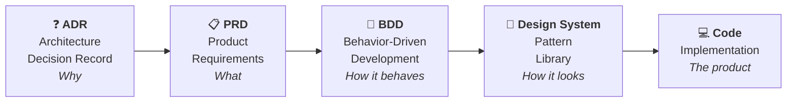
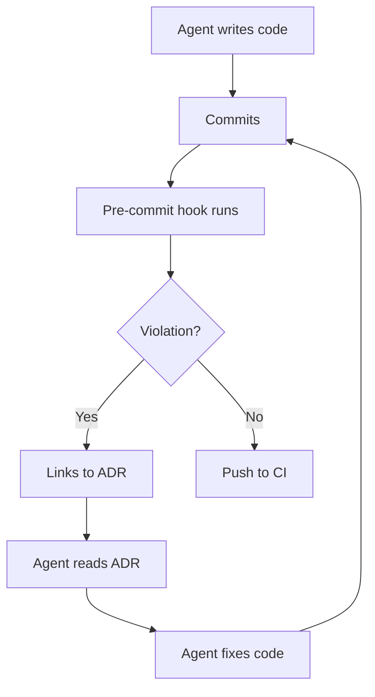
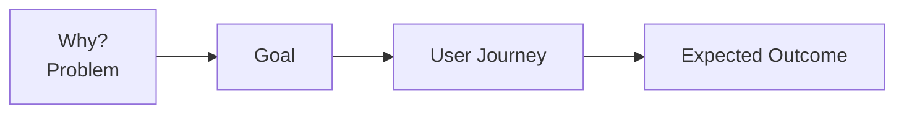
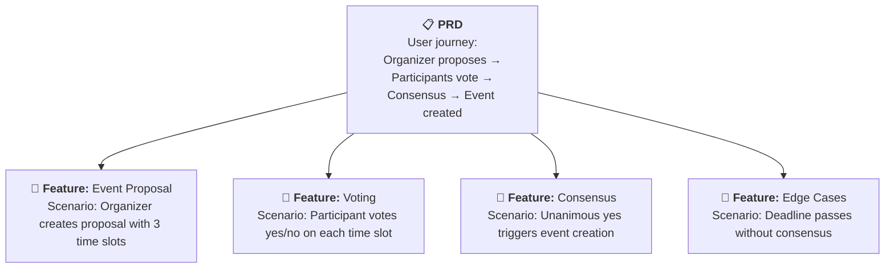
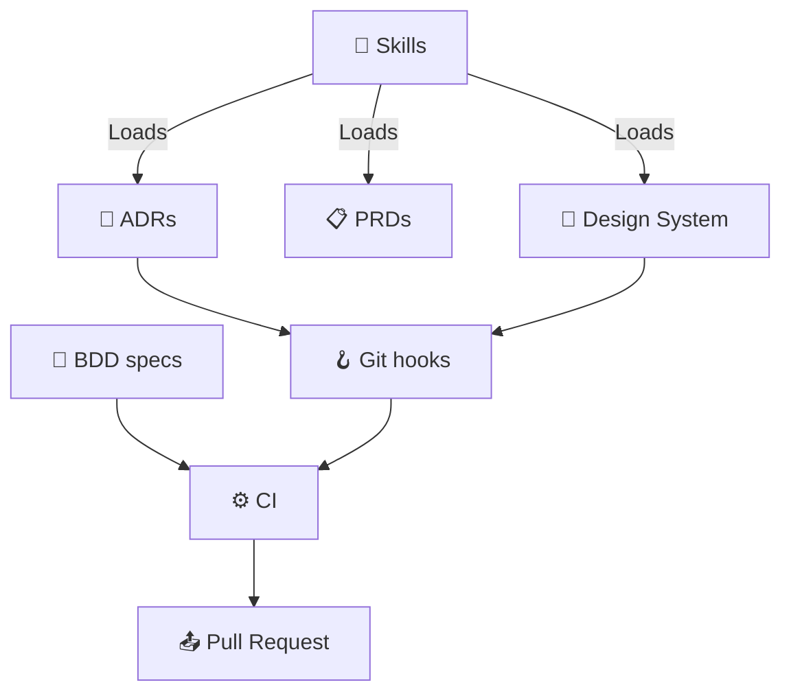
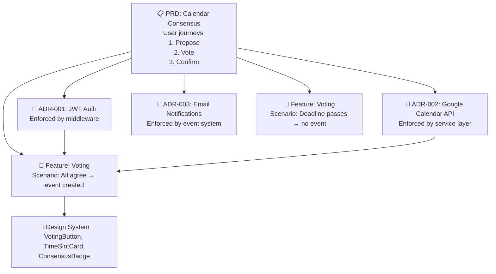
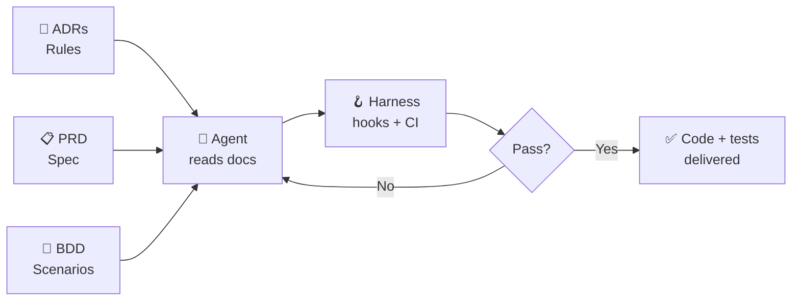

# Top-Down Planning<br />The Decision Stack

## From Architecture to Code<br/>through Progressive Abstraction

<div class="abs-br m-6 flex gap-2">
  <span class="text-sm opacity-50">Agentic Engineering Course — Lesson 2</span>
</div>

---
layout: default
---

# Lesson Agenda — 120 minutes

<div class="grid grid-cols-2 gap-4 mt-8">

<div class="p-4 bg-blue-500/10 rounded-lg border border-blue-500/30">

### 🧠 Theory — 30 min

The **Decision Stack**:
4 layers of progressive abstraction — ADR, PRD, BDD, Design System

<div class="mt-3 text-xs opacity-70">
  Source: Michal — Capturing Decisions for Humans and AI Alike
</div>

</div>

<div v-click class="p-4 bg-purple-500/10 rounded-lg border border-purple-500/30">

### 🏗️ Practice — 90 min

- 10 min: Read & critique an existing ADR and PRD
- 50 min: Write your own Decision Stack for the Calendar Consensus App
- 30 min: Cross-review & discussion

</div>

</div>

<div class="mt-8 text-center text-sm opacity-50">
  <b>Prerequisite:</b> Lesson 1 completed + your group's <code>plan.md</code> from the co-decomposition exercise.<br/>
  <b>Objective:</b> Master the top-down planning framework and produce real ADRs, PRDs, and BDD specs.
</div>

---
layout: section
---

# Part 1 — Theory
## The Decision Stack (30 min)

---
layout: statement
---

# Why does any of this matter?

<div class="mt-6 text-lg opacity-70">
  ADR, PRD, BDD, Design System...<br/>
  that's a lot of acronyms.
</div>

<div v-click class="mt-12 text-sm opacity-50">
  Michal — Capturing Decisions for Humans and AI Alike
</div>

---
layout: default
---

# The Monkey Parable 🐒

<div class="grid grid-cols-2 gap-6 mt-6">

<div class="text-sm">

### The story

Scientists put **five monkeys** in a cage with bananas on a ladder. Every time a monkey tried to get a banana, **cold shower** for everyone.

<div v-click class="mt-3 p-3 bg-yellow-500/10 rounded-lg border border-yellow-500/30">

The other monkeys **beat up** whoever tried to climb the ladder.

</div>

<div v-click class="mt-3 p-3 bg-blue-500/10 rounded-lg border border-blue-500/30">

Then they replaced the monkeys **one by one**. None of the originals remained.

</div>

<div v-click class="mt-3 p-3 bg-red-500/10 rounded-lg border border-red-500/30">
And yet, every new monkey that tried to climb the ladder got beaten up — **without anyone knowing why**.

</div>

</div>

<div v-click class="text-sm">

### Your codebase is that cage

<div class="mt-3 space-y-3">

<div class="p-3 bg-gray-500/10 rounded-lg">

**"Why do we have this flow?"**

</div>

<div class="p-3 bg-gray-500/10 rounded-lg">

**"Why is this code shaped like that?"**

</div>

<div class="p-3 bg-gray-500/10 rounded-lg">

**"Where does this belong?"**

</div>

<div class="p-3 bg-gray-500/10 rounded-lg">

**"The founding engineer left 6 months ago."**

</div>

</div>

</div>

</div>

---
layout: default
---

# Humans and LLMs Share the Same Trait

<div class="grid grid-cols-2 gap-6 mt-8">

<div class="p-4 bg-red-500/10 rounded-lg border border-red-500/30">

### Humans

<div class="text-sm mt-3 space-y-2">

- **Forget** why decisions were made
- **Leave** the team (or the company)
- **Limited context** — can't hold the entire codebase in their head
- **Reinvent** reasons for things that already have reasons

</div>

</div>

<div v-click class="p-4 bg-red-500/10 rounded-lg border border-red-500/30">

### LLMs / Agents

<div class="text-sm mt-3 space-y-2">

- **Context compacts** — lose information after many turns
- **No memory** — start fresh every session
- **Limited context window** — can't read the whole codebase
- **Hallucinate** reasons when context is missing

</div>

</div>

</div>

<div v-click class="mt-8 p-4 bg-yellow-500/10 rounded-lg border border-yellow-500/30 text-center text-sm">

<b>The answer?</b> Externalize decisions into persistent, discoverable documents.<br/>
Both humans and agents need them. Both can find them. Both can understand them.

</div>

---
layout: statement
---

# The Decision Stack

<div class="mt-8 text-lg opacity-70">
  Four layers of progressive abstraction<br/>
  from <b>why</b> to <b>how</b> to <b>what</b> to <b>code</b>
</div>

---
layout: default
---

# The Decision Stack — Overview

<div class="mt-6">



</div>

<div class="mt-4 grid grid-cols-4 gap-2 text-xs">

<div class="p-2 bg-blue-500/10 rounded text-center">
  <b>ADR</b><br/>50+ documents<br/>defining architecture
</div>

<div class="p-2 bg-green-500/10 rounded text-center">
  <b>PRD</b><br/>Lightweight<br/>feature specs
</div>

<div class="p-2 bg-yellow-500/10 rounded text-center">
  <b>BDD</b><br/>Executable<br/>specifications
</div>

<div class="p-2 bg-purple-500/10 rounded text-center">
  <b>Design System</b><br/>Consistent<br/>component library
</div>

</div>

<div v-click class="mt-4 text-xs opacity-60 text-center">
  ⬅️ The further left you go, the more stable the decision. ADRs change rarely. Code changes constantly.
</div>

---
layout: default
---

# Layer 1 — ADR: Architecture Decision Record

<div class="grid grid-cols-2 gap-6 mt-4">

<div>

### What it captures

<div class="text-sm mt-3 space-y-2">

<div class="p-2 bg-blue-500/10 rounded-lg">

**Why** you do something

</div>

<div class="p-2 bg-blue-500/10 rounded-lg">

**How** you enforce it

</div>

<div class="p-2 bg-blue-500/10 rounded-lg">

**References** to docs and code

</div>

<div class="p-2 bg-blue-500/10 rounded-lg">

**Which files** it concerns

</div>

</div>

</div>

<div v-click>

### Real example

<div class="text-sm mt-3 p-3 bg-gray-500/10 rounded-lg border border-gray-500/30">

```markdown
# ADR-003: Database Access Layers

**Decision:** Split code in layers to prevent N+1 queries.

**Enforcement:**
- Lint imports between modules
- DB reads return plain shapes, not ORM objects
- Rendering templates cannot import DB modules

**Files:** src/database/**, src/templates/**
```

</div>

<div class="mt-3 text-xs opacity-60">

50+ ADRs like this define the entire architecture of a real product.

</div>

</div>

</div>

<div v-click class="mt-4 p-3 bg-yellow-500/10 rounded-lg border border-yellow-500/30 text-xs">

<b>💡 Key insight:</b> There is no single format. ADR is a <b>concept</b>, not a template. It's text — the tool enforces it, the ADR explains why.
</div>

---
layout: default
---

# Layer 1 — ADR: How the Agent Uses It

<div class="grid grid-cols-2 gap-6 mt-6">

<div>

### The enforcement loop



</div>

<div v-click>

### Concrete flow

<div class="text-sm mt-3 space-y-3">

<div class="p-2 bg-red-500/10 rounded-lg">

Agent imports ORM in a template file → **commit rejected**

</div>

<div class="p-2 bg-blue-500/10 rounded-lg">

Linter returns: *"ADR-003: Templates cannot access DB modules. See docs/ADR/003-database-access-layers.md"*

</div>

<div class="p-2 bg-green-500/10 rounded-lg">

Agent reads ADR-003, understands why, refactors the code using the data layer instead

</div>

</div>

</div>

</div>

<div v-click class="mt-4 p-3 bg-yellow-500/10 rounded-lg border border-yellow-500/30 text-xs text-center">
<b>Result:</b> The agent doesn't just avoid the mistake — it <b>learns the rule</b> and applies it everywhere.
</div>

---
layout: default
---

# Layer 2 — PRD: Product Requirements Document

<div class="grid grid-cols-2 gap-6 mt-4">

<div>

### What it captures

<div class="text-sm mt-3 space-y-2">

<div class="p-2 bg-blue-500/10 rounded-lg">

**Why** the feature exists

</div>

<div class="p-2 bg-blue-500/10 rounded-lg">

**What problem** it solves

</div>

<div class="p-2 bg-blue-500/10 rounded-lg">

**User journey** through the app

</div>

<div class="p-2 bg-blue-500/10 rounded-lg">

**Goal** and success criteria

</div>

</div>

<div v-click class="mt-3 p-2 bg-green-500/10 rounded-lg text-xs">

Lightweight — doesn't need to be a massive document.

</div>

</div>

<div v-click>

### PRD connects the dots



<div class="mt-4 text-sm space-y-2">

<div class="p-2 bg-gray-500/10 rounded-lg">

**Problem:** Scheduling meetings with 5+ participants takes 6–8 back-and-forth messages.

</div>

<div class="p-2 bg-gray-500/10 rounded-lg">

**Goal:** Create calendar events only when everyone agrees — automatically.

</div>

<div class="p-2 bg-gray-500/10 rounded-lg">

**Journey:** Organizer proposes time slots → participants vote → consensus reached → event created in Google Calendar.

</div>

</div>

</div>

</div>

<div v-click class="mt-4 p-3 bg-yellow-500/10 rounded-lg border border-yellow-500/30 text-xs text-center">
<b>💡 It's not just for agents.</b> It's for you 6 weeks from now, when you've forgotten why you built this feature.
</div>

---
layout: default
---

# PRD vs. plan.md — The Upgrade

<div class="grid grid-cols-2 gap-6 mt-6">

<div class="p-4 bg-blue-500/10 rounded-lg border border-blue-500/30">

### plan.md (Lesson 1)

<div class="text-sm mt-3 space-y-2">

- **Exploratory** — negotiated in conversation
- **Group exercise** — collaborative discovery
- **6 loose sections** — Goal, Scope, Constraints, User Stories, Acceptance Criteria, Risks
- **Rough draft** — captures thinking, not perfection

</div>

<div class="mt-3 text-xs opacity-60">
  This was your first interaction with the agent.
</div>

</div>

<div v-click class="p-4 bg-green-500/10 rounded-lg border border-green-500/30">

### PRD (this lesson)

<div class="text-sm mt-3 space-y-2">

- **Structured** — follows a deliberate template
- **Authoritative** — single source of truth for the feature
- **Referenced by agents** — loaded into context when working on the feature
- **Persistent** — lives in the repo, versioned in git

</div>

<div class="mt-3 text-xs opacity-60">
  This is the document the agent will use to build the feature.
</div>

</div>

</div>

<div v-click class="mt-4 p-3 bg-yellow-500/10 rounded-lg border border-yellow-500/30 text-xs text-center">
<b>The transformation:</b> plan.md was the <b>conversation</b>. The PRD is the <b>commitment</b>.
</div>

---
layout: default
---

# Layer 3 — BDD: Behavior-Driven Development

<div class="grid grid-cols-2 gap-6 mt-4">

<div>

### The problem with specs

<div class="text-sm mt-3 space-y-3">

<div class="p-3 bg-red-500/10 rounded-lg">

You write a spec. It's a Markdown document describing how the product should work.

</div>

<div v-click class="p-3 bg-red-500/10 rounded-lg">

**How do you know it actually works like that?**

</div>

<div v-click class="p-3 bg-red-500/10 rounded-lg">

And AI-generated tests are even **harder to review** than AI-generated code.

</div>

</div>

</div>

<div v-click>

### The BDD answer

<div class="text-sm mt-3 space-y-3">

BDD provides an **intermediate layer** that:

<div class="space-y-2 mt-2">

<div class="p-2 bg-green-500/10 rounded-lg">

✅ Describes behavior in **human language**

</div>

<div class="p-2 bg-green-500/10 rounded-lg">

✅ Is **executable** — runs as real tests

</div>

<div class="p-2 bg-green-500/10 rounded-lg">

✅ Is **readable** — easier to review than code

</div>

<div class="p-2 bg-green-500/10 rounded-lg">

✅ Connects directly to PRDs and user journeys

</div>

</div>

</div>

</div>

</div>

<div v-click class="p-3 bg-yellow-500/10 rounded-lg border border-yellow-500/30 text-xs text-center">
<b>BDD closes the loop</b> that spec-driven development leaves open. Spec says what it should do — BDD proves it.
</div>

---
layout: default
---

# BDD with Cucumber — How It Works

<div class="grid grid-cols-2 gap-6 mt-4">

<div>

### The feature file (human-readable)

<div class="text-sm mt-2">

```gherkin
Feature: Calendar Event Consensus

  Scenario: All participants agree
    Given an event proposal exists
      with 3 time slots
    When all participants vote "yes"
      on the same time slot
    Then a Google Calendar event
      is created
    And all participants receive
      a confirmation email
```

</div>

<div class="mt-2 text-xs opacity-60">
  Written in <b>Gherkin syntax</b> — Given/When/Then. This is the <b>specification</b>.
</div>

</div>

<div v-click>

### The step definitions (executable)

<div class="text-sm mt-2">

```python
@given("an event proposal exists with {int} time slots")
def step_event_proposal(count):
    proposal = create_proposal(
        time_slots=count
    )
    context.proposal = proposal

@when("all participants vote \"yes\" on the same time slot")
def step_all_agree():
    for p in context.participants:
        vote(p, context.proposal, "yes")
```

</div>

<div class="mt-2 text-xs opacity-60">
  Parsed and executed. The feature file is the <b>test</b>.
</div>

</div>

</div>

<div v-click class="mt-4 p-3 bg-yellow-500/10 rounded-lg border border-yellow-500/30 text-xs text-center">

<b>🧠 For AI agents:</b> Feature files are <b>easier to read and generate</b> than raw test code.<br/>
They connect directly to the PRD's user journey. The agent can read the scenario and implement the step — or vice versa.

</div>

---
layout: default
---

# The BDD → PRD Connection

<div class="mt-6">



</div>

<div v-click class="mt-4 text-sm text-center opacity-70">
  Each step in the PRD's user journey maps to <b>one or more BDD scenarios</b>.<br/>
  Each BDD scenario is <b>one executable test</b>.
</div>

---
layout: default
---

# Layer 4 — Design System & Pattern Library

<div class="grid grid-cols-2 gap-6 mt-4">

<div>

### Why it matters

<div class="text-sm mt-3 space-y-2">

<div class="p-2 bg-red-500/10 rounded-lg">

Without it: agents produce **inconsistent UIs** — every component looks different

</div>

<div class="p-2 bg-blue-500/10 rounded-lg">

Like code architecture: build from **small pieces** into **bigger ones**

</div>

<div class="p-2 bg-green-500/10 rounded-lg">

Define once, **reuse everywhere** — agents and humans

</div>

</div>

</div>

<div v-click>

### What it contains

<div class="text-sm mt-3 space-y-2">

<div class="p-2 bg-gray-500/10 rounded-lg">

**Language** — a primary button is blue, 40px, rounded

</div>

<div class="p-2 bg-gray-500/10 rounded-lg">

**Rules** — only one primary button visible per page

</div>

<div class="p-2 bg-gray-500/10 rounded-lg">

**Components** — buttons, inputs, cards, modals with all states

</div>

<div class="p-2 bg-gray-500/10 rounded-lg">

**Previews** — visual snippets the agent can see and reference

</div>

</div>

</div>

</div>

<div v-click class="mt-4 p-3 bg-yellow-500/10 rounded-lg border border-yellow-500/30 text-xs text-center">
<b>💡 Design system + linting:</b> enforce "no inline styles" and "use design system components only."<br/>
The agent sees the component library and composes UIs from known pieces.
</div>

---
layout: default
---

# The Loop: How It All Works Together

<div class="grid grid-cols-2 gap-4 mt-4">

<div>



</div>

<div class="text-xs space-y-3">

<div class="p-2 bg-blue-500/10 rounded">
<b>🧠 Skills</b> — load relevant documents into agent context based on the task
</div>

<div class="p-2 bg-green-500/10 rounded">
<b>🪝 Git hooks</b> — enforce rules before commit (linting, imports, types, architecture)
</div>

<div class="p-2 bg-purple-500/10 rounded">
<b>⚙️ CI</b> — runs full BDD suite, validates everything, catches what hooks miss
</div>

<div class="p-3 bg-yellow-500/10 rounded-lg border border-yellow-500/30">
<b>The agent's goal is to deliver a PR.</b><br/>
To do that: pass hooks → pass CI → get reviewed.<br/>
Every rejection links back to an ADR, PRD, or BDD scenario — the agent reads and learns.
</div>

</div>

</div>

---
layout: default
---

# The Loop is Generic — Skills Provide Focus

<div class="mt-4">

<div class="text-sm">

The loop is always the same: **do work → commit → get feedback → fix → iterate**. But the **focus** changes based on what you're building:

</div>

<div class="grid grid-cols-4 gap-3 mt-6">

<div class="p-3 bg-blue-500/10 rounded-lg border border-blue-500/30 text-center">
  <div class="text-2xl mb-2">📐</div>
  <b>ADR skill</b>
  <div class="text-xs mt-2 opacity-70">
    Loads architecture rules<br/>
    Finds affected code<br/>
    Links violations to ADRs
  </div>
</div>

<div v-click class="p-3 bg-green-500/10 rounded-lg border border-green-500/30 text-center">
  <div class="text-2xl mb-2">📋</div>
  <b>PRD skill</b>
  <div class="text-xs mt-2 opacity-70">
    Loads feature spec<br/>
    Maps user journey to tasks<br/>
    Links scenarios to PRD
  </div>
</div>

<div v-click class="p-3 bg-purple-500/10 rounded-lg border border-purple-500/30 text-center">
  <div class="text-2xl mb-2">🎨</div>
  <b>UI skill</b>
  <div class="text-xs mt-2 opacity-70">
    Loads design system<br/>
    Skips backend checks<br/>
    Iterates in browser quickly
  </div>
</div>

<div v-click class="p-3 bg-yellow-500/10 rounded-lg border border-yellow-500/30 text-center">
  <div class="text-2xl mb-2">🧪</div>
  <b>Test skill</b>
  <div class="text-xs mt-2 opacity-70">
    Identifies tests to run<br/>
    Based on code coverage<br/>
    Runs focused suite, not all
  </div>
</div>

</div>

<div v-click class="mt-6 p-3 bg-yellow-500/10 rounded-lg border border-yellow-500/30 text-xs text-center">
  <b>Same loop, different context.</b> Skills are the <b>harness</b> that focuses the agent on the right rules for the right task.
</div>

</div>

---
layout: default
---

# Drawbacks (and Why They're OK)

<div class="grid grid-cols-2 gap-6 mt-6">

<div>

### ⚠️ Context-heavy

<div class="text-sm mt-3 p-3 bg-yellow-500/10 rounded-lg border border-yellow-500/30">

Loading ADRs + PRD + BDD + Design System can consume **half the context window** before work even starts.

</div>

<div v-click class="mt-4">

### ⚠️ Maintenance cost

<div class="text-sm mt-3 p-3 bg-yellow-500/10 rounded-lg border border-yellow-500/30">

Documents must stay in sync with reality. An outdated ADR is worse than no ADR — it actively misleads.

</div>

</div>

</div>

<div v-click>

### ✅ Why it still works

<div class="text-sm mt-3 space-y-3">

<div class="p-3 bg-green-500/10 rounded-lg border border-green-500/30">

**Context compacts are survivable.** The important decisions survive compression. The agent re-looks up documents when needed.

</div>

<div class="p-3 bg-green-500/10 rounded-lg border border-green-500/30">

**Documents are authoritative.** When the agent gets a rule violation, it reads the ADR. It doesn't guess — it learns.

</div>

<div class="p-3 bg-green-500/10 rounded-lg border border-green-500/30">

**The alternative is chaos.** Without these documents, the agent invents its own reasons. And they're usually wrong.

</div>

</div>

</div>

</div>

<div v-click class="p-3 bg-blue-500/10 rounded-lg border border-blue-500/30 text-xs text-center">
  <b>Goal:</b> multi-hour agent sessions with clear rules the agent can operate autonomously within.
</div>

---
layout: default
---

# Theory Recap — The Decision Stack

<div class="grid grid-cols-4 gap-3 mt-6">

<div class="p-4 bg-blue-500/10 rounded-lg border border-blue-500/30 text-center">
  <div class="text-3xl mb-2">📐</div>
  <b>ADR</b>
  <div class="text-xs mt-2 opacity-70">
    Architecture rules<br/>
    <b>Why</b> we build it this way<br/>
    50+ documents<br/>
    Enforced by linters
  </div>
</div>

<div v-click class="p-4 bg-green-500/10 rounded-lg border border-green-500/30 text-center">
  <div class="text-3xl mb-2">📋</div>
  <b>PRD</b>
  <div class="text-xs mt-2 opacity-70">
    Feature specifications<br/>
    <b>What</b> problem it solves<br/>
    User journey<br/>
    Lightweight, focused
  </div>
</div>

<div v-click class="p-4 bg-purple-500/10 rounded-lg border border-purple-500/30 text-center">
  <div class="text-3xl mb-2">🥒</div>
  <b>BDD</b>
  <div class="text-xs mt-2 opacity-70">
    Executable specs<br/>
    <b>How</b> it should behave<br/>
    Readable + testable<br/>
    Cucumber / Gherkin
  </div>
</div>

<div v-click class="p-4 bg-yellow-500/10 rounded-lg border border-yellow-500/30 text-center">
  <div class="text-3xl mb-2">🎨</div>
  <b>Design System</b>
  <div class="text-xs mt-2 opacity-70">
    UI consistency<br/>
    <b>How</b> it looks<br/>
    Components + rules<br/>
    Enforced by linters
  </div>
</div>

</div>

<div v-click class="mt-6 p-3 bg-yellow-500/10 rounded-lg border border-yellow-500/30 text-xs text-center">
  <b>All four connected by the loop:</b> git hooks → CI → skills → agent reads → agent fixes → iterate.<br/>
  <b>What you can't find, you can't enforce.</b> Externalize, document, automate.
</div>

---
layout: section
---

# Part 2 — Practice
## Building Your Decision Stack (90 min)

---
layout: default
---

# 👥 Reunite Your Group

<div class="mt-4 max-w-2xl mx-auto text-sm space-y-3">

<div class="p-4 bg-purple-500/10 rounded-lg border border-purple-500/30 text-center">

<b>~2 minutes</b> — same groups from Lesson 1.

</div>

<div v-click class="p-3 bg-gray-500/10 rounded-lg flex items-start gap-3">
  <span class="text-lg">1️⃣</span>
  <div><b>Same group of 3–4</b> students from the co-decomposition exercise.</div>
</div>

<div v-click class="p-3 bg-gray-500/10 rounded-lg flex items-start gap-3">
  <span class="text-lg">2️⃣</span>
  <div><b>Open your plan.md</b> from Lesson 1 — it's your starting material.</div>
</div>

<div v-click class="p-3 bg-gray-500/10 rounded-lg flex items-start gap-3">
  <span class="text-lg">3️⃣</span>
  <div><b>Pick a driver</b> — rotates from the one in Lesson 1.</div>
</div>

<div v-click class="p-3 bg-gray-500/10 rounded-lg flex items-start gap-3">
  <span class="text-lg">4️⃣</span>
  <div><b>One GitHub Copilot Chat</b> per group with the <code>decision-stack</code> skill loaded.</div>
</div>

</div>

---
layout: default
---

# Exercise Overview — 90 minutes

<div class="grid grid-cols-3 gap-3 mt-6 text-xs">

<div class="p-3 bg-gray-500/10 rounded-lg border border-gray-500/30">

### Phase 1 — 10 min
#### Read & Critique

Read a real ADR and PRD from an open-source project. Identify **what makes them effective** (or not).

</div>

<div v-click class="p-3 bg-blue-500/10 rounded-lg border border-blue-500/30">

### Phase 2 — 50 min
#### Write Your Stack

Write **at least 3 ADRs**, **1 PRD**, and **2 BDD scenarios** for the Calendar Consensus App.

</div>

<div v-click class="p-3 bg-purple-500/10 rounded-lg border border-purple-500/30">

### Phase 3 — 30 min
#### Cross-Review

Swap documents with another group. Review their stack. Discuss differences, strengths, gaps.

</div>

</div>

<div v-click class="mt-6 p-3 bg-yellow-500/10 rounded-lg border border-yellow-500/30 text-center text-sm">

<b>⚠️ Fundamental rule:</b> No code. Today we only produce ADRs, PRDs, and BDD scenarios.<br/>
Code comes when the agent reads these documents and implements them — in the next lesson.

</div>

---
layout: default
---

# Phase 1 — Read & Critique (10 min)

<div class="mt-4">

<div class="text-sm">

Your group receives **two example documents**:

</div>

<div class="grid grid-cols-2 gap-4 mt-4">

<div class="p-3 bg-blue-500/10 rounded-lg border border-blue-500/30">

### ADR Example

```markdown
# ADR-007: Use JWT for Authentication

**Status:** Accepted
**Date:** 2024-03-15

**Context:**
Users need to authenticate across
a React SPA and a REST API.

**Decision:**
Use JWT with refresh tokens.
Access token: 15 min expiry.
Refresh token: 7 days, stored
in httpOnly cookie.

**Consequences:**
- Stateless auth, no session DB
- Must handle token refresh in
  the API client
- Revocation requires blacklist
```

</div>

<div class="p-3 bg-green-500/10 rounded-lg border border-green-500/30">

### PRD Example

```markdown
# PRD: Calendar Event Consensus

**Problem:**
Scheduling meetings with 5+
participants takes 6-8 messages
across email and chat.

**Goal:**
Automatically create a calendar
event when all participants
agree on a time slot.

**User Journey:**
1. Organizer creates proposal
   with 3 time options
2. Participants receive email
   with voting link
3. Each participant votes
   yes/no per time slot
4. When all say yes to one slot,
   Google Calendar event created

**Success Criteria:**
- Average time to schedule < 2 min
- 0 manual follow-up messages
```

</div>

</div>

<div v-click class="mt-4 p-3 bg-yellow-500/10 rounded-lg border border-yellow-500/30 text-xs">

<b>Your task (in group):</b> discuss these questions for 10 minutes — take notes.

<div class="grid grid-cols-2 gap-2 mt-2">

<div class="p-1">

• What's missing?<br/>
• Is the decision clear or ambiguous?<br/>
• Can an agent understand and follow this?

</div>

<div class="p-1">

• Is the user journey complete?<br/>
• Are success criteria measurable?<br/>
• What edge cases are not covered?

</div>

</div>

</div>

</div>

---
layout: default
---

# Phase 2 — Build Your Stack (50 min)

<div class="mt-4">

### You'll produce 3 documents (one per group)

<div class="grid grid-cols-3 gap-3 mt-4">

<div class="p-3 bg-blue-500/10 rounded-lg border border-blue-500/30">

### 📐 ADRs (at least 3)

<div class="text-xs mt-2 space-y-1 opacity-70">

- Authentication strategy
- Data storage decisions
- API design / integration patterns
- Consensus algorithm
- Notification system

</div>

</div>

<div class="p-3 bg-green-500/10 rounded-lg border border-green-500/30">

### 📋 PRD (1, complete)

<div class="text-xs mt-2 space-y-1 opacity-70">

Transform your plan.md into a structured PRD:
- Problem statement
- Goal & success criteria
- Full user journey
- Scope (in/out)

</div>

</div>

<div class="p-3 bg-purple-500/10 rounded-lg border border-purple-500/30">

### 🥒 BDD Scenarios (at least 2)

<div class="text-xs mt-2 space-y-1 opacity-70">

- One "happy path" scenario
- One edge case scenario
- Given/When/Then format
- Link to PRD user journey step

</div>

</div>

</div>

<div v-click class="mt-4 p-3 bg-yellow-500/10 rounded-lg border border-yellow-500/30 text-xs">

<b>⚓ Anchor rule for ADRs:</b> every ADR must answer <b>three questions</b>:

<div class="grid grid-cols-3 gap-2 mt-2 text-center">
  <div class="p-1 bg-gray-500/10 rounded"><b>Why</b> this decision?</div>
  <div class="p-1 bg-gray-500/10 rounded"><b>How</b> is it enforced?</div>
  <div class="p-1 bg-gray-500/10 rounded"><b>What</b> are the consequences?</div>
</div>

</div>

</div>

---
layout: default
---

# Phase 2 — The Agent's Role

<div class="grid grid-cols-2 gap-6 mt-6">

<div>

### How to use Copilot

<div class="text-sm mt-3 space-y-3">

<div class="p-2 bg-blue-500/10 rounded-lg">

**Start with:** *"Help me write an ADR for authentication in our Calendar Consensus App. Ask me one question at a time."*

</div>

<div v-click class="p-2 bg-blue-500/10 rounded-lg">

**For PRD:** *"Convert our plan.md into a structured PRD. Our plan says..."* (paste key points)

</div>

<div v-click class="p-2 bg-blue-500/10 rounded-lg">

**For BDD:** *"Write a Cucumber scenario for the happy path of our consensus feature. Our PRD says the user journey is..."*

</div>

</div>

</div>

<div v-click>

### ⚠️ Pitfalls to avoid

<div class="text-sm mt-3 space-y-3">

<div class="p-2 bg-red-500/10 rounded-lg">

**Don't accept the first draft** — the agent's first ADR is generic. Push back: *"Be more specific. What exactly do we enforce?"*

</div>

<div class="p-2 bg-red-500/10 rounded-lg">

**Don't skip the "consequences" section** — it's the most valuable part. *"What are the trade-offs of this decision?"*

</div>

<div class="p-2 bg-red-500/10 rounded-lg">

**Don't write ADRs for trivial things** — "Use Python" is not an ADR. ADRs are for decisions with trade-offs.

</div>

</div>

</div>

</div>

<div v-click class="mt-4 p-3 bg-yellow-500/10 rounded-lg border border-yellow-500/30 text-xs text-center">
  <b>💡 The agent is a tool, not the author.</b> Your group owns the decisions. The agent helps structure them.
</div>

---
layout: default
---

# BDD Template — Use This

<div class="mt-6">

<div class="text-sm">

Write your BDD scenarios in **Gherkin syntax**. Copy this template:

</div>

```gherkin {all}
Feature: [Feature name from your PRD]

  As a [user role]
  I want to [action]
  So that [outcome]

  Scenario: [Happy path — descriptive name]
    Given [precondition]
    And [another precondition if needed]
    When [action]
    Then [expected outcome]
    And [another outcome if needed]

  Scenario: [Edge case — descriptive name]
    Given [precondition]
    When [action]
    Then [expected outcome]
```

<div class="mt-4 grid grid-cols-2 gap-3 text-xs">

<div class="p-2 bg-blue-500/10 rounded-lg">

<b>Good scenario name:</b> "All participants agree on the same time slot"

</div>

<div class="p-2 bg-red-500/10 rounded-lg">

<b>Bad scenario name:</b> "Test 1" or "Happy path"

</div>

</div>

<div class="mt-2 text-xs opacity-60">
  A good scenario name tells the story. Someone reading it should understand what it tests without looking at the steps.
</div>

</div>

---
layout: default
---

# Relating Your Documents

<div class="mt-6">



</div>

<div v-click class="mt-4 text-xs text-center opacity-70">
  <b>Your documents should reference each other.</b> A BDD scenario links back to the PRD user journey.<br/>
  An ADR links to affected files. A PRD links to applicable ADRs. <b>Build a web, not a list.</b>
</div>

---
layout: default
---

# Phase 3 — Cross-Review (30 min)

<div class="mt-6">

### Swap with another group

<div class="grid grid-cols-2 gap-6 mt-4">

<div class="text-sm">

### Your job as reviewer

<div class="mt-3 space-y-2">

<div class="p-2 bg-blue-500/10 rounded-lg">

**ADRs:** Is the "why" clear? Can you understand the decision without asking the authors? Is "how to enforce" specific?

</div>

<div class="p-2 bg-green-500/10 rounded-lg">

**PRD:** Is the user journey complete? Are edge cases mentioned? Would an agent understand the scope?

</div>

<div class="p-2 bg-purple-500/10 rounded-lg">

**BDD:** Are Given/When/Then clear? Do scenarios cover both happy path and edge cases? Do they link to the PRD?

</div>

</div>

</div>

<div v-click class="text-sm">

### Review format

<div class="mt-3 space-y-2">

<div class="p-2 bg-gray-500/10 rounded-lg">

**15 min:** Read the other group's stack silently

</div>

<div class="p-2 bg-gray-500/10 rounded-lg">

**15 min:** Open discussion between groups

</div>

<div class="mt-4 p-3 bg-yellow-500/10 rounded-lg border border-yellow-500/30">

**Feedback must be:**
- Specific ("ADR-002 doesn't explain how to enforce")
- Constructive ("Consider adding...")
- Questioning ("What happens if...?")

</div>

</div>

</div>

</div>

</div>

---
layout: default
---

# Cross-Review — Checklist

<div class="mt-4">

<div class="max-w-3xl mx-auto text-sm space-y-2">

<div class="p-2 bg-blue-500/10 rounded-lg">

### 📐 ADR Review

- [ ] Is the **context** clear? (what problem led to this decision?)
- [ ] Is the **decision** specific and unambiguous?
- [ ] Is the **enforcement** mechanism described?
- [ ] Are the **consequences** (both good and bad) listed?
- [ ] Are affected **files/modules** identified?

</div>

<div v-click class="p-2 bg-green-500/10 rounded-lg">

### 📋 PRD Review

- [ ] Is the **problem** stated from the user's perspective?
- [ ] Is the **goal** measurable?
- [ ] Is the **user journey** complete (start to finish)?
- [ ] Are **edge cases** mentioned (what happens when...)?
- [ ] Is the **scope** clear (what's in and what's out)?

</div>

<div v-click class="p-2 bg-purple-500/10 rounded-lg">

### 🥒 BDD Review

- [ ] Are scenarios named with **meaningful descriptions**?
- [ ] Is **Given/When/Then** correct and complete?
- [ ] Do scenarios trace back to a **PRD user journey step**?
- [ ] Is there at least one **happy path** and one **edge case**?
- [ ] Would a new team member understand the behavior?

</div>

</div>

</div>

---
layout: default
---

# Group Discussion — 10 minutes

<div class="mt-6 text-lg text-center opacity-70">
  Instructor-led discussion. Raise your hand.
</div>

<div class="grid grid-cols-2 gap-4 mt-8">

<div class="p-4 bg-blue-500/10 rounded-lg border border-blue-500/30">

### What surprised you?

<div class="text-sm mt-2 space-y-1 opacity-70">

- Which document was hardest to write?
- What did the other group catch that you missed?
- Did the agent help or hinder?

</div>

</div>

<div v-click class="p-4 bg-green-500/10 rounded-lg border border-green-500/30">

### Connect to the Loop

<div class="text-sm mt-2 space-y-1 opacity-70">

- How would you enforce these documents?
- Which checks go in git hooks vs CI?
- What would the agent do when it breaks a rule?

</div>

</div>

</div>

<div v-click class="mt-8 p-4 bg-yellow-500/10 rounded-lg border border-yellow-500/30 text-sm text-center">

<b>Reflection:</b> You started with a plan.md (exploratory). Now you have ADRs, a PRD, and BDD scenarios.<br/>
<b>This is the "plan then act" principle, made concrete.</b>

</div>

---
layout: default
---

# From Decision Stack to Code — Preview

<div class="mt-6">

### What happens in the next lesson

<div class="text-sm mt-3">

In Lesson 3, you'll feed these documents to the agent and let it **implement** the Calendar Consensus App:

</div>

<div class="mt-4">



</div>

<div class="mt-6 grid grid-cols-3 gap-3 text-xs">

<div class="p-2 bg-blue-500/10 rounded text-center">
<b>Agent reads ADRs</b> → follows architecture rules → hooks enforce them
</div>

<div class="p-2 bg-green-500/10 rounded text-center">
<b>Agent reads PRD</b> → understands user journey → builds the right thing
</div>

<div class="p-2 bg-purple-500/10 rounded text-center">
<b>Agent reads BDD</b> → knows the expected behavior → tests pass in CI
</div>

</div>

</div>

---
layout: section
---

# 📤 Submit Your Stack

<div class="mt-8 text-lg opacity-70">
  One zip per group containing:
</div>

<div class="mt-6 max-w-lg mx-auto text-left text-sm space-y-2">

<div class="p-3 bg-gray-500/10 rounded-lg">
  <b>/adr/</b> — at least 3 ADRs (markdown files)
</div>

<div class="p-3 bg-gray-500/10 rounded-lg">
  <b>/prd/</b> — 1 PRD for the Calendar Consensus App
</div>

<div class="p-3 bg-gray-500/10 rounded-lg">
  <b>/bdd/</b> — at least 2 BDD feature files (.feature)
</div>

</div>

<div class="mt-6 text-sm opacity-60">
  Group name: <b>____________________________</b><br/>
  Members: <b>____________________________</b>
</div>

---
layout: default
---

# Lesson Summary

<div class="grid grid-cols-2 gap-6 mt-6">

<div>

### Theory — The Decision Stack

<div class="text-sm mt-4 space-y-2">

- **The monkey parable** — humans and LLMs share limited context, both need externalized decisions
- **ADR** — records why, how to enforce, affected files
- **PRD** — lightweight feature spec: problem, goal, user journey
- **BDD** — executable specifications (Cucumber/Gherkin), close the loop between spec and reality
- **Design System** — component library, rules, previews for UI consistency
- **The Loop** — git hooks → CI → agent reads → agent fixes → iterate

</div>

</div>

<div v-click>

### Practice — Building the Stack

<div class="text-sm mt-4 space-y-2">

- ✅ Read & critiqued real ADR and PRD examples
- ✅ Wrote at least 3 ADRs for the Calendar Consensus App
- ✅ Transformed plan.md into a structured PRD
- ✅ Created at least 2 BDD scenarios (happy path + edge case)
- ✅ Cross-reviewed another group's stack
- ✅ Connected documents with cross-references

</div>

<div class="mt-6 p-3 bg-green-500/10 rounded-lg border border-green-500/30 text-sm">

<b>Key result:</b> You have a complete Decision Stack — the foundation for autonomous agent-driven implementation.

</div>

</div>

</div>

---
layout: center
class: text-center
---

# Next Lesson

## Lesson 3: Architecture — Harness vs Minimalism

<div class="mt-8">

How to build the loop that enforces your Decision Stack —<br/>
and why sometimes less is more.

</div>

---
layout: center
class: text-center
---

<div class="mb-8">
  <div class="text-7xl font-bold bg-gradient-to-r from-blue-400 via-purple-400 to-pink-400 bg-clip-text text-transparent">
    Questions?
  </div>
</div>

<div class="mt-8 text-lg opacity-70 max-w-2xl mx-auto">
  "What you can't find, you can't enforce.<br/>
  What you don't record, you'll forget."
</div>

<div class="mt-4 text-sm opacity-50">
  — Michal, Capturing Decisions for Humans and AI Alike
</div>

---
layout: center
class: text-center
---

<div class="mb-8">
  <div class="text-6xl font-bold bg-gradient-to-r from-blue-400 via-green-400 to-purple-400 bg-clip-text text-transparent">
    May the spec be with you.
  </div>
</div>

<div class="mt-8 text-sm opacity-50">
  Lesson 2 — Agentic Engineering Module
</div>
