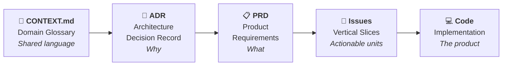
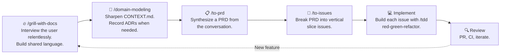
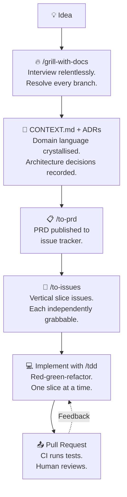
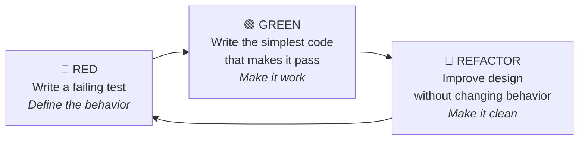
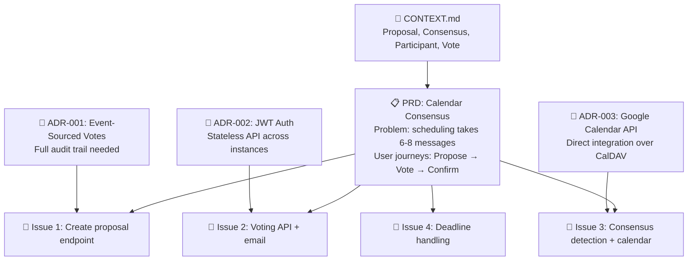
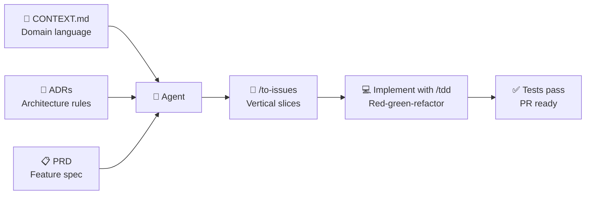

# Top-Down Planning<br />The Decision Stack

## From Architecture to Code<br/>through Progressive Abstraction

<div class="abs-br m-6 flex gap-2">
  <span class="text-sm opacity-50">Agentic Engineering Course — Lesson 2</span>
</div>

---
layout: default
---

# Lesson Agenda — 120 minutes

<div class="grid grid-cols-2 gap-4 mt-8">

<div class="p-4 bg-blue-500/10 rounded-lg border border-blue-500/30">

### 🧠 Theory — 30 min

The **Decision Stack**:
3 layers — ADR, Domain Glossary (CONTEXT.md), PRD — with agent skills as process guides

<div class="mt-3 text-xs opacity-70">
  A lightweight workflow — documents are outputs of the process, not prerequisites.<br/>
  <span class="opacity-50">Workflow by Matt Pocock</span>
</div>

</div>

<div v-click class="p-4 bg-purple-500/10 rounded-lg border border-purple-500/30">

### 🏗️ Practice — 90 min

- 10 min: Read & critique an existing ADR and PRD
- 50 min: Write your own Decision Stack for the Calendar Consensus App using the agent skills
- 30 min: Cross-review & discussion

</div>

</div>

<div class="mt-8 text-center text-sm opacity-50">
  <b>Prerequisite:</b> Lesson 1 completed + your group's <code>plan.md</code> from the co-decomposition exercise.<br/>
  <b>Objective:</b> Master the top-down planning framework and produce real ADRs, a domain glossary, and a PRD.
</div>

---
layout: section
---

# Part 1 — Theory
## The Decision Stack (30 min)

---
layout: statement
---

# Why does any of this matter?

<div class="mt-6 text-lg opacity-70">
  ADR, PRD, Domain Glossary...<br/>
  that's a lot of documents.
</div>

<div v-click class="mt-12 text-sm opacity-50">
  A lightweight, composable approach to agentic engineering
</div>

---
layout: default
---

# Humans and LLMs Share the Same Trait

<div class="grid grid-cols-2 gap-6 mt-8">

<div class="p-4 bg-red-500/10 rounded-lg border border-red-500/30">

### Humans

<div class="text-sm mt-3 space-y-2">

- **Forget** why decisions were made
- **Leave** the team (or the company)
- **Limited context** — can't hold the entire codebase in their head
- **Reinvent** reasons for things that already have reasons

</div>

</div>

<div v-click class="p-4 bg-red-500/10 rounded-lg border border-red-500/30">

### LLMs / Agents

<div class="text-sm mt-3 space-y-2">

- **Context compacts** — lose information after many turns
- **No memory** — start fresh every session
- **Limited context window** — can't read the whole codebase
- **Hallucinate** reasons when context is missing

</div>

</div>

</div>

<div v-click class="mt-8 p-4 bg-yellow-500/10 rounded-lg border border-yellow-500/30 text-center text-sm">

<b>The answer?</b> Externalize decisions into persistent, discoverable documents.<br/>
Both humans and agents need them. Both can find them. Both can understand them.

</div>

---
layout: statement
---

# The Decision Stack

<div class="mt-8 text-lg opacity-70">
  Three layers of progressive abstraction<br/>
  from <b>why</b> to <b>what</b> to <b>code</b>
</div>

---
layout: default
---

# The Decision Stack — Overview

<div class="mt-6">



</div>

<div class="mt-4 grid grid-cols-3 gap-2 text-sm">

<div class="p-2 bg-blue-500/10 rounded text-center">
  <b>CONTEXT.md</b><br/>A glossary of domain terms —<br/>"one word, not twenty"
</div>

<div class="p-2 bg-green-500/10 rounded text-center">
  <b>ADR</b><br/>Surprising, hard-to-reverse<br/>decisions with real trade-offs
</div>

<div class="p-2 bg-yellow-500/10 rounded text-center">
  <b>PRD</b><br/>Problem, user stories,<br/>implementation decisions
</div>

</div>

<div v-click class="mt-4 text-xs opacity-60 text-center">
  ⬅️ The further left you go, the more stable. A glossary entry rarely changes. Code changes constantly.
</div>

---
layout: default
zoom: 0.85
---

# Before Agents — What Humans Used to Do
<div class="mt-4 text-sm">
Every phase of this workflow existed before agents — it was just performed by humans, with all the fragility that implies.
</div>

<div class="mt-4 grid grid-cols-2 gap-3 text-sm">
<div class="p-3 bg-blue-500/10 rounded-lg border border-blue-500/30">

#### 📖 Domain Glossary → Domain Experts

<div class="mt-1 opacity-70">
Shared vocabulary lived in onboarding docs and tribal knowledge. DDD teams ran week-long workshops to align on terms. When the expert left, the language left.
</div>

</div>

<div v-click class="p-3 bg-green-500/10 rounded-lg border border-green-500/30">

#### 📐 Architecture Decisions → Architects

<div class="mt-1 opacity-70">
Decisions made in design review boards, then stored in people's heads. "Ask Dave why we picked Postgres" — Dave left 8 months ago.
</div>

</div>

<div v-click class="p-3 bg-purple-500/10 rounded-lg border border-purple-500/30">

#### 📋 Requirements → Product Managers

<div class="mt-1 opacity-70">
Specs written in Confluence after weeks of stakeholder interviews. By the time coding started, requirements had already drifted.
</div>

</div>

<div v-click class="p-3 bg-yellow-500/10 rounded-lg border border-yellow-500/30">

#### 🔥 Grilling → The Socratic Tech Lead

<div class="mt-1 opacity-70">
Relentless questioning of assumptions during design reviews. Required the right person in the room — and the courage to ask "what if?"
</div>

</div>

<div v-click class="p-3 bg-red-500/10 rounded-lg border border-red-500/30">

#### 🎯 Decomposition → Sprint Planning

<div class="mt-1 opacity-70">
Features broken into tickets by tech leads. Quality depended on seniority: juniors built horizontal layers, seniors built vertical slices.
</div>

</div>

<div v-click class="p-3 bg-gray-500/10 rounded-lg border border-gray-500/30">

#### 💻 TDD → Individual Discipline

<div class="mt-1 opacity-70">
A personal practice some devs followed, most abandoned under deadline pressure. Tests were the first sacrifice when time ran short.
</div>

</div>

</div>

<div v-click class="mt-4 p-3 bg-yellow-500/10 rounded-lg border border-yellow-500/30 text-xs text-center">
<b>The shift with agents:</b> Each of these human activities can now be <b>guided by a skill</b> — encoding the discipline so it's applied consistently, regardless of who's driving or how much experience they have.<br/>
<span class="opacity-50">This agentic workflow was pioneered by Matt Pocock</span>
</div>

---
layout: section
---

# A note on philosophy

---
layout: default
zoom: 0.88
---

# This Is One Approach — Not The Only One

<div class="grid grid-cols-2 gap-4 mt-4">

<div class="p-4 bg-blue-500/10 rounded-lg border border-blue-500/30">

### This workflow

<div class="text-sm mt-3 space-y-2">

- **This workflow** — small, composable skills that guide process
- Documents are **lightweight** — an ADR can be 3 sentences
- Skills are **process guides**, not document templates
- Rooted in established practices: Domain-Driven Design, Extreme Programming, Pragmatic Programmer
- Designed to give **you** control — the agent helps, it doesn't own the decisions

<div class="mt-2 text-xs text-center opacity-50">
  Workflow originally developed by Matt Pocock
</div>

</div>

</div>

<div v-click class="p-4 bg-purple-500/10 rounded-lg border border-purple-500/30">

### Other approaches exist

<div class="text-sm mt-3 space-y-2">

- **BDD (Cucumber/Gherkin)** — executable specs in human language. Powerful but heavier process
- **Design Systems** — component libraries with visual rules for UI consistency
- **Spec-Kit / BMAD / GSD** — structured processes that own the workflow end-to-end
- **ADR-heavy approaches** — 50+ architecture documents with lint-enforced rules

</div>

<div class="mt-3 text-xs opacity-60">
  Each has trade-offs. Today we focus on one workflow — learn it, then adapt it.
</div>

</div>

</div>

<div v-click class="mt-4 p-3 bg-yellow-500/10 rounded-lg border border-yellow-500/30 text-xs text-center">
<b>Key principle:</b> The right amount of process is the minimum that makes your agent effective.<br/>
Too little → the agent invents its own reasons. Too much → you spend more time on docs than code.
</div>

---
layout: default
zoom: 0.95
---

# The Core Workflow

<div class="mt-4">



</div>

<div class="mt-4 text-xs text-center opacity-70">
  These are <b>the agent process skills</b> — the ones you'll install and use today.<br/>
  Each is a small, composable process guide. You can use them independently or in sequence.<br/>
  <span class="opacity-50">Created by Matt Pocock</span>
</div>

---
layout: default
zoom: 0.82
---

# Layer 0 — CONTEXT.md: The Domain Glossary

<div class="grid grid-cols-2 gap-6 mt-4">

<div>

### What it is

<div class="text-sm mt-3 space-y-2">

<div class="p-2 bg-blue-500/10 rounded-lg">

A **glossary of domain terms** — nothing more. Not a spec, not a scratch pad, not a design doc.

</div>

<div class="p-2 bg-blue-500/10 rounded-lg">

Defines the **ubiquitous language** of the project. One word per concept. No synonyms.

</div>

<div class="p-2 bg-blue-500/10 rounded-lg">

Agents use it to **name things consistently** — variables, functions, files.

</div>

</div>

<v-click>

<div class="mt-3 p-2 bg-green-500/10 rounded-lg text-xs">

<b>Why it matters:</b> Without it, agents use 20 words where 1 will do. With it, concision pays off session after session.

</div>

</v-click>

</div>

<div v-click>

### Real example

<div class="text-sm mt-3 p-3 bg-gray-500/10 rounded-lg border border-gray-500/30">

```markdown
# Calendar Consensus App

A tool for scheduling meetings through group voting.

## Language

**Proposal**:
A set of time slots proposed by an organizer for
a meeting. Exists until consensus or deadline.
_Avoid_: Poll, survey, event draft

**Consensus**:
All participants agree on the same time slot.
Triggers calendar event creation.
_Avoid_: Agreement, resolution, confirmation

**Participant**:
A person invited to vote on a proposal.
_Avoid_: User, voter, member, attendee
```

</div>

</div>

</div>

<div v-click class="mt-4 p-3 bg-gray-500/10 rounded-lg border border-gray-500/30 text-xs">
<b>👥 Before agents:</b> A domain expert or senior engineer maintained the shared vocabulary through onboarding docs and tribal knowledge. DDD teams ran Event Storming workshops lasting days to align on terminology. New hires took weeks to learn the language — and when the expert left, the precision left with them.
</div>

<div v-click class="mt-4 p-3 bg-yellow-500/10 rounded-lg border border-yellow-500/30 text-xs text-center">
<b>💡 With a shared language:</b> "There's a problem with the consensus check" — not "There's a problem when everyone says yes to the same slot in the voting poll."
</div>

---
layout: default
zoom: 0.85
---

# CONTEXT.md — How the Agent Uses It

<div class="grid grid-cols-2 gap-6 mt-6">

<div>

### Before

<div class="text-sm mt-3 space-y-3">

<div class="p-2 bg-red-500/10 rounded-lg">

Agent writes: `function checkAllParticipantsAgreedOnSameSlot()`

</div>

<div class="p-2 bg-red-500/10 rounded-lg">

Agent writes test: "should check that all participants agreed on the same time slot"

</div>

<div class="p-2 bg-red-500/10 rounded-lg">

Agent uses: proposal, poll, survey, event draft — all interchangeably

</div>

</div>

</div>

<div v-click>

### After (with CONTEXT.md)

<div class="text-sm mt-3 space-y-3">

<div class="p-2 bg-green-500/10 rounded-lg">

Agent writes: `checkConsensus()`

</div>

<div class="p-2 bg-green-500/10 rounded-lg">

Agent writes test: "consensus triggers event creation"

</div>

<div class="p-2 bg-green-500/10 rounded-lg">

Agent uses only "Proposal" and "Consensus" — consistently, everywhere

</div>

</div>

</div>

</div>

<div v-click class="mt-4 p-3 bg-yellow-500/10 rounded-lg border border-yellow-500/30 text-xs text-center">
<b>Result:</b> Less thinking for the agent. Fewer tokens spent. Cleaner names. Easier navigation.
</div>

---
layout: default
zoom: 0.95
---

# Layer 1 — ADR: Architecture Decision Record

<div class="grid grid-cols-2 gap-6 mt-4">

<div>

#### The ADR philosophy

<div class="text-sm mt-3 space-y-3">

<div class="p-2 bg-blue-500/10 rounded-lg">

An ADR can be **1-3 sentences**. The value is recording that a decision was made and why — not filling out sections.

</div>

<div v-click class="p-2 bg-yellow-500/10 rounded-lg border border-yellow-500/30">
<b>Only create an ADR when ALL THREE are true:</b>

<div class="mt-2 space-y-1 text-xs">

- 🔒 **Hard to reverse** — changing your mind later costs something
- 🤔 **Surprising without context** — a future reader will wonder "why?"
- ⚖️ **Result of a real trade-off** — there were genuine alternatives

</div>

</div>

<div v-click class="p-2 bg-green-500/10 rounded-lg text-xs">

If a decision is easy to reverse, skip it. If it's the obvious choice, skip it. <b>Most decisions don't need ADRs.</b>

</div>

</div>

</div>

<div v-click>

#### Examples

<div class="text-sm mt-3 space-y-3">

```markdown
# Event-Sourced Write Model

We're using event sourcing for the write side
because we need a full audit trail of every
vote change. The read model is projected into
Postgres. Considered CQRS with a message bus
but decided against it — too heavy for this
team size.
```

<div class="p-2 bg-gray-500/10 rounded-lg text-xs">
  ✅ Hard to reverse (core architecture), surprising (many would use CRUD), real trade-off (CQRS was considered).
</div>

</div>

</div>

</div>

<div v-click class="mt-3 p-3 bg-yellow-500/10 rounded-lg border border-yellow-500/30 text-xs">
<b>👥 Before agents:</b> Decisions lived in meeting notes or people's heads — "ask Dave why we picked Postgres." Dave left, the <i>why</i> left with him. ADRs make reasoning discoverable forever. &nbsp;|&nbsp; <b>Location:</b> <code>docs/adr/0001-slug.md</code>, numbered sequentially.
</div>

---
layout: default
---

# ADR — What Qualifies and What Doesn't

<div class="grid grid-cols-2 gap-4 mt-3">

<div>

### ✅ Worth an ADR

<div class="text-sm mt-2 space-y-1">

<div class="p-1 bg-green-500/10 rounded-lg">

**Architectural shape.** "We're using a monorepo." "The write model is event-sourced."

</div>

<div class="p-1 bg-green-500/10 rounded-lg">

**Integration patterns.** "Ordering and Billing communicate via domain events."

</div>

<div class="p-1 bg-green-500/10 rounded-lg">

**Technology choices with lock-in.** Database, message bus, auth provider — the ones that would take a quarter to swap.

</div>

<div class="p-1 bg-green-500/10 rounded-lg">

**Deliberate deviations.** "We're using manual SQL instead of an ORM because..." — stops someone from "fixing" something deliberate.

</div>

</div>

</div>

<div v-click>

### ❌ Not worth an ADR

<div class="text-sm mt-2 space-y-1">

<div class="p-1 bg-red-500/10 rounded-lg">

**Generic choices.** "We're using Python." Not surprising. Not an ADR.

</div>

<div class="p-1 bg-red-500/10 rounded-lg">

**Library choices.** "We picked axios over fetch." Minimal lock-in.

</div>

<div class="p-1 bg-red-500/10 rounded-lg">

**Obvious patterns.** "We separate concerns with MVC." Everyone expects this.

</div>

<div class="p-1 bg-red-500/10 rounded-lg">

**Reversible decisions.** "Let's try Tailwind for a sprint." If it doesn't work, switch back.

</div>

</div>

</div>

</div>

---
layout: default
zoom: 0.88
---

# Layer 2 — PRD: Product Requirements Document

<div class="grid grid-cols-2 gap-6 mt-4">

<div>

### What it captures

<div class="text-sm mt-3 space-y-2">

<div class="p-2 bg-blue-500/10 rounded-lg">

**Problem Statement** — from the user's perspective

</div>

<div class="p-2 bg-blue-500/10 rounded-lg">

**Solution** — what the feature does

</div>

<div class="p-2 bg-blue-500/10 rounded-lg">

**User Stories** — exhaustive list of actor-feature-benefit

</div>

<div class="p-2 bg-blue-500/10 rounded-lg">

**Implementation Decisions** — modules, interfaces, architecture, schemas

</div>

</div>

<div v-click class="mt-3 p-2 bg-green-500/10 rounded-lg text-xs">

Synthesized from the conversation by `/to-prd` — no separate interview needed.

</div>

</div>

<div v-click>

### PRD template

<div class="text-sm mt-3 p-3 bg-gray-500/10 rounded-lg border border-gray-500/30 space-y-2">

<div class="text-xs font-bold">Problem Statement</div>
<div class="text-xs opacity-70">Scheduling meetings with 5+ participants takes 6–8 back-and-forth messages.</div>

<div class="text-xs font-bold">Solution</div>
<div class="text-xs opacity-70">Create calendar events only when everyone agrees on a time slot — automatically.</div>

<div class="text-xs font-bold">User Stories (exhaustive)</div>
<div class="text-xs opacity-70">1. As an organizer, I want to propose time slots so that participants can vote.<br/>
2. As a participant, I want to vote yes/no per slot so that my preference is recorded.</div>

<div class="text-xs font-bold">Implementation Decisions</div>
<div class="text-xs opacity-70">Modules built, interfaces modified, schema changes, API contracts</div>

</div>

</div>

</div>

<div v-click class="mt-4 p-3 bg-gray-500/10 rounded-lg border border-gray-500/30 text-xs">
<b>👥 Before agents:</b> A product manager spent weeks interviewing stakeholders, writing specs in Confluence or Google Docs, and circulating them for approval. By the time coding started, requirements had often already shifted. The spec and the codebase drifted apart — each living in its own silo, neither fully trusted.
</div>

---
layout: default
---

# PRD vs. plan.md — The Upgrade

<div class="grid grid-cols-2 gap-6 mt-6">

<div class="p-4 bg-blue-500/10 rounded-lg border border-blue-500/30">

### plan.md (Lesson 1)

<div class="text-sm mt-3 space-y-2">

- **Exploratory** — negotiated in conversation
- **Group exercise** — collaborative discovery
- **6 loose sections** — Goal, Scope, Constraints, User Stories, Acceptance Criteria, Risks
- **Rough draft** — captures thinking, not perfection

</div>

<div class="mt-3 text-xs opacity-60">
  This was your first interaction with the agent.
</div>

</div>

<div v-click class="p-4 bg-green-500/10 rounded-lg border border-green-500/30">

### PRD (this lesson)

<div class="text-sm mt-3 space-y-2">

- **Structured** — follows a deliberate template
- **Authoritative** — single source of truth for the feature
- **Published to the issue tracker** — becomes the parent issue for implementation
- **Persistent** — lives in the repo, versioned in git

</div>

<div class="mt-3 text-xs opacity-60">
  This is the document the agent will use to build the feature.
</div>

</div>

</div>

<div v-click class="mt-4 p-3 bg-yellow-500/10 rounded-lg border border-yellow-500/30 text-xs text-center">
<b>The transformation:</b> plan.md was the <b>conversation</b>. The PRD is the <b>commitment</b>.
</div>

---
layout: default
zoom: 0.95
---

# Skills: Process Guides, Not Document Templates

<div class="grid grid-cols-2 gap-6 mt-6">

<div>

### Old mental model ❌

<div class="text-sm mt-3 space-y-3">

<div class="p-2 bg-red-500/10 rounded-lg">

Skills load documents into agent context

</div>

<div class="p-2 bg-red-500/10 rounded-lg">

ADR skill → loads architecture rules

</div>

<div class="p-2 bg-red-500/10 rounded-lg">

PRD skill → loads feature spec

</div>

<div class="p-2 bg-red-500/10 rounded-lg">

UI skill → loads design system

</div>

</div>

</div>

<div v-click>

### The process model ✅

<div class="text-sm mt-3 space-y-3">

<div class="p-2 bg-green-500/10 rounded-lg">

Skills are **process guides** — they tell the agent *how* to work, not *what* to load

</div>

<div class="p-2 bg-green-500/10 rounded-lg">

`/grill-with-docs` — runs an interview to align understanding

</div>

<div class="p-2 bg-green-500/10 rounded-lg">

`/to-prd` — synthesizes a PRD from the conversation

</div>

<div class="p-2 bg-green-500/10 rounded-lg">

`/tdd` — guides the red-green-refactor loop

</div>

</div>

</div>

</div>

<div v-click class="mt-6 p-3 bg-yellow-500/10 rounded-lg border border-yellow-500/30 text-xs text-center">
  <b>The agent reads documents because the process tells it to</b> — not because a "skill" loads them.<br/>
  The skill orchestrates; the documents are inputs to the process, not the process itself.
</div>

---
layout: default
---

# The Skills You'll Use

<div class="mt-4">

### The engineering process skills — installed in one command

<div class="mt-6 grid grid-cols-2 gap-4 text-sm">

<div class="p-3 bg-blue-500/10 rounded-lg border border-blue-500/30">

### User-invoked (you type them)

<div class="mt-2 space-y-2 text-xs">

<div class="p-1 bg-gray-500/10 rounded">
  <b>/grill-with-docs</b> — Interview + build shared language. The most important skill.
</div>

<div class="p-1 bg-gray-500/10 rounded">
  <b>/to-prd</b> — Synthesize conversation into a PRD. Publish to issue tracker.
</div>

<div class="p-1 bg-gray-500/10 rounded">
  <b>/to-issues</b> — Break a PRD into vertical slice issues.
</div>

<div class="p-1 bg-gray-500/10 rounded">
  <b>/improve-codebase-architecture</b> — Scan for deepening opportunities.
</div>

</div>

</div>

<div v-click class="p-3 bg-purple-500/10 rounded-lg border border-purple-500/30">

### Model-invoked (agent reaches for them)

<div class="mt-2 space-y-2 text-xs">

<div class="p-1 bg-gray-500/10 rounded">
  <b>/domain-modeling</b> — Active discipline: sharpen terms, challenge, write CONTEXT.md + ADRs.
</div>

<div class="p-1 bg-gray-500/10 rounded">
  <b>/tdd</b> — Red-green-refactor loop. One vertical slice at a time.
</div>

<div class="p-1 bg-gray-500/10 rounded">
  <b>/codebase-design</b> — Vocabulary for deep modules, seams, interfaces.
</div>

<div class="p-1 bg-gray-500/10 rounded">
  <b>/diagnosing-bugs</b> — Reproduce → minimise → hypothesise → fix.
</div>

</div>

</div>

</div>

<div v-click class="mt-4 p-3 bg-yellow-500/10 rounded-lg border border-yellow-500/30 text-xs text-center">
  <b>Install:</b> <code>npx skills@latest add</code> — pick the skills you want, run the setup skill once per repo.
</div>

</div>

---
layout: default
zoom: 0.88
---

# How The Loop Works

<div class="mt-4">



</div>

<div v-click class="mt-4 text-xs text-center opacity-70">
  <b>This is the real workflow.</b> Not a theoretical stack — actual skills you run, in sequence, to go from idea to merged PR.<br/>
  Documents are created along the way as <b>outputs of the process</b>, not prerequisites to start.
</div>

---
layout: default
zoom: 0.75
---

# The Loop with Agent Skills — Concrete Example

<div class="text-sm mt-4 space-y-3">

<div class="p-3 bg-blue-500/10 rounded-lg border border-blue-500/30">

### Step 1: Grill with docs
You: `/grill-with-docs` — *"I want to build a calendar consensus app"*
Agent interviews you one question at a time. As terms crystallize, `/domain-modeling` updates CONTEXT.md inline.

</div>

<div v-click class="p-3 bg-green-500/10 rounded-lg border border-green-500/30">

### Step 2: Record architecture decisions
Agent: *"Are we using event sourcing for votes? The alternative is CRUD with a history table."*
You decide → agent writes a 3-sentence ADR in `docs/adr/0001-event-sourced-votes.md`.

</div>

<div v-click class="p-3 bg-yellow-500/10 rounded-lg border border-yellow-500/30">

### Step 3: Synthesize the PRD
Agent has everything it needs. `/to-prd` publishes a PRD to the issue tracker with Problem, Solution, User Stories, Implementation Decisions.

</div>

<div v-click class="p-3 bg-purple-500/10 rounded-lg border border-purple-500/30">

### Step 4: Break into issues + implement
`/to-issues` creates vertical slices. Each is a small, independently grabbable unit. Implement each with `/tdd` — one slice at a time.

</div>

</div>

<div v-click class="mt-4 p-3 bg-gray-500/10 rounded-lg border border-gray-500/30 text-xs">
<b>👥 Before agents, this same loop required 3–5 different people:</b> a domain expert for shared language, an architect for design decisions, a PM for requirements, a tech lead for decomposition, and developers for implementation. Each handoff risked information loss. Now a single agent, guided by skills, can walk the same path without dropping context.
</div>

<div v-click class="mt-4 p-3 bg-yellow-500/10 rounded-lg border border-yellow-500/30 text-xs text-center">
  <b>Same loop, different focus each time.</b> Skills are the harness that focuses the agent on the right process.
</div>

---
layout: default
---

# Vertical Slices — The Core Pattern

<div class="grid grid-cols-2 gap-4 mt-4">

<div>

### What is a vertical slice?

<div class="text-xs mt-2 space-y-2">

A **tracer bullet** — a thin, complete path through ALL layers of the system:

<div class="mt-2 space-y-1">

- Schema → API → UI → Tests → done
- Each slice is **demoable** on its own
- Each slice is **independently grabbable**

</div>

<div v-click class="mt-3 p-2 bg-green-500/10 rounded-lg text-xs">

<b>Produces good tests</b> because you test one behavior at a time, with the real implementation behind it.

</div>

</div>

</div>

<div v-click>

### Example for Calendar Consensus

<div class="text-sm space-y-2">

<div class="p-2 bg-blue-500/10 rounded-lg">
  <b>Slice 1:</b> Organizer can create a proposal with time slots → API endpoint + DB schema + minimal UI
</div>

<div class="p-2 bg-blue-500/10 rounded-lg">
  <b>Slice 2:</b> Participant can vote yes/no on a slot → voting API + email notification + vote UI
</div>

<div class="p-2 bg-blue-500/10 rounded-lg">
  <b>Slice 3:</b> Consensus triggers calendar event → consensus detection + Google Calendar integration
</div>

<div class="p-2 bg-blue-500/10 rounded-lg">
  <b>Slice 4:</b> Deadline passes without consensus → deadline cron + no-event notification
</div>

</div>

</div>

</div>

<div v-click class="mt-4 p-3 bg-gray-500/10 rounded-lg border border-gray-500/30 text-xs">
<b>👥 Before agents:</b> Senior developers mentally decomposed features into vertical slices. Junior developers often fell into the trap of building horizontal layers first (all models → all APIs → all UI), creating integration hell at the end. The quality of decomposition depended entirely on who was doing it — no process enforced the pattern.
</div>

<div v-click class="mt-4 p-3 bg-yellow-500/10 rounded-lg border border-yellow-500/30 text-xs text-center">
<b>⚠️ Anti-pattern:</b> "Write all tests first, then all implementation." This produces crap tests that test imagination, not behavior.<br/>
<b>✅ Correct:</b> One test → one implementation → repeat. Each test responds to what you learned from the previous cycle.
</div>

---
layout: default
zoom: 0.90
---

# Test-Driven Development — The Engine

<div class="grid grid-cols-2 gap-4 mt-3">

<div>

### The Red-Green-Refactor Cycle

<div class="text-xs mt-2">



</div>

<div class="mt-2 space-y-1 text-xs">

<div class="p-2 bg-red-500/10 rounded-lg">
<b>🔴 RED:</b> Write exactly one failing test. Not a suite — a single, precise specification of behavior that doesn't exist yet. Run it. Watch it fail. <i>This proves the test is testing something real.</i>
</div>

<div class="p-2 bg-green-500/10 rounded-lg">
<b>🟢 GREEN:</b> Write the absolute minimum code to make the test pass. No gold-plating, no "while I'm here" refactors. Cheat if you have to — return a hardcoded value. <i>The goal is fast feedback.</i>
</div>

<div class="p-2 bg-blue-500/10 rounded-lg">
<b>🔵 REFACTOR:</b> Now that you have passing tests, improve the design. Extract methods, rename variables, remove duplication. The tests guarantee you haven't broken anything. <i>This is where clean code happens.</i>
</div>

</div>

</div>

<div v-click>

### Why TDD with Agents

<div class="text-xs mt-2 space-y-2">

<div class="p-2 bg-purple-500/10 rounded-lg border border-purple-500/30 text-xs">

<b>The agent doesn't "know" your codebase.</b> TDD gives it a tight feedback loop — write a test, see it fail, implement, see it pass. Each cycle is 30-90 seconds. Errors are caught immediately, not after 200 lines of untested code.

</div>

<div class="p-2 bg-purple-500/10 rounded-lg border border-purple-500/30 text-xs">

<b>Tests survive the agent.</b> The agent leaves after the session. The tests stay. They document what the code does, guard against regressions, and give the next agent (or human) confidence to refactor.

</div>

<div class="p-2 bg-purple-500/10 rounded-lg border border-purple-500/30 text-xs">

<b>One vertical slice = many TDD cycles.</b> Each slice is built through multiple red-green-refactor loops. You don't write all tests first — you write one test, make it pass, refactor, then write the next. The design emerges from the cycles.

</div>

</div>

</div>

</div>

<div v-click class="mt-4 p-3 bg-yellow-500/10 rounded-lg border border-yellow-500/30 text-xs text-center">
<b>👥 Before agents:</b> TDD was an individual discipline practiced by a minority of developers. Under deadline pressure, tests were the first sacrifice — "we'll add them later" (they never did). With agents, TDD becomes a <b>process guardrail</b>: the agent follows the cycle because the skill tells it to, not because it's in the mood.
</div>

---
layout: default
zoom: 0.9
---

# What Makes A Good Test (The TDD Philosophy)

<div class="grid grid-cols-2 gap-6 mt-6">

<div>

### Good tests ✅

<div class="text-sm mt-3 space-y-3">

<div class="p-2 bg-green-500/10 rounded-lg">

**Test behavior through public interfaces.** "User can checkout with valid cart" — describes what the system does.

</div>

<div class="p-2 bg-green-500/10 rounded-lg">

**Survive refactors.** Change internal code, test still passes — because it tests behavior, not implementation.

</div>

<div class="p-2 bg-green-500/10 rounded-lg">

**Integration-style.** Exercise real code paths through public APIs. Not unit tests of isolated functions.

</div>

</div>

</div>

<div v-click>

### Bad tests ❌

<div class="text-sm mt-3 space-y-3">

<div class="p-2 bg-red-500/10 rounded-lg">

**Test implementation details.** Mock internal collaborators, test private methods, verify database queries directly.

</div>

<div class="p-2 bg-red-500/10 rounded-lg">

**Break on refactor.** Rename an internal function → tests fail. Those tests were testing structure, not behavior.

</div>

<div class="p-2 bg-red-500/10 rounded-lg">

**Test imagination.** Write all tests before any code. You're testing what you *think* the code will do — not what it actually does.

</div>

</div>

</div>

</div>

<div v-click class="mt-4 p-3 bg-yellow-500/10 rounded-lg border border-yellow-500/30 text-xs text-center">
<b>Core principle:</b> The test is a specification — <i>what</i> the system does, not <i>how</i> it does it.<br/>
Code can change entirely. Tests shouldn't.
</div>

---
layout: default
---

# Deep Modules — The Architecture Vocabulary

<div class="grid grid-cols-2 gap-4 mt-4">

<div>

### Key terms (from `/codebase-design`)

<div class="text-sm mt-3 space-y-2">

<div class="p-2 bg-blue-500/10 rounded-lg">
  <b>Module</b> — anything with an interface and an implementation. Scale-agnostic.
</div>

<div class="p-2 bg-blue-500/10 rounded-lg">
  <b>Interface</b> — everything a caller must know. Not just types — also invariants, error modes, ordering constraints.
</div>

<div class="p-2 bg-blue-500/10 rounded-lg">
  <b>Depth</b> — leverage at the interface. Lots of behavior behind a small interface.
</div>

</div>

</div>

<div v-click>

### Deep vs. shallow

<div class="text-sm mt-3">

```
┌─────────────────────┐
│   Small Interface   │  ← Few methods, simple params
├─────────────────────┤
│                     │
│  Deep Implementation│  ← Complex logic hidden
│                     │
└─────────────────────┘
```

<div class="mt-3 p-2 bg-red-500/10 rounded-lg text-xs">
  <b>Shallow module (avoid):</b> Large interface, thin implementation. Just passes through.
</div>

<div class="mt-2 p-2 bg-green-500/10 rounded-lg text-xs">
  <b>Deep module (aim for):</b> Small interface, lots of complexity hidden inside.
</div>

</div>

</div>

</div>

<div v-click class="mt-4 p-3 bg-yellow-500/10 rounded-lg border border-yellow-500/30 text-xs text-center">
  <b>The deletion test:</b> If deleting a module just moves complexity around, it was shallow. If complexity vanishes, it was earning its keep.<br/>
  <b>One adapter = hypothetical seam. Two adapters = real one.</b> Don't introduce seams unless something actually varies across them.
</div>

---
layout: default
zoom: 0.88
---

# Drawbacks (and Why They're OK)

<div class="grid grid-cols-2 gap-6 mt-6">

<div>

### ⚠️ Context-heavy

<div class="text-sm mt-3 p-3 bg-yellow-500/10 rounded-lg border border-yellow-500/30">

Loading CONTEXT.md + ADRs + PRD can consume context before work even starts.

</div>

<div v-click class="mt-4">

### ⚠️ Maintenance cost

<div class="text-sm mt-3 p-3 bg-yellow-500/10 rounded-lg border border-yellow-500/30">

Documents must stay in sync. An outdated ADR is worse than no ADR — it actively misleads.

</div>

</div>

</div>

<div v-click>

### ✅ Why it still works

<div class="text-sm mt-3 space-y-3">

<div class="p-3 bg-green-500/10 rounded-lg border border-green-500/30">

**These documents are intentionally lightweight.** An ADR is 3 sentences. CONTEXT.md is a glossary, not a design doc. They're cheap to maintain.

</div>

<div class="p-3 bg-green-500/10 rounded-lg border border-green-500/30">

**Documents are outputs of the process, not prerequisites.** You grill → terms crystallize → write them down. You don't start by writing 50 documents.

</div>

<div class="p-3 bg-green-500/10 rounded-lg border border-green-500/30">

**The alternative is chaos.** Without these documents, the agent invents its own reasons. And they're usually wrong.

</div>

</div>

</div>

</div>

<div v-click class="p-3 bg-blue-500/10 rounded-lg border border-blue-500/30 text-xs text-center">
  <b>Goal:</b> focused agent sessions with clear rules — not multi-hour autonomous runs.<br/>
  The skills keep the agent on rails, one step at a time.
</div>

---
layout: default
zoom: 0.9
---

# Theory Recap — The Decision Stack

<div class="grid grid-cols-3 gap-3 mt-6">

<div class="p-4 bg-blue-500/10 rounded-lg border border-blue-500/30 text-center">
  <div class="text-3xl mb-2">📖</div>
  <b>CONTEXT.md</b>
  <div class="text-xs mt-2 opacity-70">
    Domain glossary<br/>
    <b>Shared language</b><br/>
    One word per concept<br/>
    Updated by /domain-modeling
  </div>
</div>

<div v-click class="p-4 bg-green-500/10 rounded-lg border border-green-500/30 text-center">
  <div class="text-3xl mb-2">📐</div>
  <b>ADR</b>
  <div class="text-xs mt-2 opacity-70">
    Architecture decisions<br/>
    <b>Why</b> we build it this way<br/>
    1-3 sentences each<br/>
    Only for surprising, hard-to-reverse, trade-off decisions
  </div>
</div>

<div v-click class="p-4 bg-purple-500/10 rounded-lg border border-purple-500/30 text-center">
  <div class="text-3xl mb-2">📋</div>
  <b>PRD</b>
  <div class="text-xs mt-2 opacity-70">
    Feature specifications<br/>
    <b>What</b> problem it solves<br/>
    User stories + implementation decisions<br/>
    Published to issue tracker
  </div>
</div>

</div>

<div v-click class="mt-6 p-3 bg-yellow-500/10 rounded-lg border border-yellow-500/30 text-xs text-center">
  <b>All three connected by the loop:</b> /grill-with-docs → /domain-modeling → /to-prd → /to-issues → implement with /tdd<br/>
  <b>What you can't find, you can't enforce.</b> Externalize, document, then build.
</div>

---
layout: section
---

# Part 2 — Practice
## Building Your Decision Stack (90 min)


---
layout: default
zoom: 0.88
---

# The Exercise — Run the Full Loop (90 min)

<div class="mt-6">

<div class="flex items-center gap-2 text-xs justify-center flex-wrap">

<div class="p-3 bg-gray-500/10 rounded-lg border border-gray-500/30 text-center w-44">
<div class="text-xl mb-1">🔥</div>
<b>/grill-with-docs</b>
<div class="mt-1 opacity-70">Interview relentlessly.<br/>Crystallize decisions.</div>
</div>

<span class="text-xl opacity-40">→</span>

<div v-click class="p-3 bg-gray-500/10 rounded-lg border border-gray-500/30 text-center w-44">
<div class="text-xl mb-1">📖</div>
<b>CONTEXT.md + ADRs</b>
<div class="mt-1 opacity-70">Domain glossary.<br/>Architecture decisions.</div>
</div>

<span v-click class="text-xl opacity-40">→</span>

<div v-click class="p-3 bg-gray-500/10 rounded-lg border border-gray-500/30 text-center w-44">
<div class="text-xl mb-1">📋</div>
<b>/to-prd</b>
<div class="mt-1 opacity-70">Synthesize into<br/>a structured PRD.</div>
</div>

<span v-click class="text-xl opacity-40">→</span>

<div v-click class="p-3 bg-gray-500/10 rounded-lg border border-gray-500/30 text-center w-44">
<div class="text-xl mb-1">🎯</div>
<b>/to-issues</b>
<div class="mt-1 opacity-70">Break PRD into<br/>vertical slice issues.</div>
</div>

</div>

<div v-click class="mt-6 p-3 bg-yellow-500/10 rounded-lg border border-yellow-500/30 text-xs text-center">
<b>⚠️ Fundamental rule:</b> No code. Today you produce the Decision Stack: CONTEXT.md, ADRs, PRD, <b>and issues</b>.<br/>
Code comes in the next lesson when the agent reads these documents and implements them.
</div>

</div>

---
layout: default
zoom: 0.82
---

# What You'll Produce

<div class="mt-4">

### You'll produce 3 documents (one per group)

<div class="grid grid-cols-3 gap-3 mt-4">

<div class="p-3 bg-blue-500/10 rounded-lg border border-blue-500/30">

### 📖 CONTEXT.md

<div class="text-xs mt-2 space-y-1 opacity-70">

Define the domain glossary for your Calendar Consensus App:
- Canonical terms (Proposal, Consensus, Participant...)
- What to avoid per term
- Group terms under subheadings if clusters emerge

</div>

</div>

<div class="p-3 bg-green-500/10 rounded-lg border border-green-500/30">

### 📐 ADRs (at least 2)

<div class="text-xs mt-2 space-y-1 opacity-70">

Only for decisions that are:
- Hard to reverse
- Surprising without context
- The result of a real trade-off

Topics to consider: auth strategy, data storage, consensus algorithm, API design.

</div>

</div>

<div class="p-3 bg-purple-500/10 rounded-lg border border-purple-500/30">

### 📋 PRD (1, complete)

<div class="text-xs mt-2 space-y-1 opacity-70">

Transform your plan.md using the agent:
- Problem statement
- Solution
- User stories (exhaustive)
- Implementation decisions
- Testing decisions
- Out of scope

</div>

</div>

</div>

<div v-click class="mt-4 p-3 bg-yellow-500/10 rounded-lg border border-yellow-500/30 text-xs">

<b>⚓ The ADR test:</b> before writing an ADR, ask: "Is this hard to reverse? Would someone wonder why? Were there real alternatives?" If any answer is no, skip it.

</div>

</div>

---
layout: default
zoom: 0.88
---

# The Agent's Role

<div class="grid grid-cols-2 gap-4 mt-4">

<div>

### How to use the agent

<div class="text-sm mt-3 space-y-3">

<div class="p-2 bg-blue-500/10 rounded-lg">

**Start with grilling:** Run `/grill-with-docs` — *"I want to build a Calendar Consensus App. Ask me one question at a time."*

</div>

<div v-click class="p-2 bg-blue-500/10 rounded-lg">

**Let terms crystallize:** As you define Proposal, Consensus, Participant — the agent updates CONTEXT.md inline.

</div>

<div v-click class="p-2 bg-blue-500/10 rounded-lg">

**For ADRs:** When the agent asks about auth or storage decisions, give your answer. The agent records it as a 1-3 sentence ADR.

</div>

<div v-click class="p-2 bg-blue-500/10 rounded-lg">

**For PRD:** Once grilling is done, say *"Now synthesize everything into a PRD"* — the agent runs `/to-prd`.

</div>

</div>

</div>

<div v-click>

### ⚠️ Pitfalls to avoid

<div class="text-sm mt-3 space-y-3">

<div class="p-2 bg-red-500/10 rounded-lg">

**Don't over-document.** Most decisions don't need ADRs. "We're using Python" is not an ADR.

</div>

<div class="p-2 bg-red-500/10 rounded-lg">

**Don't accept the first draft.** The agent's first pass is generic. Push back: *"Be more specific. What exactly are the trade-offs?"*

</div>

<div class="p-2 bg-red-500/10 rounded-lg">

**Don't skip CONTEXT.md.** The shared language is the foundation everything else builds on. Invest time here.

</div>

</div>

</div>

</div>

<div v-click class="mt-4 p-3 bg-yellow-500/10 rounded-lg border border-yellow-500/30 text-xs text-center">
  <b>💡 The agent is a process guide, not the author.</b> Your group owns the decisions. The agent helps structure them.
</div>

---
layout: default
zoom: 0.88
---

# CONTEXT.md Template

<div class="mt-4">

```markdown
# Calendar Consensus App

A tool for scheduling meetings through group voting on
proposed time slots.

## Language

**Proposal**:
A set of time slots proposed by an organizer for a
meeting. Exists until consensus is reached or the
deadline passes.
_Avoid_: Poll, survey, event draft

**Consensus**:
All participants agree on the same time slot within a
proposal. Triggers automatic calendar event creation.
_Avoid_: Agreement, resolution, confirmation

**Participant**:
A person invited to vote on a proposal's time slots.
_Avoid_: User, voter, member, attendee

**Vote**:
A participant's yes/no decision on a specific time
slot within a proposal.
_Avoid_: Response, answer, choice
```

<div class="mt-2 text-xs opacity-60">
  Format: term → 1-2 sentence definition → what to avoid.<br/>
  Be opinionated. Pick the best word and ban the rest.
</div>

</div>

---
layout: default
zoom: 0.85
---

# ADR Template

<div class="mt-4">

<div class="text-sm">

```markdown
# {Short title of the decision}

{1-3 sentences: what's the context, what did
we decide, and why.}
```

</div>

<div class="mt-4 p-3 bg-blue-500/10 rounded-lg border border-blue-500/30 text-xs">

### Optional sections — only include when they add value

```markdown
**Status:** proposed | accepted | deprecated | superseded by ADR-NNNN
**Considered Options:** only when rejected alternatives are worth remembering
**Consequences:** only when non-obvious downstream effects need calling out
```

</div>

<div class="mt-4 grid grid-cols-2 gap-3 text-xs">

<div class="p-2 bg-green-500/10 rounded-lg">

<b>Good ADR:</b> "We're using event sourcing for the write model because we need a full audit trail of every vote change. The read model is projected into Postgres. Considered CQRS with a message bus but decided against — too heavy for this team size."

</div>

<div class="p-2 bg-red-500/10 rounded-lg">

<b>Not an ADR:</b> "We're using Python for the backend." — not surprising, no real alternative, no trade-off to record.

</div>

</div>

<div class="mt-2 text-xs opacity-60">
  Save as <code>docs/adr/0001-slug.md</code>. Number sequentially. Create the directory lazily.
</div>

</div>

---
layout: default
zoom: 0.8
---

# PRD Template

<div class="mt-4">

<div class="text-sm">

```markdown
## Problem Statement

The problem the user is facing, from the user's perspective.

## Solution

The solution to the problem, from the user's perspective.

## User Stories

1. As an <actor>, I want a <feature>, so that <benefit>
2. As an <actor>, I want a <feature>, so that <benefit>
...
(This list should be extremely extensive — cover all aspects.)

## Implementation Decisions

- The modules that will be built or modified
- The interfaces of those modules
- Technical clarifications, architectural decisions
- Schema changes, API contracts
(No file paths or code snippets — they go stale fast.)

## Testing Decisions

- What makes a good test for this feature
- Which modules will be tested
- Prior art for the tests

## Out of Scope

What is explicitly NOT included in this PRD.

## Further Notes

Any additional context or notes.
```

</div>

<div class="mt-2 text-xs opacity-60">
  This is the template used by <code>/to-prd</code>.
</div>

</div>

---
layout: default
---

# Relating Your Documents

<div class="mt-6">



</div>

<div v-click class="mt-4 text-xs text-center opacity-70">
  <b>Build a web, not a list.</b> The glossary names the things. The ADRs constrain how they're built.<br/>
  The PRD describes the user journey. The issues are vertical slices through all layers.
</div>

---
layout: default
zoom: 0.88
---

# Group Discussion — 10 minutes

<div class="mt-6 text-lg text-center opacity-70">
  Instructor-led discussion. Raise your hand.
</div>

<div class="grid grid-cols-2 gap-4 mt-8">

<div class="p-4 bg-blue-500/10 rounded-lg border border-blue-500/30">

### What surprised you?

<div class="text-sm mt-2 space-y-1 opacity-70">

- Which document was hardest to produce?
- Where did the agent help most? Where did it struggle?
- How does grilling change how you think about a feature?
- Did you catch the agent making assumptions?

</div>

</div>

<div v-click class="p-4 bg-green-500/10 rounded-lg border border-green-500/30">

### Connect to the Loop

<div class="text-sm mt-2 space-y-1 opacity-70">

- How would the agent use these documents in the next lesson?
- Which skill would you run first when implementing?
- What's the difference between a PRD and a set of issues?
- How do vertical slices emerge from a good PRD?

</div>

</div>

</div>

<div v-click class="mt-8 p-4 bg-yellow-500/10 rounded-lg border border-yellow-500/30 text-sm text-center">

<b>Reflection:</b> You ran the full loop: /grill-with-docs → /to-prd → /to-issues.<br/>
<b>This is the "plan then act" principle, made concrete — with lightweight process guides, not heavyweight templates.</b>

</div>

---
layout: default
zoom: 0.85
---

# From Decision Stack to Code — Preview

<div class="mt-6">

### What happens in the next lesson

<div class="text-sm mt-3">

In Lesson 3, you'll take your CONTEXT.md, ADRs, and PRD — and let the agent **implement** the Calendar Consensus App using the same process skills:

</div>

<div class="mt-4">



</div>

<div class="mt-6 grid grid-cols-3 gap-3 text-xs">

<div class="p-2 bg-blue-500/10 rounded text-center">
<b>Agent reads CONTEXT.md</b> → uses consistent names everywhere
</div>

<div class="p-2 bg-green-500/10 rounded text-center">
<b>Agent reads ADRs</b> → respects architecture decisions
</div>

<div class="p-2 bg-purple-500/10 rounded text-center">
<b>Agent reads PRD</b> → understands user journey → builds the right thing
</div>

</div>

</div>

---
layout: section
---

# 📤 Submit Your Stack

<div class="mt-8 text-lg opacity-70">
  One zip per group containing:
</div>

<div class="mt-6 max-w-lg mx-auto text-left text-sm space-y-2">

<div class="p-3 bg-gray-500/10 rounded-lg">
  <b>/docs/</b> — CONTEXT.md + adr/ directory with at least 2 ADRs
</div>

<div class="p-3 bg-gray-500/10 rounded-lg">
  <b>/prd/</b> — 1 PRD for the Calendar Consensus App
</div>

<div class="p-3 bg-gray-500/10 rounded-lg">
  <b>/issues/</b> — vertical slice issues generated via /to-issues
</div>

</div>

<div class="mt-6 text-sm opacity-60">
  Group name: <b>____________________________</b><br/>
  Members: <b>____________________________</b>
</div>

---
layout: default
---

# Lesson Summary

<div class="grid grid-cols-2 gap-6 mt-6">

<div>

### Theory — The Decision Stack

<div class="text-sm mt-4 space-y-2">

- **Shared context limitation** — humans and LLMs share limited context, both need externalized decisions
- **CONTEXT.md** — domain glossary: one canonical word per concept, opinionated, avoid-words listed
- **ADR** — 1-3 sentences: why a surprising, hard-to-reverse, trade-off decision was made
- **PRD** — problem, solution, exhaustive user stories, implementation and testing decisions, out of scope
- **Skills are process guides** — they don't load documents, they orchestrate workflows
- **The Loop** — /grill-with-docs → /domain-modeling → /to-prd → /to-issues → implement with /tdd

</div>

</div>

<div v-click>

### Practice — Running the Workflow

<div class="text-sm mt-4 space-y-2">

- ✅ Ran the full loop: /grill-with-docs → /to-prd → /to-issues
- ✅ Built a domain glossary (CONTEXT.md) for the Calendar Consensus App
- ✅ Wrote at least 2 ADRs (only for decisions that pass the three-part test)
- ✅ Synthesized a structured PRD from the grilling conversation
- ✅ Decomposed the PRD into vertical slice issues via /to-issues
- ✅ Connected documents with cross-references and the vertical slice workflow

</div>

<div class="mt-6 p-3 bg-green-500/10 rounded-lg border border-green-500/30 text-sm">

<b>Key result:</b> You have a complete Decision Stack — CONTEXT.md, ADRs, PRD, and issues — ready for agent-driven implementation in the next lesson.

</div>

</div>

</div>


---
layout: center
class: text-center
---

<div class="mb-8">
  <div class="text-7xl font-bold bg-gradient-to-r from-blue-400 via-purple-400 to-pink-400 bg-clip-text text-transparent">
    Questions?
  </div>
</div>

<div class="mt-8 text-lg opacity-70 max-w-2xl mx-auto">
  "Invest in the design of the system every day."
</div>

<div class="mt-4 text-sm opacity-50">
  — Kent Beck, Extreme Programming Explained
</div>

---
layout: center
class: text-center
---

<div class="mb-8">
  <div class="text-6xl font-bold bg-gradient-to-r from-blue-400 via-green-400 to-purple-400 bg-clip-text text-transparent">
    May the docs be with you.
  </div>
</div>

<div class="mt-8 text-sm opacity-50">
  Lesson 2 — Agentic Engineering Module
</div>
